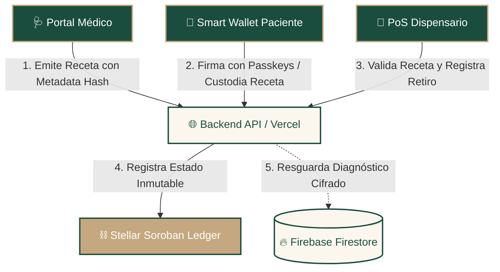
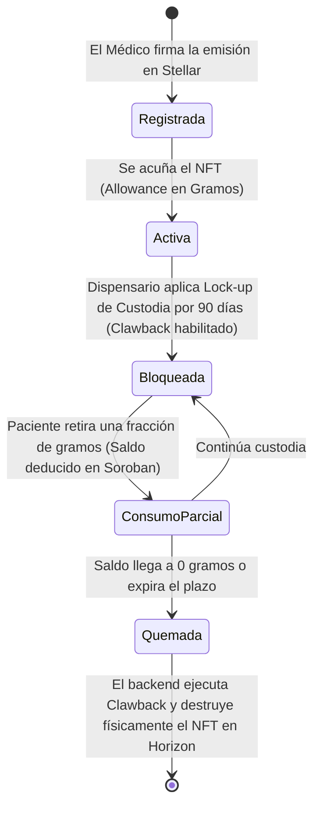

# 🌿 Trust Leaf
### *The First DeCentrally Compliant Medical Cannabis & Controlled Substance Infrastructure Built on Stellar*


[](https://stellar.org)
[](https://vitejs.dev)
[](https://firebase.google.com)
[](https://webauthn.guide)

---

> [!IMPORTANT]
> **🚀 Live in Production:** El portal operacional y el MVP piloto interactivo se encuentran desplegados y disponibles en el dominio oficial: **[https://www.trustleaf.org](https://www.trustleaf.org)**. Para validar el estado del entorno en tiempo real y la preparación de los contratos de Stellar, navega a la ruta de diagnóstico: **[/mvp](https://www.trustleaf.org/mvp)**.

---

## 🏗️ 1. Arquitectura Híbrida de Privacidad (Zero-Knowledge Compliance)

**Trust Leaf** resuelve de forma elegante el dilema de la privacidad médica y la trazabilidad de estupefacientes. Diseñado bajo un modelo híbrido, **garantizamos que ningún diagnóstico o dato sensible de salud (Ley 19.628) sea registrado en la blockchain**, delegando a Stellar únicamente la gobernanza de accesos, saldos de consumo autorizados, y hashes criptográficos inmutables.



---

## 🩺 2. Localización Regulatoria de Chile (Minsal / ISP)

Trust Leaf está diseñado y validado específicamente bajo el marco legal y sanitario chileno, otorgando protección penal inexpugnable al paciente crónico y trazabilidad operativa al dispensario magistral:

* **Ley 21.575 y Ley 20.000 (Art. 8):** La receta médica extendida por un médico cirujano tratante es causa justificada y suficiente para excluir de sanción penal el cultivo y posesión de cannabis medicinal. Al registrar la receta e incorporar los metadatos de autocultivo (plantas, dirección, comuna) on-chain con estampa de tiempo inalterable, blindamos la defensa jurídica del paciente ante fiscalías.
* **Superintendencia de Salud (SIS):** Validación de identidad del profesional mandatoria mediante su **RUT** y su **Número de Registro SIS** de prestadores individuales.
* **Preparación de Recetario Magistral (ISP & Minsal):** Herramienta médica guiada para formular formatos farmacéuticos (Aceites, Flores vaporizadas, Cremas, Cápsulas) y concentración precisa de fitocannabinoides (THC/CBD).
* **Decreto 404 / 466:** Integración en el punto de venta del dispensario de un **Libro de Control de Estupefacientes digital** que traza el lote de laboratorio (QC), médico emisor, paciente receptor y saldos on-chain deducidos en tiempo real.

---

## ⛓️ 3. Ciclo de Vida del Token Soroban en Stellar

El motor Web3 de la plataforma corre sobre **Stellar Soroban (Rust Contracts)**. Cada receta es tratada como un activo digital dinámico y condicional (similar a un NFT con cupo físico):



---

## 🔐 4. Criptografía de Vanguardia: Passkeys (Llaves de Paso)

Olvídate de las contraseñas débiles y de las complejas frases semilla de 12 palabras. Trust Leaf implementa **Passkeys (WebAuthn)** nativas de Stellar:

* **Desbloqueo Biométrico:** Los usuarios firman transacciones descentralizadas utilizando su huella dactilar (TouchID) o rostro (FaceID).
* **Llave Privada en Hardware:** La clave privada del usuario se genera y resguarda en el Enclave Seguro de Hardware de su dispositivo móvil, garantizando que Trust Leaf nunca posea custodia sobre sus fondos o activos médicos.
* **Adopción Masiva:** Flujo híbrido Web2 a Web3 vinculando la cuenta Stellar a la cuenta de Google mediante autenticación federada en Firebase Firestore.

---

## 📂 5. Directorio de Documentación Clave

* 📂 **[docs/vc-executive-technical-whitepaper.md](docs/vc-executive-technical-whitepaper.md):** Dossier ejecutivo y técnico de alto nivel diseñado para Venture Capitalists (VCs) e inversionistas estratégicos.
* 📂 **[docs/chile-legal-compliance.md](docs/chile-legal-compliance.md):** Análisis exhaustivo de acoplamiento legal chileno (Leyes 21.575, 20.000, 19.628, ISP, SIS).
* 📂 **[docs/soroban-mvp.md](docs/soroban-mvp.md):** Arquitectura Web3, despliegue de contratos inteligentes y scripts de interacción en testnet.
* 📂 **[docs/firebase-admin-setup.md](docs/firebase-admin-setup.md):** Guía de configuración para la lista de administración clínica y gobernanza en Firebase.

---

## 💻 6. Guía de Inicio Rápido para Desarrolladores

### Prerrequisitos
- Node.js v18+
- npm o pnpm
- Stellar CLI (si planeas compilar o desplegar los Smart Contracts en `soroban/`)

### 1. Clonar el repositorio e instalar dependencias:
```bash
npm install
```

### 2. Configurar variables de entorno:
Crea un archivo `.env` en la raíz guiándote de `.env.example` y configura las variables de conexión de Firebase y de Stellar Testnet (IDs de contratos e inicializadores).

### 3. Levantar servidor local en modo desarrollo:
```bash
npm run dev
```
La consola indicará la dirección de acceso local (usualmente `http://localhost:5173` o `http://localhost:3000`).

### 4. Pruebas de calidad y type-safety:
```bash
# Verificar análisis estático y sintaxis con ESLint
npm run lint

# Validar tipado y compilación limpia de TypeScript
npx tsc --noEmit

# Compilar producción bundle
npm run build
```

---
*Desarrollado con dedicación por el equipo de Trust Leaf Technologies © 2026. Todos los derechos reservados.*
