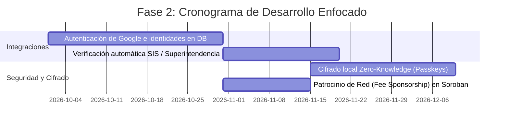
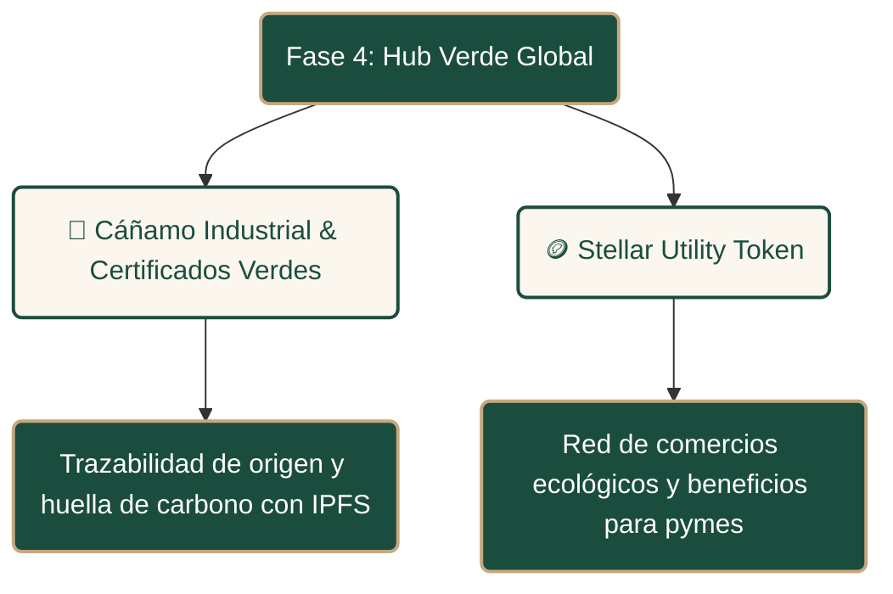

# 🗺️ Trust Leaf Roadmap
**Strategic Evolution towards a Decentralized Global Cannabis & Hemp Infrastructure**

[](https://stellar.org) [](LICENSE)

---

## 🧭 Visión General

Este documento detalla el **Roadmap Estratégico** de **Trust Leaf**. Nuestro objetivo es evolucionar desde un prototipo funcional y MVP técnico hacia una red global interconectada de dispensarios, médicos y pacientes bajo un marco regulado, privado y de triple impacto sobre la red **Stellar**.

```
   [ MVP TESTNET ] ───► [ PILOTO CHILE ] ───► [ EXPANSIÓN REGIONAL ] ───► [ ECO-HUB GLOBAL ]
     (Completado)          (Q4 '26 - Q1 '27)         (Q2 '27 - Q4 '27)            (2028+)
```

---

## 🚀 Fases del Roadmap

### 📦 Fase 1: Consolidación del MVP (Q3 2026) - **[COMPLETADO]**
> *Hito: Validación técnica del núcleo de contratos inteligentes y firma híbrida en Chile.*

*   **100% On-chain en Soroban:** Implementación de la retención criptográfica (`retained_by`) y consumo parcial sobre Stellar Testnet. (Completado y validado en `test-flow.ts`)
*   **Firma Híbrida:** Integración de Freighter/Albedo y firma custodial en backend/frontend. (Completada la arquitectura híbrida)
*   **Sincronización Firestore:** Cola de dispensación en tiempo real con privacidad inter-sucursal (colección `pickups`). (Completada)
*   **Receta Magistral PDF:** Generación client-side con QR dinámico y visualización de firma digital asociada. (Completada)

---

### 🔒 Fase 2: Piloto Controlado & Fortalecimiento Técnico (Q4 2026 - Q1 2027) - **[EN DESARROLLO - FOCUSED]**
> *Hito: Primer lanzamiento en entorno productivo cerrado bajo el marco legal chileno.*



*   **Identidades Reales vinculadas a Blockchain:**
    *   Mapeo del `uid` de Google Auth con la clave pública Stellar de hardware (Passkeys) del paciente.
    *   Limitar accesos administrativos mediante allowlist en `appAdministrators/{uid}`.
*   **Verificación Institucional:**
    *   Verificación automática/semiautomática de médicos contra el registro de la **Superintendencia de Salud (SIS)** antes del alta on-chain.
*   **Privacidad Absoluta (Zero-Knowledge):**
    *   Cifrado simétrico (AES-GCM) en el cliente de la ficha clínica de modo que los servidores de Firestore nunca puedan leer diagnósticos médicos en texto plano.
*   **Patrocinio de Red (Fee Sponsorship):**
    *   Integrar de manera nativa operaciones de patrocinio en Stellar para que el backend de Trust Leaf asuma los costos en XLM de las interacciones con Soroban.

---

### 🌎 Fase 3: Expansión Regional LatAm (Q2 2027 - Q4 2027)
> *Hito: Despliegue modular y adaptabilidad legal en Argentina y Uruguay.*

*   **Arquitectura Soroban Multi-Jurisdiccional:**
    *   Despliegue de contratos inteligentes independientes por país (`prescription_cl`, `prescription_ar`, `prescription_uy`) para gestionar límites locales de gramos y tiempos de expiración regulados.
*   **Federación Médica Transfronteriza:**
    *   Confianza federada on-chain mediante esquemas multifirma (m de n) en los contratos de registro de médicos (`DoctorRegistry`), permitiendo verificar credenciales de países socios de forma descentralizada.
*   **Integración de Credenciales Estatales:**
    *   **Argentina:** Conexión con el registro de autocultivo **REPROCANN** para validar el estatus legal del paciente directo en su wallet.
    *   **Uruguay:** Adaptación regulatoria ante las normativas del IRCCA.

---

### 🌱 Fase 4: Ecosistema Global & Hub de Impacto (2028+)
> *Hito: Integración del Cáñamo Industrial y programa de fidelización Web3.*



*   **Trazabilidad de Cáñamo Industrial:**
    *   Certificación verde de origen, materiales biodegradables y huella ecológica usando hashes inmutables de Stellar e IPFS.
*   **Distribución de Utilidad Programática (Soroban SAC):**
    *   Acuñación y distribución automática del token de fidelidad `$LEAF` mediante un contrato inteligente Soroban Asset Contract (SAC), gatillado al completarse transacciones exitosas de retiro.
*   **Staking en Defindex (Finanzas Regenerativas - ReFi):**
    *   Integración con el protocolo **Defindex** en Stellar/Soroban para habilitar vaults de staking de `$LEAF`. El rendimiento (yield) generado se redirigirá programáticamente para subsidiar consultas y tratamientos de pacientes vulnerables y financiar cooperativas agrícolas locales.
*   **Interoperabilidad Transatlántica:**
    *   Mapeo de recetas válidas para viajes de pacientes entre LatAm, Europa y Estados Unidos.

---

## 📂 Enlaces a Documentación de Soporte

*   📂 **[ROADMAP_INSTAAWARDS.md](ROADMAP_INSTAAWARDS.md):** Plan de sprints de 1 mes (3 meses totales) alineado con las reglas y financiamiento acelerado de Stellar Instawards.
*   📂 **[docs/roadmap-vision-global.md](docs/roadmap-vision-global.md):** Visión detallada de arquitectura, on-chain vs off-chain y cronograma de negocio.
*   📂 **[docs/chile-legal-compliance.md](docs/chile-legal-compliance.md):** Guía de cumplimiento de salud chilena (Leyes 21.575, 20.000, 19.628, SIS, ISP).
*   📂 **[docs/guia-pruebas-E2E.md](docs/guia-pruebas-E2E.md):** Manual paso a paso para correr los tests en testnet.
