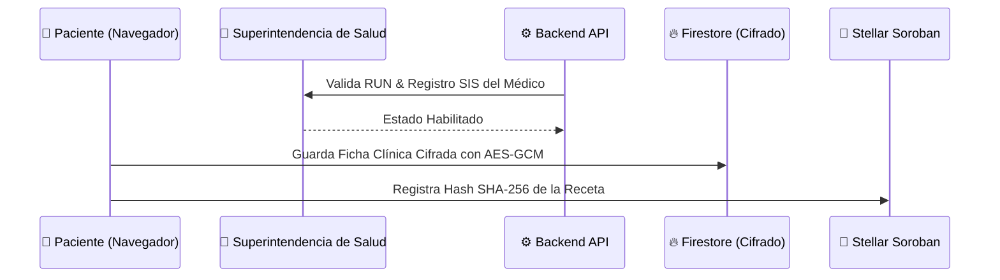

# 🗺️ Trust Leaf: Stellar Instawards Sprint Roadmap
**Plan de Ejecución Acelerado de 3 Meses (Sprints de 30 Días)**

Este documento detalla la hoja de ruta técnica y de producto para la postulación de **Trust Leaf** al programa **Instawards** de Stellar. El plan se estructura en **3 sprints de 30 días**, con entregables concretos y criterios de aceptación claros orientados a la red de prueba (Testnet) y preparación del piloto real.

---

## 🛠️ Estado Actual de las Billeteras (Punto de Partida)
Antes de iniciar los sprints de los Instawards, la infraestructura de wallets en Trust Leaf se compone de:
1.  **Billeteras de Prueba (Demo/Derivadas):** Generación determinística a partir del correo mediante la API `/api/stellar/derive-wallet`. Ideal para demostraciones rápidas, pero no viable para entornos reales.
2.  **Passkeys Híbridas locales:** Implementación nativa WebAuthn que dispara el prompt biométrico del sistema operativo, generando una llave Stellar almacenada localmente y resguardada en el navegador (`localStorage`).
3.  **Billeteras Web3 (Freighter / Albedo):** Soporte inicial para la firma y envío de transacciones directamente desde el cliente.

---

## 🏃‍♂️ Sprint 1 (Días 1 - 30): Onboarding Real y Registro On-Chain de Actores Habilitados
> **Objetivo principal:** Conectar el backend Express y los contratos Soroban existentes con una autenticación real (Firebase Auth) y vincular de forma persistente las identidades de Pacientes, Médicos y Dispensarios con sus wallets (Freighter/Passkeys).  
> **Monto Solicitado:** $5,000 USD (en XLM)

### 📦 Entregables Concretos
1.  **Onboarding de Identidad Híbrido (Google + Passkeys):**
    *   Integración real de `signInWithPopup(auth, googleProvider)` en el flujo de registro.
    *   Mapeo inalterable en la colección `users` del `uid` de Firebase con la clave pública de Stellar del paciente resguardada en su hardware vía Passkeys (WebAuthn).
2.  **Seguridad y Allowlist Administrativo:**
    *   Configuración estricta de las reglas de seguridad de Firestore (`firestore.rules`) para restringir la consulta y escritura de documentos por `request.auth.uid`.
    *   Habilitación del panel `/admin` únicamente a cuentas asociadas en la colección `appAdministrators/{uid}`.
3.  **Firma Local en el Cliente (Freighter / Albedo):**
    *   Implementación completa de la firma local de transacciones Stellar (XDR) desde el navegador para Médicos y Dispensarios, reduciendo el rol del backend a la simple transmisión final (`/api/stellar/submit`).

### 🏁 Criterios de Aceptación (Success Criteria)
*   Un usuario nuevo puede registrarse con Google, crear su billetera por Passkey y persistir esta relación de forma segura.
*   Los médicos y dispensarios pueden firmar transacciones usando la extensión Freighter/Albedo localmente.
*   El acceso no autorizado al panel `/admin` es rechazado de forma nativa por las reglas de Firestore.

---

## 🏃‍♂️ Sprint 2 (Días 31 - 60): Privacidad Zero-Knowledge y Verificación SIS
> **Objetivo principal:** Implementar el cifrado de datos clínicos sensibles en el cliente y la verificación institucional contra el organismo de salud chileno (SIS).  
> **Monto Solicitado:** $5,000 USD (en XLM) - *Primer Follow-on*

### 📦 Entregables Concretos
1.  **Cifrado Simétrico Client-Side (Zero-Knowledge):**
    *   Cifrado de fichas clínicas e historiales mediante AES-GCM en el navegador del paciente antes de enviarlos a Firestore, de forma que el administrador de base de datos no pueda ver diagnósticos en texto plano.
    *   Derivación de llaves criptográficas a partir de la Passkey biométrica del paciente.
2.  **Integración con Registro SIS:**
    *   Desarrollo de un validador en el backend de Trust Leaf que consulte de manera automática o semi-automatizada el Registro Nacional de Prestadores Individuales de la **Superintendencia de Salud (SIS)** para verificar la idoneidad legal del médico solicitante antes de su alta en `DoctorRegistry`.
3.  **Receta PDF Firmada y QR Dinámico:**
    *   Generación client-side de la receta oficial magistral en PDF, incluyendo la estampa de tiempo on-chain de Stellar, hash SHA-256 de integridad, y QR de validación dinámico.

### 🏁 Criterios de Aceptación (Success Criteria)
*   El historial clínico en Firestore se lee como datos cifrados (texto no legible) y solo puede descifrarse con la llave del paciente/médico autorizado.
*   La solicitud de un médico sin registro SIS válido es rechazada o marcada para revisión manual obligatoria.
*   El QR de la receta en PDF redirige a un validador público en testnet que despliega los datos del balance remanente de Stellar.

---

## 🏃‍♂️ Sprint 3 (Días 61 - 90): Patrocinio de Tarifas, Pruebas de Estrés y Despliegue de Piloto
> **Objetivo principal:** Minimizar la fricción del usuario final implementando patrocinio de red nativo y realizar pruebas de estrés de los contratos en Soroban.  
> **Monto Solicitado:** $5,000 USD (en XLM) - *Segundo Follow-on*

### 📦 Entregables Concretos
1.  **Fee Sponsorship Nativo (Patrocinio de Red):**
    *   Configurar el backend de `server.ts` para que firme las transacciones de Soroban como Patrocinador de Tarifas (Fee Sponsor), absorbiendo el costo en XLM del gas de pacientes y médicos durante sus operaciones cotidianas.
2.  **Pruebas de Estrés y Concurrencia de Contratos:**
    *   Completar y ejecutar el script `test-stress.ts` contra Stellar Testnet, simulando escenarios de 100+ recetas simultáneas, retiros paralelos y quema mediante Clawback.
3.  **Despliegue de Producción y Demo de Cierre:**
    *   Configuración de variables de entorno y despliegue del frontend/backend en Vercel/Cloud Run con conectividad estable a Stellar Testnet.
    *   Grabación de una demo técnica E2E de 5 minutos explicando el flujo completo bajo los estándares de los Instawards.

### 🏁 Criterios de Aceptación (Success Criteria)
*   El paciente no requiere tener saldo en XLM para realizar un retiro parcial o emitir una receta (Fee Sponsorship exitoso).
*   Los contratos en Soroban responden de manera robusta y sin fallos de concurrencia bajo el script de estrés.
*   La aplicación está live y accesible públicamente con diagnósticos limpios en `/mvp`.

---

## 🔐 Cumplimiento de Reglas de Instawards

*   **Duración Acotada:** 3 sprints independientes de 30 días, enfocados en ejecución técnica.
*   **Relevancia Directa a Stellar:** Integración nativa de Smart Contracts (Soroban), Classic Claimable Balances (NFTs), Clawbacks, Fee Sponsorship y firmas Web3 con hardware.
*   **Transparencia de Progreso:** Cada sprint concluye con un entregable verificable on-chain mediante TX Hashes audibles en Stellar.expert Testnet.
