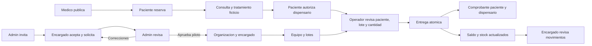

# Trust Leaf: mapa de producto y nueva experiencia

## Estado vigente (2026-09-25)

La Mesa conectada esta publicada en main `d101469` (PR #42), con aprobacion visual,
CI y despliegue confirmados. El laboratorio A/B/C/D/Mesa sigue aislado.
El mapa original de abajo documenta la referencia historica `a995f44`; sus
pendientes de eleccion visual/publicacion no describen el estado actual.

E7: [PR #42 y cierre de publicacion](https://github.com/CaBsCrypto/Trust-Leaf/pull/42#issuecomment-5824007733),
[CI aprobado](https://github.com/CaBsCrypto/Trust-Leaf/actions/runs/36072522968),
capturas sinteticas en `docs/evidence/desk-connected`. Vercel Ready reconfirmado
el 25/09. Navegacion y Atenciones conectadas; Inventario/Historial mantienen
funciones y Gestion permanece accesible. Sin APIs, migraciones ni saldos nuevos.
E7 acredita publicacion y pruebas tecnicas, no autonomia ni telefono fisico.

| Capacidad actual | Publicacion | Validacion pendiente |
| --- | --- | --- |
| Jornada, Pacientes y revision de entrega | Publicada E7 | Uso sin ayuda por ambos roles |
| Inventario e Historial bajo nuevo marco | Publicada E7 | Lote/comprobante y retorno en movil real |
| Gestion y Equipo | Funciones conservadas E7 | Legibilidad y experiencia; escrituras comerciales remotas E3 siguen separadas |
| Incorporacion de Browns | Evidencia parcial E5 | Acceso efectivo del encargado |
| Compras, Caja, Conteos | Planificado | Confirmar necesidades y especificar cada entrega |

[Tablero unico y evaluacion de uso](DISPENSARY_CLOSEOUT_SPRINT.md).
No se revalidaron saldos, stock ni autorizaciones vigentes en esta consolidacion.

## Ajuste local de estados de lote (2026-09-24)

Mesa de atencion presenta Cuarentena como "Bloqueado para entrega" y NOR-018
con motivo "Pendiente de revision". Jornada y el filtro Bloqueados conservan
el estado interno y sus restricciones. A/B/C/D mantienen sus etiquetas previas.
Sin conexiones a produccion, cambios de stock ni nuevas acciones.

Tipos y compilacion del laboratorio aprobados. QA A/B/C/D/E aprobado con ambos
roles en 360, 390, 768, 1024 y 1440 px, cero solicitudes a produccion.
Capturas en scratch/product-lab-evidence; inspeccion visual de E a 390 y 1440 px.
Pruebas responsive automatizadas, no equivalentes a una prueba en celular real.

Fecha de revision: 2026-09-23. Referencia funcional: main `a995f44` (PR #39).
Fuentes: codigo de esa referencia, plan maestro y comprobaciones de esta tarea.
Este documento no es una certificacion sanitaria ni una comprobacion fresca de
todos los servicios remotos. No contiene datos de pacientes o solicitantes.

## 1. Como leer la evidencia

Estado de entrega y naturaleza de los datos son ejes distintos: una funcion puede
estar publicada y validada con datos simulados, sin estar habilitada para uso real.

- **PV**: publicado con evidencia del escenario indicado, no de todos los casos.
- **IV**: implementado sin validacion completa del escenario en produccion.
- **S**: simulacion o fixture; no acredita persistencia ni permisos reales.
- **H**: heredado o ruta alternativa; presencia en codigo no prueba uso actual.
- **P**: planificado, sin capacidad funcional verificada.

E1: plan maestro, Agenda/cierres y entregas A/B (septiembre 8-15).
E2: plan maestro, invitaciones/retirada/reincorporacion y jornada diaria.
E3: PR #37, publicacion tecnica comercial; lectura alojada validada, escrituras
con SQL aislado, no jornada comercial remota completa.
E4: PR #38, navegacion por rol; CI y preview aprobados; PR #39 incluye esta base.
E5: PR #39, CI de main 35813471991 aprobada; Admin autenticado, invitaciones y
solicitudes comprobadas el 23/09. Usuario confirma recepcion, solicitud y aceptar
el dialogo de aprobacion. Falta verificar el panel del nuevo encargado.
E6: inspeccion local de rutas, contratos y componentes; no evidencia de despliegue.

Fuentes de codigo contrastadas:
- [Rutas y capas heredadas](../src/App.tsx), [reescrituras de Vercel](../vercel.json).
- [Workspace por actor](../src/features/operations/OperationsWorkspace.tsx) y
  [contratos operativos](../src/features/operations/contracts.ts).
- [Equipo](../src/features/operations/TeamPanel.tsx),
  [ingreso por invitacion](../src/features/operations/TeamInvitationGate.tsx).
- [Comercio](../src/features/commerce/CommercePanel.tsx) y
  [contratos comerciales](../src/features/commerce/contracts.ts).
- [Contratos de incorporacion](../src/features/onboarding/contracts.ts).
- [Enrutamiento consolidado](../api/stellar/readiness.ts).
- [Indice de evidencias historicas](TRUSTLEAF_MASTER_PLAN.md).

## 2. Matriz de capacidades

| Actor / objetivo | Entrada y acciones | Resultado / autoridad | Estado y evidencia |
|---|---|---|---|
| Todos: identidad | Ingreso Privy, cambio de cuenta | Identidad verificada; rol resuelto en Supabase | PV parcial E1/E5; identidad no equivale a aprobacion profesional |
| Admin: incorporar encargado | /admin, Incorporaciones: invitar, revisar, correcciones, rechazar, aprobar | Borrador privado; organizacion/membresia atomicas al aprobar; Supabase + Resend | PV envio/solicitud E5; IV cierre con acceso, correcciones/rechazo reales |
| Encargado: solicitar acceso | /dispensario con invitacion, verificar correo, aceptar, guardar, enviar | Solicitud versionada; no operacion antes de aprobar | PV parcial E5; campos de contacto pueden ser reales, no datos clinicos |
| Admin: activar medico | Cola profesional de prueba, aprobar/rechazar | Rol en Supabase | PV piloto E1; invitacion medica por correo P, no reutilizar invitacion de encargado |
| Medico: organizar agenda | /medico, Agenda: publicar disponibilidad | Horario persistido, estado compartido | PV piloto E1 |
| Paciente: reservar/cancelar | /paciente, Agenda | Reserva y cancelacion persistidas; prevencion de doble reserva | PV piloto E1 |
| Medico/paciente: llamada | Reserva confirmada, abrir Meet | Calendar crea llamada/invitaciones; no cierra atencion | PV conexion E1; Meet abierto solo para pruebas, no aptitud clinica |
| Medico/paciente: reserva historica | Ver en agenda desde cancelada | selectedBooking autorizado, separado del reemplazo | IV cierre completo; correccion SQL/API/UI implementada, evidencia parcial en historial de tarea |
| Medico: atencion | Consultas, filtros, iniciar, nota, finalizar con/sin tratamiento | Encuentro y nota privada versionados, Supabase | PV escenarios E1; no iniciar por abrir Meet |
| Medico: tratamiento | Emitir al cerrar, revocar | Periodos de prueba, mg enteros, sin regla legal implicita | PV piloto E1 |
| Paciente: ordenar perfil | Tratamientos, editar perfil ficticio | Perfil propio privado; contacto no cambia identidad | PV parcial E2; perfil clinico real fuera de alcance |
| Paciente: permisos | Autorizar dispensario temporalmente, revocar | Acceso minimo por tratamiento; no ficha clinica completa | PV piloto E1/E2 |
| Paciente: comprobantes | Historial de entregas | Cantidad, lote, producto y dispensario autorizado, Supabase | PV parcial E2; verificar vigencia de evidencia segun escenario |
| Encargado: preparacion | Inicio: organizacion, equipo, lote, primera entrega | Progreso derivado de datos, no pasos marcados manualmente | IV autonomia; codigo y QA E4 |
| Encargado: equipo | Gestion/Equipo: invitar, reenviar, cancelar, retirar | Membresia de operador, correo verificado, Resend + Supabase | PV E2; negativos de enlaces y limites aun separados |
| Operador: ingreso | /dispensario, aceptar invitacion | Acceso exclusivo como trabajador; sin equipo no ve datos | PV piloto E2 |
| Ambos: atender | Atenciones: buscar autorizado, elegir tratamiento/lote, revisar, confirmar | Entrega + stock + cupo atomicos, Supabase | PV entrega E1/E2; autonomia de uso pendiente |
| Ambos: existencias | Inventario: buscar, filtrar, abrir historial de lote | Stock/lote/estado visibles de su organizacion | PV lectura E2 |
| Encargado: control de stock | Recibir, ajustar con motivo, cuarentena | Movimientos auditados; operador no ajusta | PV piloto E1/E2; interfaz no sustituye autorizacion del servidor |
| Encargado: catalogo | Gestion: producto, precio referencia, umbral, archivo | Catalogo por organizacion, comercio Supabase | IV escritura remota E3 |
| Encargado: proveedores | Gestion: datos comerciales y archivo | Contactos privados, excluidos de proyeccion operador | IV escritura remota E3 |
| Encargado: recepcion comercial | Producto, proveedor, lote, cantidad, costo opcional | Documento/lote/movimiento atomicos; sin caja | IV remota; pruebas aisladas aprobadas E3 |
| Ambos: historial | Entregas/movimientos, fecha, lote, detalle | Comprobante y responsable segun permisos | PV lectura E2; autonomia movil/escritorio pendiente |
| Admin: supervision | Actividad, Organizaciones, actores, llamadas | Auditoria y equipos; sin acceso clinico innecesario | PV parcial E2/E5 |
| Admin: demostracion | POV de prueba | Datos sinteticos; no suplantacion de un usuario | S, E6 |
| Dispensario: compras | Orden, recepciones parciales, remanente | Contrato futuro sobre recepcion actual | P; no acciones en prototipos |
| Dispensario: documento/caja | Documento opcional, turno, cobro, cierre | Separado de entrega; no inventario duplicado | P; no cobros reales ni simulados implementados por este trabajo |
| Dispensario: conteos | Bloqueo lotes, captura, diferencias, cierre | Ajustes compensatorios futuros | P |
| Dispensario: reportes ampliados | Compras, caja, conciliacion | Dependientes de modulos anteriores | P; no indicadores ficticios en producto |

## 3. Mapa tecnico y puntos de confusion

`src/App.tsx` decide las cuatro rutas y sus variantes por banderas y sesion.
`OperationsWorkspace` comparte estructura y estados entre actores. El nombre
de una URL reescrita hacia `api/stellar/readiness.ts` es consolidacion de Vercel:
NO significa que la operacion se ejecute en Stellar.

| Superficie | Contrato actual | Autoridad y frontera |
|---|---|---|
| Agenda | /api/agenda | Privy -> comprobacion recurso/rol -> Supabase; Calendar separado |
| Atencion, tratamiento, perfil, permiso, stock | /api/operations-pilot | Snapshot proyectado por actor; acciones verificadas en servidor/SQL |
| Catalogo, proveedores, recepcion y vinculacion | /api/dispensary-commerce | Lecturas paginadas y campos segun rol; no caja ni compras |
| Equipo | /api/team-invitations | Aceptacion operador distinta de incorporacion encargado |
| Incorporacion | /api/dispensary-onboarding | Solicitudes privadas, revision admin; aprobacion no es transaccion on-chain |
| Correo | /api/team-mail-webhook | Firma verificada y estados de entrega, no apertura como aceptacion |
| Videollamadas | /api/google-calendar/* y worker | Credenciales servidor; estado llamada no equivale a estado consulta |
| Stellar/Testnet | /api/stellar/*, contratos Soroban | Superficie separada; no inferir cobertura on-chain de entrega o aprobacion |

Hallazgos a resolver en la futura arquitectura:

1. Admin apila llamadas, cola antigua, directorio y workspace: duplicacion de
   contextos y mucho desplazamiento antes de llegar a Incorporaciones.
2. Textos sobre Testnet/fees aparecen en accesos al piloto Supabase. Deben indicar
   la autoridad real de la tarea, sin prometer anclaje blockchain inexistente.
3. `src/App.tsx` mantiene importaciones y escrituras Firestore, acceso sin Privy
   y rutas /medico/operacion, /dispensario/operacion e historial alternativo.
   Inventariar alcanzabilidad por configuracion antes de retirar nada.
4. Varias rutas paciente convergen en una misma vista del piloto. Un nombre de
   ruta no garantiza profundidad de navegacion ni persistencia del contexto.
5. Workspace, Equipo y Comercio refrescan por foco/15 s por separado. Medir
   solicitudes por tarea antes de deduplicar; no reducir chequeos de permisos.
6. Confirmaciones nativas, formularios sin guardar y mensajes de error tienen
   patrones diferentes. La preview descartada solo migro algunos dialogos.
7. Preparacion, stock, recibos y equipo existen; compras/caja/conteos no. No
   convertir el mapa futuro en una barra de modulos aparentemente disponibles.

## 4. Recorridos conectados



| Actor | Entrada propuesta | Tareas prioritarias | Excepciones y retorno |
|---|---|---|---|
| Paciente | Proxima cita / tratamiento actual, segun datos | Reservar, llamada, saldo, permisos, recibos | Sin tratamiento no dispensacion; cancelacion no elimina historia; volver conserva contexto |
| Medico | Consultas que requieren atencion | Agenda, retomar borrador, llamada, cerrar, historial relacionado | Reserva cancelada solo lectura; no cierre implicito; error conserva borrador |
| Encargado | Jornada / pendientes reales | Preparar equipo, ver existencias, recibir, resolver incidencias, revisar recibos | Sin lotes no entrega; errores no son ceros; nunca ajustar para forzar una demo |
| Operador | Pacientes autorizados / atencion | Buscar, verificar saldo, lote, revisar, entregar, recuperar recibo | Revocacion retira detalle; sin equipo bloquea; stock insuficiente detiene confirmacion |
| Admin | Bandeja de solicitudes e incidencias | Incorporaciones, actores/equipos, fallos de llamada, auditoria | Correcciones con motivo; identidad no equivale a aprobacion; herramientas tecnicas separadas |

## 5. Arquitectura propuesta y alternativas

Separar areas por tarea: Jornada, Atender, Existencias, Comprobantes y Gestion.
Gestion agrupa catalogo/proveedores/equipo; la estructura final depende de la
comparacion. Inicio de operador abre Atender; encargado abre Jornada.

**A / Centro operativo compacto**

```text
Escritorio: rail fijo | cabecera con identidad
                     | indicadores + pendientes
                     | busqueda + lista densa | detalle contextual
Movil: identidad + menu | lista -> detalle -> revision -> volver
```

**B / Espacio orientado a tareas**

```text
Escritorio: cabecera horizontal | Jornada / Atender / Existencias / Comprobantes
           resumen de tarea | elegir paciente -> preparar -> revisar
           contenido amplio por etapa, sin lista lateral permanente
Movil: identidad + menu | una etapa | acciones al final del contenido
```

Los prototipos comparten fixtures y reglas visibles: 3 pacientes sinteticos,
2 nombres repetidos con referencias distintas, perfil pendiente, 3 lotes
(disponible, cuarentena y vencido), 2 comprobantes historicos. Ningun boton
confirma entregas. La revision es hipotetica y nunca crea un comprobante nuevo.
Estado carga/error/vacio y rol se controlan desde la barra del laboratorio,
que no pertenece al producto. No hay login, API ni almacenamiento persistente.

## 6. Especificacion comun, sin elegir estilo todavia

- Componentes futuros: marco por rol, navegacion, lista de trabajo, cabecera de
  recurso, estado semantico, balance, selector de lote, revision, detalle de
  comprobante, dialogo de descarte y estados de lectura.
- Foco visible; al abrir detalle enfocar encabezado y devolver al origen al salir.
  Modal con Escape, foco contenido y retorno. Menu movil con estado expandido.
- Un borrador pertenece al paciente/tratamiento. Cancelar descarte conserva datos;
  confirmar limpia; volver de revision a edicion conserva lote y cantidad.
- Carga inicial sin salto de estructura; error no muestra datos como actuales;
  reintento explicito. Revocacion real debe limpiar datos y bloquear escrituras.
- Confirmacion financiera/clinica solo tras servidor; conservar idempotencia y
  resultados recuperables. No implementar estas escrituras en los prototipos.
- Transiciones cortas y movimiento reducido. No guardar informacion del paciente
  en URL, localStorage, analitica ni logs.
- Nombre de producto y lote del comprobante son lecturas actuales, no snapshot
  inmutable. No solicitar inventario privado para el paciente.

## 7. Backlog con puertas de salida

| Orden | Entregable | Puerta de salida |
|---|---|---|
| 0 | Este mapa + dos alternativas aisladas | Evidencia enlazada, tareas equivalentes y pruebas responsive |
| 1 | Seleccion visual con usuario | A, B o mezcla definida por pantalla/comportamiento; no asumir aprobacion |
| 2 | Marco y navegacion conectados | Login/roles/banderas existentes, sin perdida de borradores ni estilos cruzados |
| 3 | Atenciones conectadas | Saldo, permisos, stock, revision e idempotencia sin regresiones |
| 4 | Existencias y comprobantes | Filtros, acceso cruzado lote/historial, privacidad y errores |
| 5 | Gestion | Catalogo/proveedores/equipo con permisos y confirmaciones consistentes |
| 6 | Evaluacion acompanada | Ambos roles resuelven tareas sin ayuda; dificultades registradas |
| 7 | Otros actores | Admin, medico y paciente adoptan sistema elegido por entregas separadas |

Datos faltantes no se inventan: compras pendientes requieren modulo Compras;
caja abierta requiere turnos; margenes requieren costos/reglas aun no acordadas;
tiempos de espera requieren una cola real que hoy no existe. Ninguno se simula
como indicador operativo disponible.

## 8. Guion y decision pendiente

Proponer la tarea sin indicar botones; anotar alternativa, rol, ancho, tiempo,
ayuda necesaria, resultado y comentario. La prueba automatizada acredita
interaccion, no preferencia visual ni autonomia de una persona.

1. Encontrar a Camila con referencia P-104 y explicar 20 g retirados/10 g disponibles.
2. Preparar 5 g desde ALB-024 y explicar el saldo hipotetico de 5 g, sin entregar.
3. Volver a editar sin perder cantidad; cambiar paciente y cancelar descarte.
4. Encontrar un lote en cuarentena y distinguirlo del disponible.
5. Recuperar REC-001: cantidad, producto, lote y responsable; abrir historial del lote.
6. Revisar error, vacio y carga sin interpretarlos como operaciones completadas.

Decision inicial: **mezcla A + B elegida por el usuario**; propuesta C local.
La aprobacion visual del resultado sigue pendiente. No existe especificacion final de
implementacion elegida hasta esa decision. Tras elegir: comprobar tambien
360/768/1024, teclado, reconexion/cambio de cuenta con la integracion real,
CI/preview y pruebas oficiales sin nuevas entregas.

Preguntas para la reunion: volumen diario y dispositivos; quien recibe/ajusta;
excepciones frecuentes; modelo venta/aporte/membresia; formatos de producto;
documentos imprescindibles; herramientas actuales a reemplazar. No estan
resueltas por estas maquetas.

Limites: sin publicacion ni nuevas APIs/migraciones/permisos; B y sus saldos
intactos. Acceso final del encargado recien aprobado aun pendiente. La propuesta
`58b2839` se conserva en Git como descartada; no se adopta su CSS en este trabajo.

## 9. Validacion local de las alternativas

2026-09-23, rama `design/product-map-and-directions`, laboratorio aislado:
`http://127.0.0.1:4330/`. Ejecucion y pruebas en
[README del laboratorio](../design/product-lab/README.md).

- Tipos del repositorio: `tsc --noEmit` aprobado.
- Compilacion del laboratorio Vite: aprobada; no es build ni despliegue del producto.
- Chrome/Playwright: A y B, encargado y operador, 360/390/768/1024/1440 px.
  Veinte combinaciones de rol/direccion/ancho aprobadas.
- Busqueda, detalle, revision sin ejecutar, volver a editar, Escape/cancelar
  descarte, descarte confirmado, retorno de foco y busqueda conservada.
- Inventario por estado, historial por lote, comprobante, limpieza de filtros,
  carga/error/vacio y recuperacion local. Sin errores JS ni desborde de pagina.
- Cero solicitudes de API o a destinos externos durante esos recorridos.
- Capturas 390/1440 en `scratch/product-lab-evidence`; revision visual de A
  escritorio/detalle y movil/inventario, B escritorio/inicio y movil/detalle.

No se validaron permisos reales, revocacion remota, persistencia ni latencia de
Supabase con estas maquetas. No se hizo CI/preview remota ni publicacion.
La evaluacion de uso y eleccion A/B/mezcla siguen pendientes; no cerrar esta
fase como direccion elegida ni empezar el redisenio conectado por inferencia.

### Iteracion C: mezcla elegida, revision visual pendiente

El usuario eligio combinar A y B. C es ahora la entrada predeterminada del
laboratorio; A/B se conservan. Escritorio desde 1024 px mantiene navegacion
lateral y lista/detalle; por debajo, menu y etapas consecutivas. Cabecera,
indicadores y registros mas compactos; detalle prioriza permiso y cantidades.
Los estilos nuevos estan limitados a `.direction-C`.

Validacion de esta iteracion: tipos y compilacion local aprobados; QA de A/B/C
en ambos roles y 360/390/768/1024/1440 px (30 combinaciones), sin solicitudes
operativas ni errores JS. Capturas comparables en la misma carpeta de evidencia;
detalle C revisado visualmente en 390 y 1440 px. Saldo y stock siguen siendo
fixtures sin escrituras. No hay despliegue ni validacion de permisos reales.

La eleccion inicial anterior queda resuelta, pero la aceptacion de C por el
usuario no se infiere de las pruebas. No conectar ni publicar el redisenio
hasta revisar esta propuesta y planificar su integracion.

### Iteracion D: minimalismo clinico

Direccion solicitada por el usuario para todas las vistas locales: lateral
claro, grises neutros, verde puntual, cabecera y menu movil con vidrio al 92%
y desenfoque de 12 px; fallback blanco solido. Datos/formularios sin vidrio.
Estilos aislados en `clinical.css`, encabezados de 24 px, controles de 44 px,
textos secundarios de al menos 12 px en las superficies de trabajo.
Se conserva Flor Cordillera. Los controles de evaluacion quedan plegados al pie.

Tipos y build del laboratorio aprobados. QA de A/B/C/D con ambos roles y cinco
anchos (40 combinaciones): navegacion, busqueda, revision sin ejecutar,
descarte/Escape/retorno de foco, filtros, recibos, error/carga/vacio, cero
solicitudes externas u operativas y sin desbordamiento horizontal.
Capturas de las cuatro vistas en 390/1440 bajo `scratch/product-lab-evidence`.
Contraste calculado de texto secundario, navegacion, permiso, accion primaria
y deshabilitado: 5.31:1 a 7.89:1. Esto no constituye una auditoria WCAG integral.
Movimiento reducido probado; revision visual manual en escritorio y movil.

D queda abierta por defecto para evaluacion humana, no aprobada por inferencia.
No hay cambios de API, permisos, migraciones, datos reales ni publicacion.

### 2026-09-24: Mesa de atencion, boceto 01

La nueva entrada predeterminada reemplaza D solo como seleccion del laboratorio.
Referencia: boceto 01 aprobado; no se copian sus fechas, cantidades erroneas ni
modulos inexistentes. A/B/C/D siguen disponibles en controles plegados al pie.
Componentes locales separados: navegacion, lista, detalle y seleccion de lotes.
Escritorio con rail estrecho/lista/detalle; movil y tablet bajo 1024 px con
navegacion inferior fija, espacio reservado y `safe-area-inset-bottom`.
No hay ejecucion de entregas, APIs, persistencia ni cambios en B/Browns.

QA: regresiones A/B/C/D completadas en ambos roles y cinco anchos; Mesa probada
en 360/390/768/1024/1440 px, ambos roles. Lotes no disponibles bloqueados,
cantidades invalidas, revision, descarte, retorno de foco/busqueda, filtros,
historial, estados de error y cero solicitudes de produccion.
Tipos y build del laboratorio aprobados. Capturas E-* en la carpeta de evidencia;
detalle revisado visualmente en 390/1440 px. La navegacion inferior no tapa
Revisar al reducir el viewport a 520 px de alto.

Limite de evidencia: reduccion de viewport no es teclado virtual real. Teclado,
recortes/safe area en telefono fisico y aprobacion visual del usuario pendientes.
Sin publicacion ni afirmacion de preparacion para operacion real.
