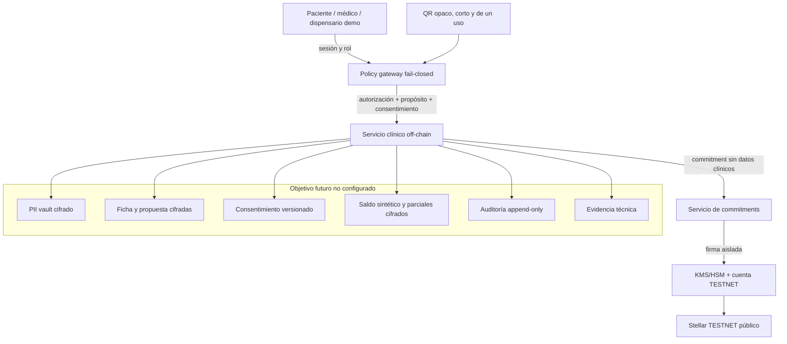
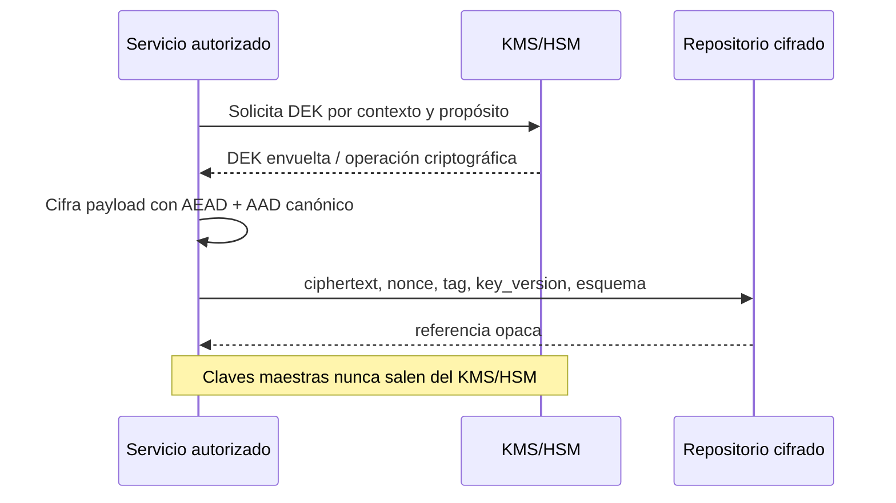

# Arquitectura de datos clínicos y privacidad

**Estado:** diseño para revisión; Supabase/Postgres no está configurado ni aprobado como repositorio clínico.

**Ámbito:** piloto sintético en Stellar TESTNET. No habilita datos reales, actos clínicos, recetas válidas ni dispensación farmacéutica.
**Documento relacionado:** `stellar-testnet-threat-model.md` define amenazas, invariantes, QR anti-replay y límites de correlación.

## Principios y límites

1. La fuente de verdad detallada es off-chain, cifrada y autorizada. Stellar conserva solo un commitment opaco versionado y eventos técnicos mínimos.
2. Nunca se publica en cadena PII/PHI, RUT, nombre, contacto, ficha, consentimiento, diagnóstico, receta, dosis, cantidad, duración, PDF, dirección, identificador interno ni wallet vinculable a una persona.
3. Nunca se publica un hash directo de información clínica o identificable. Los commitments requieren secreto administrado, nonces/sales aleatorios de alta entropía, separación de dominio e identificadores aleatorios por ciclo.
4. El estado público no prueba identidad, contenido, entrega material, legalidad ni cumplimiento. La metadata mutable no es fuente de verdad.
5. Mínimo privilegio, segregación de funciones, denegación por defecto, trazabilidad y minimización desde el diseño.
6. Chile constituye un conjunto de gates pendientes: revisión legal, clínica, farmacéutica y de protección de datos. Este documento no afirma conformidad con Ley 20.584, Ley 19.628/Ley 21.719, DS 466/404, telemedicina ni normativa relacionada.

## Arquitectura lógica

Supabase/Postgres es un candidato para `F`, no una selección final ni una migración realizada. Antes de adoptarlo deben validarse aislamiento, cifrado, RLS, backups, auditoría, residencia/transferencias, retención, borrado y operación. La aplicación debe depender de interfaces neutrales para poder sustituir el repositorio sin cambiar las políticas.

## Modelo conceptual y separación de dominios

| Dominio | Contenido permitido off-chain | Protección | Relación externa |
|---|---|---|---|
| Identidad/PII | Identidad mínima necesaria y estado de verificación | Vault separado, DEK propia, acceso muy restringido | `subject_ref` aleatorio interno; nunca on-chain |
| Ficha | Observaciones y antecedentes autorizados | Envelope encryption por sujeto/caso; versiones inmutables | Solo referencias internas opacas |
| Propuesta de receta | Borrador/estado técnico; contenido clínico solo tras gates | Cifrado separado, firma/aprobación off-chain, append-only | Commitment opaco; nunca receta/hash directo/PDF |
| Consentimiento | Texto/version, alcance, propósito, otorgamiento/retiro | Versionado y firmado técnicamente; evidencia separada | Ningún detalle on-chain |
| Saldo/parciales | Unidades y operaciones sintéticas; valores reales prohibidos en piloto | Cifrado, CAS transaccional, versión monotónica | Commitment de estado; sin cantidad/duración pública |
| Auditoría | Quién, propósito, política, resultado, versión; payload redactado | Append-only/WORM lógico, integridad encadenada | Tx/evento técnico opcional, no identidad |
| Evidencia | Confirmaciones, pruebas, versión de reglas y software | Retención limitada, acceso de auditor | Referencias TESTNET no correlacionables externamente |
| Mapeo ledger | receipt secreto ↔ referencia interna | Vault aislado y DEK independiente | Único puente; acceso excepcional auditado |

Las referencias entre dominios son UUID/valores aleatorios internos, no claves naturales. PII no se replica en tablas clínicas, logs, eventos, cachés ni analítica. Las vistas por rol devuelven solo campos necesarios para el propósito actual.

### Esquema conceptual, no DDL

- `subjects(subject_ref, identity_vault_ref, lifecycle_state)`
- `professional_assertions(actor_ref, evidence_ref, status, reviewed_at)`
- `consent_versions(consent_ref, subject_ref, purpose, version, status, encrypted_payload_ref)`
- `encounters(encounter_ref, subject_ref, professional_ref, status, encrypted_record_ref)`
- `proposal_versions(proposal_ref, encounter_ref, version, state, encrypted_payload_ref)`
- `balance_versions(balance_ref, proposal_ref, version, encrypted_value_ref, transition)`
- `ledger_receipts(receipt_ref, proposal_ref, public_handle_ref, version, confirmation_state)`
- `audit_events(audit_ref, actor_ref, purpose, policy_version, action, outcome, prev_digest)`
- `evidence_objects(evidence_ref, type, encrypted_object_ref, retention_class)`

Los nombres describen responsabilidades, no campos aprobados. Ningún payload clínico debe estar en columnas indexables o texto libre sin cifrado.

## Cifrado por envolvente y gestión de claves

- AEAD moderno aprobado por revisión criptográfica; nonce único y AAD que liga esquema, tenant/contexto, registro y versión.
- Una DEK por sujeto/caso o granularidad equivalente; DEK envuelta por KEK de entorno en KMS/HSM.
- Separar claves de PII, clínica, consentimiento, auditoría, mapeo ledger y commitments.
- TESTNET/desarrollo y cualquier entorno futuro usan cuentas, KEK y secretos completamente distintos.
- Rotación de KEK sin descifrado masivo mediante rewrap; rotación de DEK por compromiso, cambio de propósito o política.
- `k_epoch` de commitments vive separado de las DEK. Commitment candidato: `HMAC(k_epoch, domain || random_receipt_secret || version || canonical_state_commitment || nonce)`; requiere revisión criptográfica.
- Secretos jamás en frontend, repositorio, ledger, logs, QR, backups sin cifrar o variables accesibles al cliente.
- Destrucción criptográfica requiere política, doble control, registro y consideración de backups/obligaciones de conservación.

## Identidad, RBAC, consentimiento y propósito

La autenticación no equivale a autorización. Toda acción evalúa server-side: actor, rol vigente, organización, relación con el caso, propósito, consentimiento aplicable, estado del flujo, versión esperada y política. Claims del cliente son datos no confiables.

| Acción demo | Médico | Paciente | Dispensario | Admin técnico |
|---|---:|---:|---:|---:|
| Ver identidad mínima propia | — | Sí | — | No por defecto |
| Crear nota/propuesta sintética | Sí, caso asignado | No | No | No |
| Ver/retirar consentimiento | Según propósito | Sí | No | No |
| Presentar QR | No | Sí | No | No |
| Verificar QR mínimo | No | No | Sí, dispensario autorizado | No |
| Registrar parcial sintético | No | No | Sí, con CAS y versión | No |
| Revocar receipt demo | Sí, política explícita | No | No | Emergencia con doble control |
| Acceder al mapeo ledger | No | No | No | Excepcional, dividido y auditado |

El retiro de consentimiento detiene accesos futuros que dependan de él, sin reescribir historia ni eliminar automáticamente registros sujetos a conservación. Las excepciones requieren base/política revisada, no lógica implícita.

## Cuenta Stellar, custodia y exposición pública

- Cuenta técnica TESTNET por función/entorno; no cuenta pública estable por paciente ni wallet custodial asociada a su identidad.
- Firmante aislado detrás de política; el servicio clínico no recibe la secret key.
- Rate limit, allowlist de red/contrato/operaciones, límites cuantitativos, pausa y rotación con doble control.
- Metadata estática mínima: versión de protocolo y dominio técnico si son imprescindibles. Sin texto libre, URLs clínicas, organización/rol, estado detallado o identificadores.
- Eventos separados y append-only: emisión técnica, transición versionada y cierre. Considerar un `event_kind` uniforme para reducir inferencia por tráfico.
- La intrasecuencia es técnicamente vinculable para verificar versiones; debe ser opaca, limitada a un ciclo y no enlazable deliberadamente con identidad, wallet personal, otra secuencia o renovación.
- Saldo, cantidad, duración y parciales quedan cifrados off-chain. En cadena solo cambia un commitment sin revelar valor.

## Auditoría, evidencia y append-only

La auditoría clínica/técnica off-chain registra acción, actor interno, propósito, policy/software version, versión esperada/obtenida, resultado y timestamp confiable. No registra secretos ni payload clínico. Se encadena por digest o mecanismo WORM y se exporta a almacenamiento con acceso separado.

Corregir no significa editar un evento: se agrega una versión o compensación. Los eventos del ledger son evidencia técnica secundaria; la reconciliación asocia estados `pending`, `confirmed`, `failed` o `anomalous` sin adoptar automáticamente transacciones inesperadas.

La evidencia del piloto debe incluir fixtures sintéticos, resultado de tests, identificadores TESTNET, versión del contrato/política y aprobaciones de revisión. No debe incluir capturas con datos reales, QR reutilizable ni secretos.

## Backups, retención y borrado

- Backups cifrados con claves separadas, acceso mínimo, inventario, caducidad y restauración probada.
- RPO/RTO deben definirse antes del piloto; una copia que nunca se restauró no es evidencia de recuperación.
- Retención por clase: identidad, ficha, consentimiento, auditoría, evidencia y mapeo ledger no comparten automáticamente plazo.
- Borrado lógico no basta: definir propagación a réplicas, cachés, búsqueda, analítica, exports y backups, sujeto a gates legales pendientes.
- Un evento público no puede borrarse; por eso nunca debe contener datos personales ni un puntero resoluble públicamente.
- Renovaciones, revocaciones o solicitudes de borrado no reescriben el ledger; destruyen/limitan el mapeo off-chain solo conforme a política revisada.
- Ensayar restauración sin reactivar roles revocados, tokens expirados o claves antiguas.

## Amenazas de acceso y datos

| Amenaza | Control esperado | Evidencia mínima |
|---|---|---|
| RLS/RBAC mal configurado | Gateway común, deny-by-default, pruebas negativas por rol/tenant | Matriz automática allow/deny |
| Consulta lateral por ID | IDs aleatorios, relación server-side, respuestas uniformes | Enumeración/fuzzing rechazada |
| Operador con acceso completo | Separación vault/clínica/mapeo/KMS, doble control | Revisión de permisos efectivos |
| Fuga por logs/telemetría | Allowlist, redacción estructurada, scanner de secretos/PII | Snapshot y tests de logging |
| Backup o export abandonado | Inventario, cifrado, TTL y acceso auditado | Restore/delete drill |
| Compromiso de DEK/KEK | Granularidad, rotación, rewrap, revocación y runbook | Simulación de rotación/compromiso |
| Inferencia desde ledger | Eventos uniformes, batching/relayer evaluado, no valores públicos | Análisis de correlación residual |
| Desincronización DB-ledger | Idempotencia, CAS, estados de confirmación y reconciliador | Fallos/timeout/reorg simulados |
| Consentimiento obsoleto | Version/purpose binding y reevaluación en cada acceso | Retiro bloquea operación posterior |
| Uso de datos reales en demo | Fixtures marcados, validadores y feature flags fail-closed | Scanner y checklist de entorno |

## Checklist de paciente cero

Debe completarse sin crear un paciente real:

- [ ] Aprobación del threat model y de esta arquitectura.
- [ ] Decisión documentada sobre repositorio; Supabase/Postgres sigue no configurado.
- [ ] Inventario y clasificación de campos; lista explícita de campos prohibidos.
- [ ] Interfaces neutrales y esquema sintético revisados, sin datos reales.
- [ ] RBAC/purpose/consentimiento server-side con pruebas negativas.
- [ ] Diseño criptográfico revisado: AEAD, AAD, DEK/KEK, `k_epoch`, nonces y rotación.
- [ ] Cuenta/firmante TESTNET aislado, pausa, límites y recuperación ensayados.
- [ ] QR corto, audience-bound, single-use e idempotente probado ante carreras.
- [ ] Máquina de estados, saldo sintético y reconciliación probados.
- [ ] Logs, métricas, auditoría y evidencia libres de PII/PHI/secretos.
- [ ] Backup/restore/delete drill con fixtures sintéticos.
- [ ] Banner y consentimiento de participantes que indiquen simulación no clínica.
- [ ] Gates legales, clínicos, farmacéuticos y privacidad marcados pendientes.

## Checklist de paciente uno

En esta fase “paciente uno” solo puede ser una persona que opera un personaje/fixture sintético; no aporta información de salud ni recibe una receta o dispensación real.

- [ ] Identidad demo separada de cualquier identidad clínica; rol otorgado administrativamente y con vencimiento.
- [ ] Dataset generado, inequívocamente ficticio y validado por scanner.
- [ ] Consentimiento para participar en la prueba de software, distinto de consentimiento clínico.
- [ ] Recorrido supervisado: acceso, QR, parcial sintético, replay rechazado, revocación/expiración y cierre.
- [ ] Confirmación manual de que el ledger no contiene campos prohibidos ni vínculos externos.
- [ ] Evidencia redactada y accesible solo al equipo autorizado.
- [ ] Revocación de sesiones/tokens/roles de la prueba y rotación si corresponde.
- [ ] Retrospectiva de privacidad, incidentes y correlación antes de otro participante.

## Decisiones obligatorias para revisión

1. ¿Se acepta la vinculación opaca intrasecuencia inherente a eventos versionados públicos? Si no, detener opción B.
2. ¿Qué repositorio neutral satisface cifrado, aislamiento y operación? No asumir Supabase/Postgres hasta evaluarlo.
3. ¿Qué campos exactos existen en cada dominio y cuál es su propósito/base/retención?
4. ¿Qué granularidad de DEK y qué proveedor KMS/HSM se usarán en el entorno demo?
5. ¿Quién puede unir identidad, clínica y receipt, bajo qué doble control y auditoría?
6. ¿Qué metadata/eventos son estrictamente necesarios y cómo se reduce inferencia temporal?
7. ¿Cuál es la política de confirmación, reconciliación, pausa y recuperación TESTNET?
8. ¿Cómo se gestionan retiro de consentimiento, rectificación, retención y borrado bajo revisión chilena?
9. ¿Qué aprobación independiente se exige antes de introducir el primer dato real? La respuesta actual debe ser: ninguna introducción hasta cerrar todos los gates.

