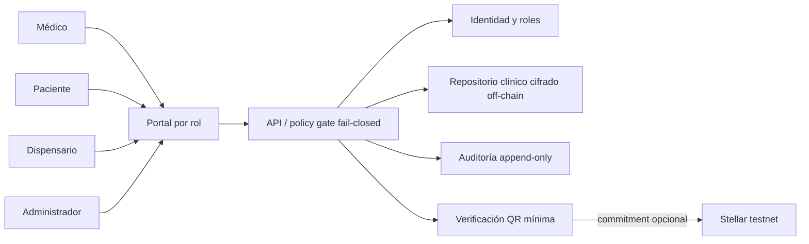
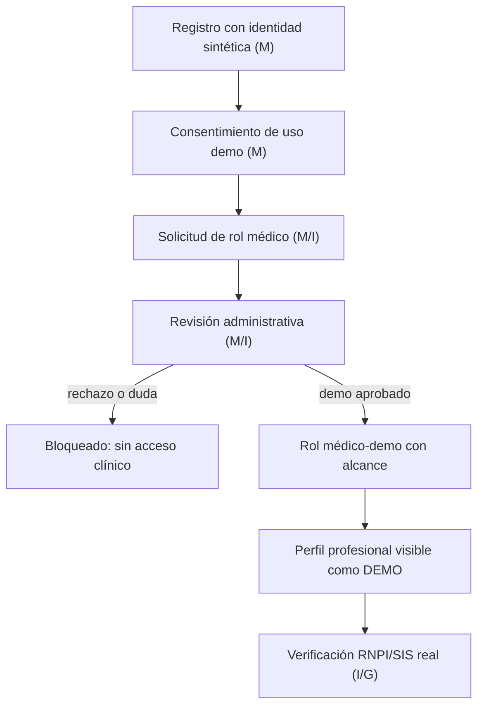
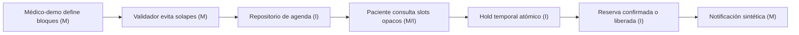
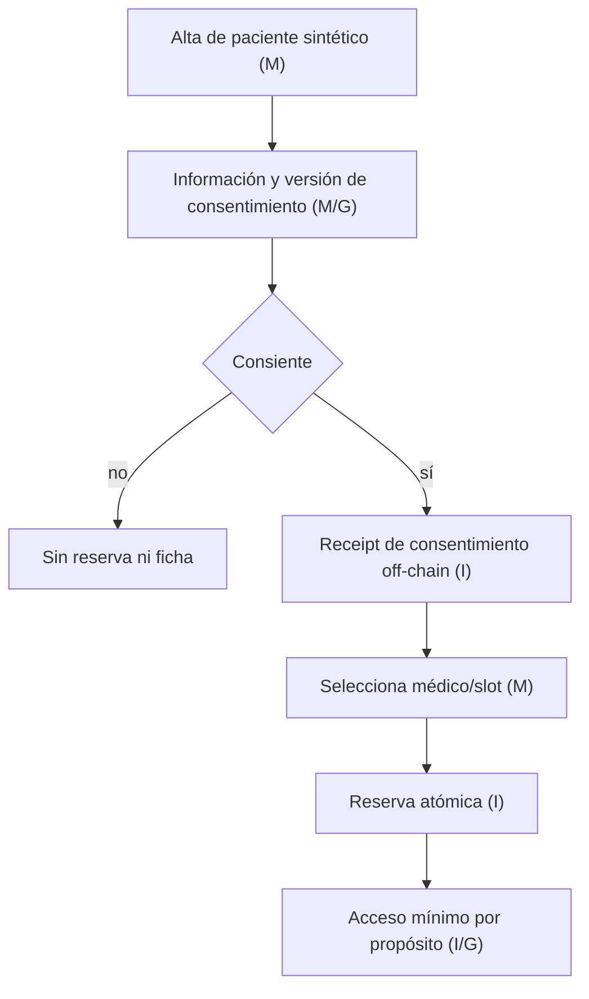
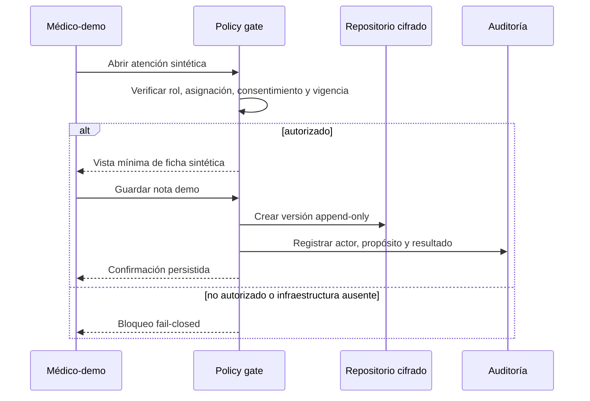
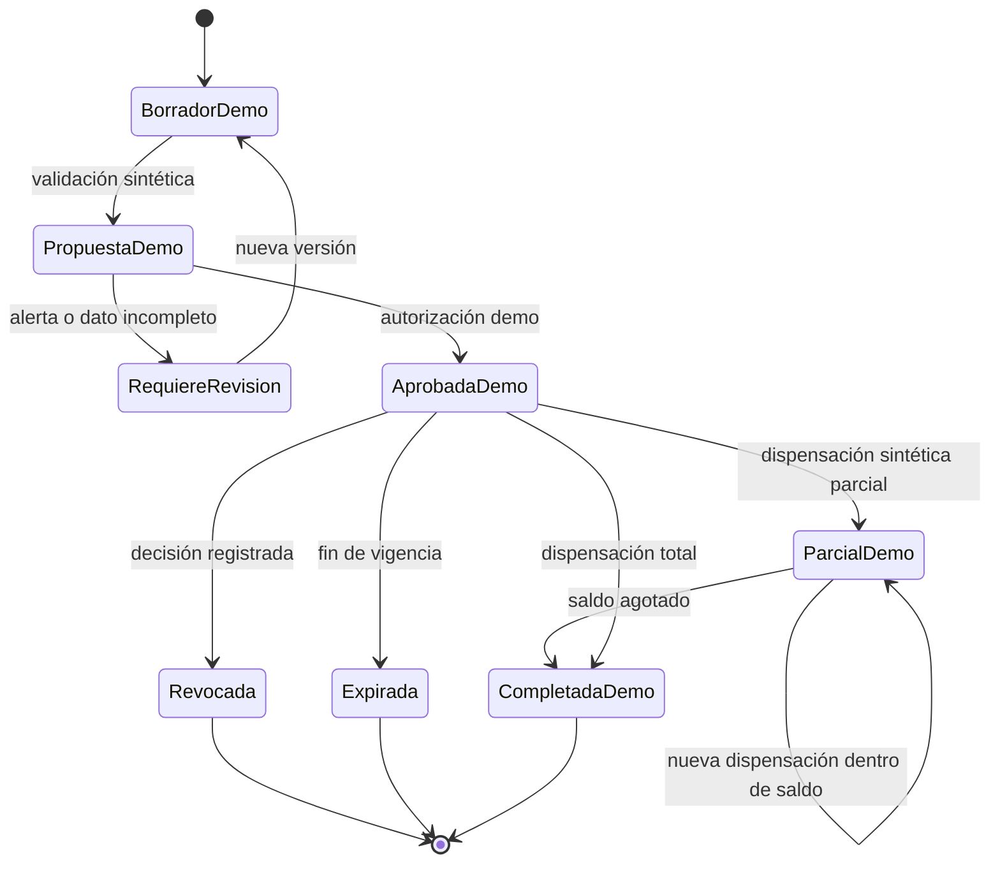
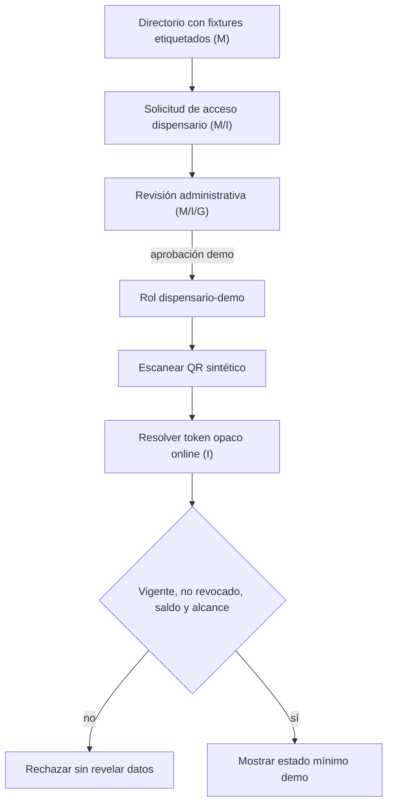
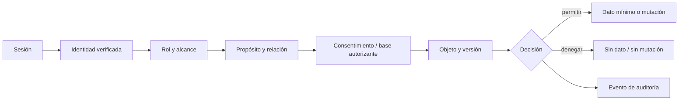

# Blueprint interno del sistema clínico (demo)

Estado de referencia: rama `audit/medical-flow-capabilities-20260821`, commit `aa1bf7b`.

Este documento describe el sistema objetivo para ordenar desarrollo y pruebas con datos sintéticos. No certifica cumplimiento, validez clínica ni preparación productiva. En el estado auditado, Firestore y sus reglas no cierran los flujos; varias pantallas usan mocks o fallback local; Supabase no está configurado. La fuente clínica futura debe ser off-chain.

## Leyenda

- **M — Mock:** interacción y datos sintéticos, sin efecto clínico.
- **I — Infraestructura:** requiere identidad, persistencia, cifrado, auditoría o integración verificable.
- **G — Gate:** requiere aprobación legal, clínica y/o farmacéutica antes de uso real.
- **Fail-closed:** ante identidad, autorización, consentimiento, configuración o estado ambiguo, se bloquea la mutación.

## Principios del diseño

1. Ningún dato real se usa durante la fase demo.
2. El frontend no decide roles, habilitación profesional ni autorización final.
3. Consentimientos, notas, propuestas y dispensaciones son registros append-only; una corrección crea una nueva versión.
4. La receta clínica completa, identidad y auditoría viven cifradas off-chain.
5. Blockchain, si se usa, solo contiene compromisos no identificables y no es fuente de verdad clínica.
6. Un QR transporta un token opaco, corto y revocable; la verificación online devuelve el mínimo estado necesario.

## Vista de contexto



## 1. Onboarding y verificación del médico



El marcador administrativo demo nunca equivale a verificación profesional. Para piloto se requieren fuente oficial, evidencia fechada, revisión de excepciones y revocación de rol.

## 2. Agenda y disponibilidad



La UI actual no prueba atomicidad, concurrencia, zona horaria ni persistencia autorizada. La confirmación visual no debe preceder a la confirmación del repositorio.

## 3. Paciente, consentimiento y reserva



Consentimiento debe ser específico, revocable y versionado; no reemplaza base jurídica ni evaluación legal.

## 4. Atención, ficha y seguimiento



Seguimiento se deriva de episodios persistidos y tareas explícitas, no de fixtures ni permisos. Correcciones de nota preservan historia y autoría.

## 5. Propuesta y estados de receta



Cada transición exige autorización, precondición de versión e idempotency key. Ningún estado demo representa una receta válida.

## 6. Directorio y verificación por dispensario



El directorio no debe mezclar organizaciones aprobadas con inventario o compatibilidad mock sin etiquetas visibles.

## 7. Dispensación, revocación y renovación

```mermaid
sequenceDiagram
  participant DP as Dispensario-demo
  participant VR as Verificador
  participant RX as Estado off-chain
  participant AU as Auditoría
  DP->>VR: Token QR + idempotency key
  VR->>RX: Compare-and-set de versión y saldo
  alt primera operación válida
    RX-->>VR: Nueva versión parcial/completa
    VR->>AU: Evento mínimo auditado
    VR-->>DP: Receipt demo no reutilizable
  else replay, revocada, expirada o conflicto
    VR->>AU: Intento rechazado
    VR-->>DP: Rechazo genérico
  end
  Note over RX: Renovación crea nueva propuesta; no edita historia
```

Revocar no borra la historia. Una renovación referencia internamente la versión anterior, pero recibe identidad clínica propia off-chain.

## 8. Roles, identidad, datos y auditoría



| Rol | Lectura demo mínima | Mutación demo permitida | Nunca decide por sí solo |
|---|---|---|---|
| Paciente | sus datos sintéticos, citas y estados | consentimiento/reserva propios | habilitación médica o dispensación |
| Médico-demo | pacientes asignados y episodio activo | disponibilidad, nota y propuesta demo | identidad profesional real |
| Dispensario-demo | resultado mínimo de QR válido | dispensación sintética idempotente | diagnóstico, ficha o receta completa |
| Administrador-demo | solicitudes y evidencia administrativa | asignar/revocar roles demo | decisiones clínicas o farmacéuticas |

La auditoría registra actor, acción, propósito, objeto opaco, versión, resultado y tiempo; nunca secretos ni contenido clínico completo.

## Matriz consolidada

| Flujo | Evidencia actual | Estado actual | Objetivo demo verificable | Gate para piloto real |
|---|---|---|---|---|
| Médico | UI/alta y credencial parcial | M parcial | solicitud, revisión y rol demo revocable | I + identidad profesional + G legal/clínico |
| Agenda | UI y estado local | M; nube bloqueada | slots, solapes y reserva sintética | I atómica + privacidad + operación clínica |
| Paciente/reserva | UI confirma e intenta Firestore | M inconsistente | consentimiento versionado y confirmación tras persistir | I + G legal/privacidad |
| Atención/seguimiento | nota experimental y fixtures | M; esquema incompatible | episodio y versiones sintéticas append-only | cifrado/KMS + auditoría + G clínico/legal |
| Propuesta receta | UI demo/testnet; más estados que pruebas | M/testnet | máquina de estados sintética con guards | G médico/legal/farmacéutico |
| Directorio/dispensario | fixtures + solicitudes mezcladas | M mixto | catálogo etiquetado y rol demo separado | I identidad organización + G farmacia |
| Dispensación/ciclo | prototipos/testnet no integrados | M/testnet | CAS, parcial, replay y revocación sintéticos | I transaccional + G clínico/farmacia/legal |
| Roles/datos/auditoría | gates/rules candidatos fuera de main | M parcial | policy engine y matriz negativa en emulador | I productiva + DPIA/seguridad + G legal |

## Contradicciones que el equipo debe resolver

- La documentación histórica afirma capacidades blockchain y Firestore “completadas”; la auditoría reproducible no demuestra integración clínica ni productiva. No usar esas afirmaciones como criterio de aceptación.
- Agenda y reserva pueden mostrar éxito aunque la nube rechace la escritura.
- La forma de la nota clínica no coincide con las reglas Firestore.
- “Pacientes en seguimiento” se calcula desde fixtures/permisos, no desde un registro longitudinal.
- El directorio mezcla aprobación administrativa con inventario/catálogo sintético.
- Hay modelos de estados de receta en ramas candidatas que no forman parte de `main`.
