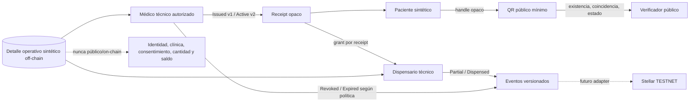

# TrustLeaf — preparación y validación end-to-end

Documento vivo. Actualizar fecha, responsable, evidencia y decisión en cada gate. No reemplaza revisión jurídica, clínica, farmacéutica o de seguridad.

**Estado global:** `NO-GO TESTNET`.

**Alcance confirmado:** demostración local con identidades y contenido completamente sintéticos. No es una receta válida, no admite pacientes reales, no prueba elegibilidad clínica, no habilita dispensación farmacéutica, pagos, mainnet o producción.

## Flujo objetivo

La capa visual NFT representa el receipt, pero no es un token transferible ni contiene metadata clínica. El público solo recibe `{demo, evidenceExists, proofMatches, status}`. Los detalles operativos permanecen en superficies autorizadas.

## Tablero de gates

Leyenda: **CONFIRMADO** tiene evidencia reproducible; **PENDIENTE** requiere implementación o decisión; **BLOQUEADO** no puede ejecutarse sin autoridad adicional.

| Gate | Estado | Evidencia actual | Valida / decide |
|---|---|---|---|
| QR incorporado a candidata | CONFIRMADO | `940deb8` es ancestro de la rama receipt; [suite QR](../../tests/public-verification.test.ts) | Integrador + QA |
| Contrato Receipt V1 local | CONFIRMADO | 20 tests; [contrato](../../soroban/contracts/receipt-ledger/src/lib.rs), [tests](../../soroban/contracts/receipt-ledger/src/test.rs) | Ingeniería Soroban + seguridad |
| Workspace Soroban | CONFIRMADO | 45 tests locales | QA de contrato |
| WASM reproducible en entorno actual | CONFIRMADO | build `--release`; tamaño/hash se registran por corrida, no se versiona el artefacto | Release engineering |
| Backend/QR/UI sintético | CONFIRMADO local | [backend](../../tests/receipt-ledger-backend.test.ts), [UI](../../tests/receipt-pilot-ui-flow.test.ts), [E2E inyectado](../../tests/receipt-shared-state-e2e.test.ts) | Backend, UX y QA |
| Persistencia compartida entre procesos | PENDIENTE | el E2E comparte store por inyección; navegador y handlers no son durables | Arquitectura de datos |
| Adapter/signer/secret store simulados | CONFIRMADO LOCAL | `api/_lib/simulated-testnet-adapter.ts`; suite valida allowlists, rotación, timeout→`unknown`, no-resubmit, idempotencia y transporte marcado sintético | Ingeniería Stellar + seguridad |
| Adapter RPC, signer y submission reales | BLOQUEADO | adapter productivo lanza `RECEIPT_TESTNET_GATE_CLOSED`; mutaciones deshabilitadas | Ingeniería Stellar + aprobación humana |
| Indexación, finality y reconciliación simuladas | CONFIRMADO LOCAL | `api/_lib/receipt-indexer.ts`; `npm run test:receipt-indexer` valida cursor, profundidad, gaps, fork/reorg, deduplicación, `unknown`, retry acotado y auditoría redactada | Backend/SRE |
| Indexación y reconciliación contra Stellar Testnet/RPC | BLOQUEADO | no existe conexión RPC ni persistencia durable; la submission real permanece deshabilitada | Backend/SRE + aprobación humana |
| Auth real o arnés aislado | PENDIENTE | solo fixtures server-side con roles/scopes sintéticos | Seguridad/identidad |
| Commitments y claves | PENDIENTE | falta especificación canónica, KMS/HSM, rotación y separación de dominios | Criptografía + privacidad |
| Cuentas técnicas/custodia | BLOQUEADO por decisión | direcciones, grants, tiempos y secuencia son correlacionables | Owner seguridad + usuario |
| TTL/rent/archivo | PENDIENTE | Receipt/Operation/Grant extienden TTL; roles persistentes carecen de procedimiento operativo | Soroban/SRE |
| Legal, clínico y farmacia | BLOQUEADO por revisión humana | ninguna aprobación se presume | Abogado + médico + farmacéutico |
| Deploy efímero Testnet | BLOQUEADO | requiere todos los gates previos y autorización específica posterior | Usuario + release approver |

## Evidencia reproducible

Usar el [runbook Testnet gated](receipt-testnet-runbook-gated.md). Registrar siempre:

- commit y estado limpio;
- versiones de Rust, Cargo, Stellar CLI, Node y npm;
- `cargo fmt --check -p receipt-ledger`;
- `cargo test --locked -p receipt-ledger` y `cargo test --locked --workspace`;
- build WASM `--locked`, tamaño y SHA-256;
- `npm run preflight` y `git diff --check`;
- revisión independiente y lista de riesgos residuales.

Los snapshots o WASM regenerados por la prueba se guardan fuera del commit candidato. No restaurar, borrar o publicar artefactos sin revisar su procedencia.

## Preconditions obligatorias para Testnet

- [ ] Autorización humana específica para una ventana Testnet; no autoriza producción o mainnet.
- [ ] Contract ID, hash WASM, network passphrase y RPC Testnet en allowlist aislada del stack legacy.
- [ ] Cuentas técnicas seudónimas por rol, nunca derivadas de PII/PHI, con owner, custodia, rotación y revocación.
- [ ] Signer server-side con secret store/KMS/HSM; ninguna clave en repositorio, navegador, QR, URL o logs.
- [ ] Auth real con claims verificados y scopes por receipt, o arnés sintético aislado y no accesible públicamente.
- [ ] Adapter con `simulate → sign → submit → confirm`, timeout y estado `unknown`; mutaciones off por defecto.
- [x] Arnés simulado exige transporte `kind: simulated`; timeout queda `unknown` y retries exactos sólo reconcilian, sin resubmit.
- [x] Indexer puramente simulado con cursor, finality configurable, fork/reorg lógico, gaps, deduplicación, estados ambiguos y retries acotados.
- [ ] Persistencia durable, política Testnet definitiva y reconciliación contra RPC/estado off-chain real.
- [ ] Commitments canónicos opacos con separación de dominio, nonce/salt y rotación; nunca hash directo de clínica.
- [ ] Verificador con rate limit, respuesta uniforme, `no-store`, referrer policy y redacción de URL/logs en todos los paths.
- [ ] Política TTL/rent para receipt, operaciones, grants y roles; alertas antes de expiración.
- [ ] Aceptación explícita del riesgo de correlación pública de cuentas técnicas, receipt, grants, tiempo y secuencia.
- [ ] Confirmación jurídica, clínica y farmacéutica de que el ejercicio usa solo fixtures sintéticos y no constituye receta/dispensación válida.

## Criterios de decisión

**GO para preparación local:** suites verdes, diff revisado, adapter y mutaciones fail-closed, sin datos/secretos y revisión independiente.

**GO para smoke Testnet:** todas las precondiciones anteriores cerradas con responsable/evidencia, runbook ensayado offline, hash WASM aprobado y autorización específica registrada.

**NO-GO inmediato:** red/passphrase/contract no coinciden; hash distinto; auth/scope ambiguo; secreto expuesto; campo prohibido; resultado RPC `unknown` sin reconciliación; fallo de CAS/replay/grant; TTL insuficiente; logs no redactados; falta aprobación humana. No convertir un fallo RPC en éxito in-memory.

## Smoke Testnet propuesto

1. Verificar commit, red, hash WASM, cuentas técnicas, flags y owners.
2. Simular todas las operaciones sin submit y revisar footprint/eventos.
3. Desplegar instancia efímera solo tras autorización.
4. Inicializar roles técnicos y registrar receipt opaco: `Issued → Active`.
5. Crear grant para dispensario; ejecutar `Partial → Dispensed`.
6. En receipts separados ejecutar `Revoked` y `Expired`.
7. Probar actor ajeno, grant ausente/revocado, version obsoleta, replay exacto, replay cruzado y estado terminal.
8. Confirmar QR mínimo y detalle solo con scope autorizado.
9. Comparar RPC, indexer y store; provocar timeout/unknown y reconciliar.
10. Escanear eventos, logs y explorer por campos prohibidos; guardar evidencia sin secretos.

## Rollback y teardown

No existe rollback de eventos confirmados; se aplica contención y cierre lógico:

1. Deshabilitar mutations/submission y pausar el adapter.
2. Revocar grants y roles técnicos según política aprobada.
3. Marcar receipts de prueba terminales cuando sea seguro; nunca alterar historia.
4. Detener signer/indexer, revocar credenciales y rotar secretos comprometidos.
5. Reconciliar operaciones confirmadas, fallidas y `unknown`; preservar evidencia auditada.
6. Retirar configuración efímera, mantener contract ID/hash en el informe y verificar que UI vuelva a fail-closed.
7. Abrir incidente con owner, impacto, ledger range y decisión de reanudación. No borrar evidencia on-chain.

## Secuencia de integración, merge y publicación

1. Mantener feature branches y candidata receipt; QR ya está contenido y no se reintegra.
2. Revisión de diff/allowlist, pruebas por frente y auditoría independiente.
3. Preparar commit candidato limpio; no incluir WASM generado ni secretos.
4. Revisión humana de arquitectura, privacidad, UX y runbook.
5. Solo con instrucción posterior: proponer merge local/no-FF o PR hacia `main`; repetir suites sobre el resultado exacto.
6. Push y publicación requieren instrucciones separadas; deploy Testnet y producción son decisiones distintas.
7. Después de cualquier publicación, registrar commit, hash, aprobadores y gates; nunca afirmar validez clínica/legal.

## Decisiones humanas abiertas

1. Modelo de custodia, owners y rotación de cuentas técnicas.
2. Aceptación o rechazo de correlación pública residual.
3. Proveedor RPC/indexer y política de finality/reorg/estado `unknown`.
4. KMS/HSM, construcción de commitments y gestión de claves.
5. Auth real versus arnés sintético aislado para el primer smoke.
6. Autoridad exacta para `Expired`, renovación de roles y política TTL/rent.
7. Repositorio durable off-chain y modelo de auditoría; Firebase/Supabase no están aprobados como base clínica.
8. Límites y autoridad competente para acceso ampliado; nunca enlace público permanente.
9. Aprobación jurídica, clínica y farmacéutica del guion sintético.
10. Autorización explícita del deploy efímero Testnet, y por separado cualquier merge, push o publicación.
