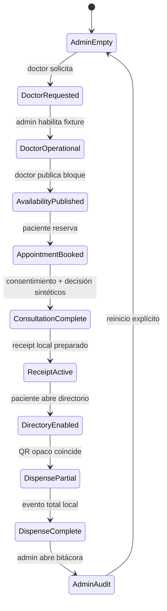

# Blueprint visual E2E sintético

Fecha de revisión: 2026-08-26  
Estado: candidata local, sin infraestructura externa

## Objetivo y límites

La ruta `/demo/pilot-flow` permite revisar un recorrido continuo entre cuatro roles usando únicamente fixtures deterministas en memoria. Es una herramienta de diseño y QA: no autentica actores, no almacena datos, no consulta RPC, no firma, no envía transacciones y no representa una atención o receta válida.

Nunca se incorporan ficha, diagnóstico, indicación, dosis, cantidad, identidad, RUT, correo, dirección, wallet, secreto o documento. Las referencias del fixture son opacas y no corresponden a personas.

## Máquina de estados visible

Las transiciones rechazan rol incorrecto, orden inválido, consentimiento/decisión faltante y QR manipulado. Un rechazo conserva fase, versión y auditoría.

## Matriz de integración

| Paso | Superficie actual | Fuente en esta candidata | Integración futura | Gate antes de dejar fixtures |
|---|---|---|---|---|
| 1. Admin vacío | Panel y bitácora mínima | Memoria local | Persistencia de actores/auditoría | IdP/JWKS, RBAC admin y auditoría durable |
| 2. Solicitud médica | Acción por rol | Fixture | Registro operacional | Verificación documental y revisión humana aprobadas |
| 3. Aprobación médica | Estado operativo | Fixture | `TrustRegistry` | Credencial activa, firma autorizada, revocación y expiry |
| 4. Disponibilidad | Bloque abstracto | Fixture | Agenda durable | Propiedad por recurso y control de concurrencia |
| 5. Reserva | Referencias opacas | Fixture | Reserva durable | Auth de paciente, consentimiento de tratamiento de datos |
| 6. Consulta/decisión | Dos gates booleanos sintéticos | Fixture | Sistema clínico privado | Revisión clínica/legal, ficha cifrada, consentimiento versionado |
| 7. Receipt | Estado y versión local | Fixture `ReceiptLedgerV2` esperado | Lector/indexador read-only y después submission autorizada | Contratos desplegados/allowlisted y evidencia finalizada |
| 8. Directorio | Acceso condicionado | Fixture | Política server-side | Elegibilidad y receipt activos verificados sin confiar en cliente |
| 9. Parcial/total | QR mínimo y eventos locales | Fixture | Verificador + `ReceiptLedgerV2` | Anti-replay, CAS/idempotencia y mapping opaco durable |
| 10. Auditoría | Secuencia rol/evento | Memoria local | Append-only durable + evidencia técnica | Retención, redacción, monitoreo y acceso admin real |

## Qué se reutiliza y qué no

- Se reutilizan tokens visuales, tipografía y reglas globales de foco/reduced-motion ya presentes.
- Se conserva la separación conceptual de `TrustRegistry` para credenciales y `ReceiptLedgerV2` para receipts/eventos.
- No se reutilizan sesiones legacy, Firebase, wallets, localStorage, handlers mutantes ni copies clínicos.
- El entrypoint decide la ruta antes de importar dinámicamente la aplicación legacy. Por ello, abrir la demo no evalúa sus módulos de autenticación, perfil, custodia o conexión RPC.
- La landing 3D revisada no se incorpora a esta candidata: es una superficie de descubrimiento separada y no aporta evidencia a las transiciones operativas. Su integración futura debe conservar el componente visual puro, sin acoplar rutas o estado legacy.
- La constancia pública usa la proyección pura ya existente (`publicProjection` + coincidencia de token sintético). La UI sólo renderiza existencia, coincidencia y estado; no llama al verificador con red.

## Evidencia reproducible

- Máquina de estados y negativos: `npm run test:pilot-flow-demo`.
- Contrato público minimizado y estado compartido: incluidos por `npm run qa:pilot-flow-demo`.
- Tipos y accesibilidad estática: `npm run lint`.
- Empaquetado: `npm run build`.
- Revisión visual humana: `docs/internal/pilot-flow-visual-review-runbook.md`.
