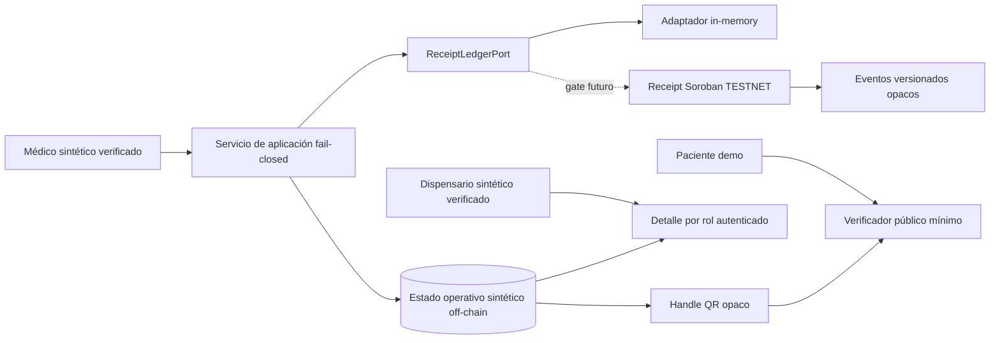

# Re-baseline técnico TrustLeaf — sprint receipt Testnet

Estado: inventario interno sobre `integration/stellar-receipt-pilot-sprint-20260822`. No autoriza datos reales, producción, pagos, fondeo ni despliegue Testnet.

## Base reconciliada

- `main` permanece en `506417a` y no contiene el trabajo reciente.
- La base funcional elegida es `940deb8`, que incorpora análisis de privacidad y el verificador QR público minimizado.
- La arquitectura vigente exige receipt no transferible y versionado; clínica, identidad, consentimiento, cantidades y saldo permanecen cifrados off-chain.
- El contrato heredado `prescription`, sus endpoints y las instrucciones antiguas de `AGENTS.md` no son compatibles: publican o procesan direcciones estables, cantidades, saldos y un NFT/asset transferible. Se conservan como legado, pero no son fuente del piloto nuevo.
- Firestore sigue NO-GO para datos clínicos o autoridad de roles: no hay claims/RBAC ni suite Emulator multiusuario suficiente. Supabase/Postgres sigue sin configurar.

## Inventario operativo

| Superficie | Existe | Estado reconciliado |
|---|---|---|
| Landing y portales React | sí | demo/fixtures; no autoridad clínica |
| Rutas médico/paciente/dispensario/admin | sí | guardas UI parciales; no RBAC productivo |
| Verificador QR público | sí, desde `940deb8` | demo local minimizada; no chain/backend productivo |
| API Express y funciones Vercel Stellar | sí | legado con mutaciones; mantener deshabilitado |
| Contratos registry/prescription/dispense-record | sí | tests locales históricos; prescription no reutilizable |
| Receipt V1 separado | sprint actual | contrato/puertos/UI aislados, pendiente integración QA |
| Firebase rules | sí | cierre global parcial, modelo de autoridad insuficiente |
| Tests web/preflight | sí | estáticos, seguridad demo, QR, backend/UI receipt y build |
| Deploy config | Vercel/Firebase | presente, fuera de alcance; ningún deploy autorizado |

## Arquitectura objetivo del sprint

La representación NFT es visual y no transferible; no introduce token, balance, wallet de paciente ni metadata clínica. El receipt y sus eventos constituyen evidencia técnica de secuencia, no receta legal o decisión clínica.

## Backlog maestro

| ID | Entrega | Depende | Estado | Gate |
|---|---|---|---|---|
| RB-01 | IDL/estado/eventos Receipt V1 | threat model | integrado local | tests Rust locales y scan de campos |
| RB-02 | Puerto neutral y ledger in-memory | RB-01 conceptual | integrado | tests auth/red/mutación fail-closed |
| RB-03 | Backend público mínimo y detalle por rol | RB-02 | integrado sin deploy | auth fixture sintética; identidad real pendiente |
| RB-04 | UI médico→paciente→dispensario sintética | RB-02 | integrado | interacción/privacidad/build |
| RB-05 | Integración QR con receipt mock | RB-02/RB-03 | integrada sintética | endpoint real sigue bloqueado |
| RB-06 | Suite contrato/eventos/concurrencia/replay | RB-01 | integrada | cargo test verde |
| RB-07 | QA integrada web + privacidad | RB-01..06 | verde local; gate deploy abierto | preflight y revisión independiente |
| RB-08 | Runbook Testnet sin secretos | RB-01/RB-03/RB-07 | preparado no ejecutado | revisión humana; mutations off |
| RB-09 | Deploy efímero Testnet | RB-08 | bloqueado | autorización específica posterior |
| RB-10 | Persistencia clínica/RBAC real | ADR datos + legal | bloqueado | KMS, DB, Emulator/E2E y revisión profesional |

## Controles de integración Scrum

Solo se aceptan commits con allowlist de archivos, tests del frente, revisión de privacidad y ausencia de dependencias o configuración productiva no autorizadas. El Scrum Master no integrará a `main`; el resultado de este sprint permanecerá en la rama candidata. El primer gate externo es autorización explícita para desplegar el contrato en Stellar Testnet después de build reproducible, hash WASM, runbook de claves/cuentas técnicas y suite completa verde.
