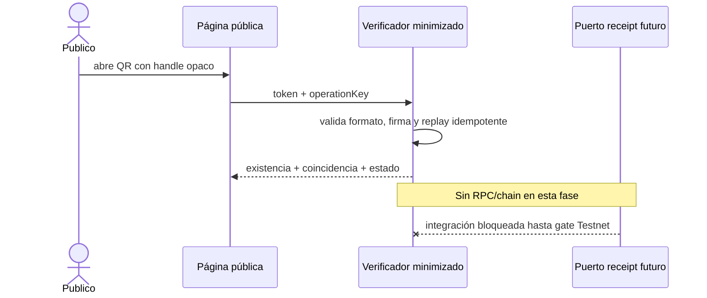

# Verificación pública QR — especificación de demo

Estado: implementable solo con fixtures sintéticos. No es receta, certificación clínica, asesoría jurídica ni declaración de cumplimiento.

## Contrato público

La ruta sin cuenta recibe exclusivamente un token `handle.signature`. El handle debe ser aleatorio, de alta entropía y no derivado de identidad o contenido clínico. La respuesta usa una allowlist cerrada:

```ts
{ demo: true, evidenceExists: boolean, proofMatches: boolean, status: 'active' | 'revoked' | 'expired' | 'unavailable' }
```

No se publican ficha, identidad, RUT, diagnóstico, medicamento, dosis, gramaje, saldo, fechas clínicas, direcciones, wallets, actores, historial, identificadores internos ni detalle de dispensación. Entradas desconocidas, malformadas o manipuladas producen la misma envolvente mínima y no se reflejan en la respuesta.

La firma de esta fase es un fixture determinista embebido y solo prueba el contrato UI. No acredita autenticidad fuera de la demo. Una fase posterior debe verificar server-side una firma gestionada fuera del navegador y, tras autorización específica, resolver un receipt opaco en Stellar Testnet.



El detalle de dispensación solo podrá consultarse en una superficie autenticada con rol, propósito y auditoría. El acceso ampliado de autoridades requiere definir autoridad competente, base jurídica, alcance y autenticación; no se implementará como enlace público permanente.

## Amenazas y controles

| Riesgo | Control demo | Límite pendiente |
|---|---|---|
| Enumeración | handle no secuencial y respuesta negativa uniforme | rate limit/gateway server-side |
| Manipulación | integridad de fixture verificada y fail-closed | firma KMS productiva |
| Replay | una operation key no puede sustituir otro token; repetición exacta es idempotente | nonce server-side para operaciones futuras |
| Fuga de campos | allowlist y tests negativos | revisión de logs/CDN/backend |
| Indexación | `noindex/nofollow/noarchive` | cabecera HTTP y política CDN |

## Backlog y gates

1. **Cerrado en demo:** tipos, estados, fixtures sintéticos, página pública minimizada y pruebas negativas.
2. **Siguiente gate técnico:** revisión humana del contrato, accesibilidad y Browser QA.
3. **Bloqueado:** endpoint server-side, rate limiting, firma KMS, almacenamiento privado y receipt Stellar Testnet.
4. **Gate profesional:** definir vigencia, revocación y autoridad competente con revisión jurídica/clínica/farmacéutica.
5. **Prohibido:** datos reales, receta válida, historia pública, producción, mainnet o despliegue Testnet.

## Controles implementados y evidencia

| Control cerrado en la demo local | Evidencia reproducible |
|---|---|
| DTO público limitado a cuatro campos y sin detalle clínico | `npm run test:public-verification`: compara la allowlist exacta y escanea campos prohibidos |
| Handles opacos no secuenciales y ruta estricta | el mismo test exige longitud mínima y rechaza número, correo y RUT |
| Manipulación fail-closed | fixture alterado y handle desconocido producen la misma respuesta mínima |
| Replay de lectura idempotente | repetición exacta conserva resultado; cambiar token con la misma `operationKey` falla cerrado |
| Estados vigente, revocado y expirado | fixtures sintéticos cubren los tres estados |
| Separación de datos | el test impide endpoint Stellar heredado, campos de actores/cantidades y enlace al explorer |
| Integración al gate general | `npm run preflight` incluye esta suite antes de TypeScript y build |

No están implementados: firma productiva, secreto server-side, KMS, rate limiting, cabeceras HTTP, autorización por roles, almacenamiento clínico, receipt Soroban o consulta Testnet. Los roles y el detalle clínico permanecen fuera de la superficie pública y siguen siendo gates de arquitectura, no capacidades verificadas. El token permanece en URL/historial durante esta demo local; una fase server-side debe aplicar política de referrer, no-store, redacción de logs y rotación.
