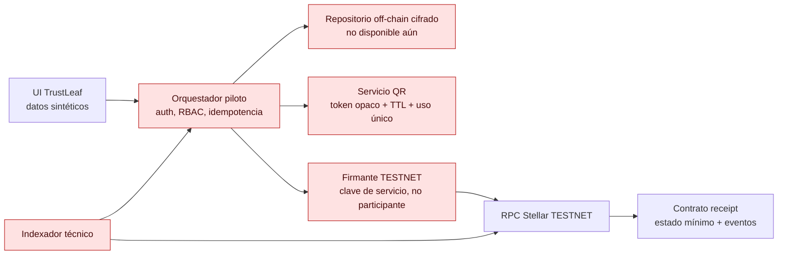
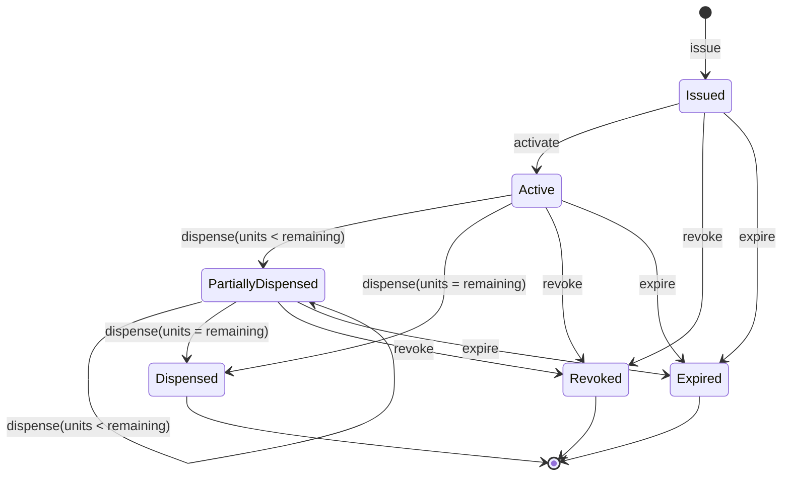
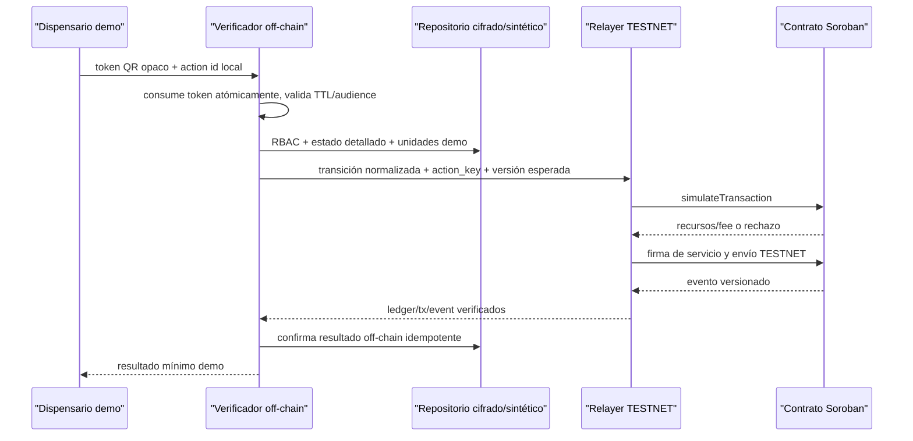
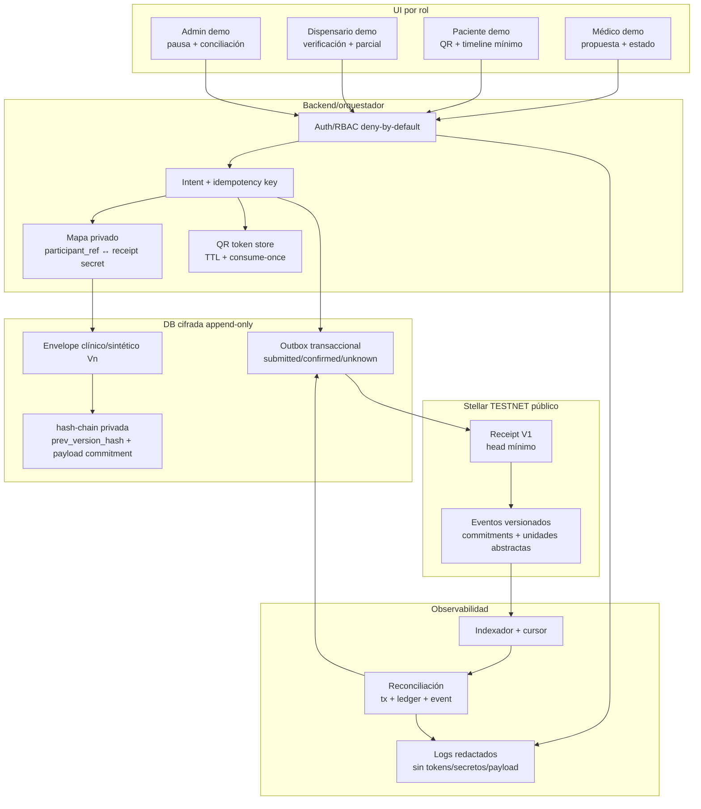
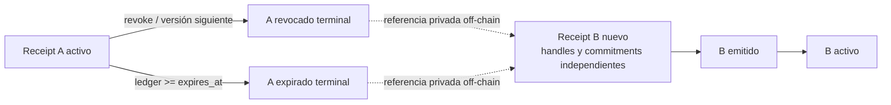

# Arquitectura implementable: receipt versionado en Stellar TESTNET

**Estado:** propuesta técnica, no implementación.

**Red:** exclusivamente Stellar TESTNET.

**Alcance humano:** demostración con identidades y datos sintéticos; no receta válida, atención clínica, dispensación farmacéutica, pagos, fondos ni Mainnet.

Esta propuesta reemplaza, para el siguiente experimento técnico, la recomendación anterior de una demo completamente off-chain. Adopta la opción B: un receipt no transferible, implementado como estado de contrato Soroban y eventos append-only. No es NFT, token, saldo económico ni prueba de cumplimiento. La fuente clínica y el estado detallado siguen siendo off-chain, cifrados y sujetos a RBAC.

## 1. Invariantes no negociables

1. La cadena nunca recibe PII/PHI, RUT, nombre, email, dirección, diagnóstico, medicamento, dosis, PDF, contenido de receta, identificador de paciente/médico/dispensario, wallet de participante ni hash directo de esos valores.
2. Un hash sin secreto de datos de baja entropía tampoco es seguro. Todo commitment se deriva de material aleatorio de al menos 256 bits y separación de dominio; nunca de campos clínicos solos.
3. El receipt solo expresa una transición técnica sintética: `Issued`, `Active`, `PartiallyDispensed`, `Dispensed`, `Revoked` o `Expired`.
4. Cada transición crea una versión y un evento; metadata mutable no es fuente de verdad y no se sobreescribe la historia.
5. El saldo representa unidades demo abstractas, no cantidad, dosis ni inventario farmacéutico. La relación con cualquier concepto clínico existe únicamente en el repositorio cifrado off-chain.
6. El QR no contiene el receipt, el commitment ni una dirección Stellar. Contiene un token opaco, corto en tiempo y de un solo propósito, resuelto por el verificador off-chain.
7. El contrato falla cerrado: actor, rol técnico, versión, estado, expiración, idempotencia o autorización ausente/inválida implica rechazo.
8. TESTNET puede reiniciarse y no ofrece garantía operacional. Los eventos y el estado deben tratarse como demostración reproducible, no archivo clínico.

## 2. Decisión y límite de privacidad

Un registro público que permite comprobar una secuencia de estados necesariamente revela alguna relación entre transiciones. No es posible prometer simultáneamente trazabilidad pública por receipt y cero correlación temporal. Para la demostración se acepta solo **correlación técnica interna al lifecycle sintético**, sin vínculo público con una persona, organización, wallet de participante o contenido clínico.

Se reducen los enlaces mediante handles rotativos: cada versión consume un `current_handle` aleatorio y publica un `next_handle_commitment`. Aun así, una transición y sus eventos dentro de la misma transacción pueden relacionarse. Antes de cualquier dato o usuario real se requiere un threat model aprobado que decida entre este modelo, batching/Merkle roots o abandonar el receipt individual público.

## 3. Límites del sistema



El repositorio actual contiene UI con mocks/fallbacks y no cuenta con persistencia clínica lista: las reglas/cloud de Firestore no soportan este flujo y Supabase no está configurado. Por eso el primer sprint solo puede usar fixtures sintéticos, un adaptador en memoria y cuentas TESTNET de servicio separadas. No se debe ocultar un fallo de RPC detrás de un éxito local.

## 4. Modelo del receipt

### 4.1 Tipos conceptuales (IDL, no código)

```text
type HandleCommitment = BytesN<32>   // H(domain || random_handle || blind)
type PayloadCommitment = BytesN<32>  // HMAC/commitment producido off-chain sobre envelope cifrado versionado
type ActionKey = BytesN<32>           // H(domain || random idempotency secret), nunca dato de negocio
type Version = u32
type DemoUnits = u32                  // unidad abstracta; máximo acotado por configuración
type LedgerSequence = u32

enum ReceiptStatus {
  Issued,
  Active,
  PartiallyDispensed,
  Dispensed,
  Revoked,
  Expired
}

struct ReceiptHead {
  version: Version,
  status: ReceiptStatus,
  remaining_units: DemoUnits,
  current_handle_commitment: HandleCommitment,
  payload_commitment: PayloadCommitment,
  expires_at_ledger: LedgerSequence,
  last_action_key: ActionKey
}

struct TransitionReceipt {
  version: Version,
  prior_status: ReceiptStatus,
  next_status: ReceiptStatus,
  prior_remaining: DemoUnits,
  next_remaining: DemoUnits,
  prior_handle_commitment: HandleCommitment,
  next_handle_commitment: HandleCommitment,
  payload_commitment: PayloadCommitment,
  action_key: ActionKey,
  effective_ledger: LedgerSequence
}
```

`PayloadCommitment` compromete un envelope cifrado y aleatorizado, nunca el JSON clínico. El envelope incluye un nonce aleatorio nuevo por versión. Su formato exacto y custodia de claves pertenecen al diseño off-chain posterior.

### 4.2 Almacenamiento

- `Instance`: configuración pequeña (`admin`, conjunto de operadores, pausa, versión de esquema). Debe tener estrategia explícita de extensión TTL.
- `Persistent`: `ReceiptHead` y cada `TransitionReceipt`, separados por claves para evitar reescribir estructuras grandes. Aunque el dato puede archivarse al vencer TTL, no se asume permanencia automática.
- `Temporary`: nonces/action keys consumidos hasta un ledger absoluto, cuando solo se necesiten para ventana anti-replay. Para idempotencia histórica se conserva también el action key de la transición persistente.
- Nunca almacenar arrays sin límite. La historia se consulta por eventos/indexador y por versión individual.

Soroban cobra y limita instrucciones, accesos, bytes leídos/escritos, tamaño de transacción, eventos/retorno y renta de almacenamiento. Los valores de red cambian; la implementación debe consultar `stellar network settings` y simular cada transacción antes de firmar, no fijar un coste en documentación.

## 5. Interfaz propuesta

| Función | Autorización | Precondiciones | Resultado |
|---|---|---|---|
| `initialize(admin, operator_set_hash, schema_version)` | despliegue único | contrato sin inicializar | configuración TESTNET |
| `issue(operator, initial_units, first_handle, payload_commitment, expires_at, action_key)` | operador emisor | unidades `1..MAX`, expiración futura, action nueva | versión 1 `Issued` |
| `activate(operator, current_handle, expected_version, next_handle, payload_commitment, action_key)` | operador emisor | `Issued`, versión exacta, no expirado | `Active` |
| `dispense(operator, current_handle, expected_version, units, next_handle, payload_commitment, action_key)` | operador dispensador | `Active/PartiallyDispensed`, `0 < units <= remaining` | `PartiallyDispensed` o `Dispensed` |
| `revoke(operator, current_handle, expected_version, next_handle, payload_commitment, action_key)` | operador revocador | no terminal, versión exacta | `Revoked` |
| `expire(operator, current_handle, expected_version, next_handle, payload_commitment, action_key)` | operador keeper | ledger >= expiración y estado no terminal | `Expired` |
| `get_head(handle_commitment)` | lectura pública | handle commitment conocido | estado técnico mínimo |
| `get_transition(handle_commitment, version)` | lectura pública | clave conocida | transición técnica |
| `pause(admin)` / `unpause(admin)` | admin | política multisig operacional | bloquea mutaciones salvo administración |
| `rotate_operator_set(admin, new_set_hash)` | admin | cambio auditado | nueva política técnica |

La `Address` autorizante pertenece a servicios del piloto, no al médico, paciente o dispensario. Cada función mutante usa `require_auth`/`require_auth_for_args`, compara versión y estado, y registra `action_key`. La protección nativa de autorización de Soroban no sustituye la idempotencia de negocio: reintentos después de respuestas inciertas deben devolver el resultado previo solo si todos los argumentos normalizados coinciden; si la misma action key llega con argumentos diferentes, se rechaza.

## 6. Estados y transiciones



Reglas adicionales:

- `remaining_units` solo disminuye y nunca desborda.
- Activar no cambia unidades.
- Revocar/expirar no “borra” saldo; impide consumirlo y preserva historia.
- Renovar no reabre un receipt terminal: crea otro receipt con material aleatorio independiente y relación solo off-chain.
- No existe transferencia, owner, balance token, mint, burn, aprobación ni metadata actualizable.

## 7. Eventos append-only

Un único evento uniforme reduce errores de indexación:

```text
event ReceiptTransitionV1 {
  schema_version: u32,
  transition_kind: Issued | Activated | PartiallyDispensed | Dispensed | Revoked | Expired,
  version: u32,
  prior_status: Option<ReceiptStatus>,
  next_status: ReceiptStatus,
  prior_remaining: u32,
  next_remaining: u32,
  prior_handle_commitment: Option<BytesN<32>>,
  next_handle_commitment: BytesN<32>,
  payload_commitment: BytesN<32>,
  action_key: BytesN<32>,
  effective_ledger: u32
}
```

No incluir addresses en tópicos propios. La transacción pública aún revela la cuenta fuente/firmante, por lo que se usa un relayer común del piloto y no cuentas de participantes. Los eventos son evidencia técnica indexable; no sustituyen el estado del contrato, el expediente cifrado ni una auditoría clínica.

## 8. Errores fail-closed

```text
NotInitialized, AlreadyInitialized, Paused, Unauthorized,
UnknownReceipt, HandleMismatch, VersionConflict, InvalidTransition,
AlreadyTerminal, Expired, NotYetExpired, InvalidUnits, InsufficientUnits,
InvalidExpiry, DuplicateAction, ActionConflict, InvalidCommitment,
StorageUnavailable, SchemaUnsupported
```

Una invocación no debe producir evento de éxito si falla. El adaptador traduce errores a respuestas mínimas (`valid`, `inactive`, `used`, `expired`, `temporarily_unavailable`) sin revelar historia ni razón clínica.

## 9. QR, idempotencia y anti-replay



- El token QR es aleatorio, audience-bound, con TTL corto y consumo atómico. Una captura/reimpresión falla al segundo uso.
- `action_key` se genera aleatoriamente por intención normalizada y se conserva antes de enviar a red; nunca es el token QR ni un hash de PII.
- Ante timeout: consultar transacción/evento por action key antes de reintentar. Nunca crear una nueva intención silenciosamente.
- La comparación `expected_version` impide dos dispensaciones parciales concurrentes sobre el mismo saldo.
- La confirmación UI ocurre solo tras inclusión y verificación del evento; un fallo RPC no se presenta como dispensación realizada.

## 10. Cuentas, custodia y claves

### Demostración TESTNET mínima

| Identidad técnica | Uso | Custodia |
|---|---|---|
| deployer-admin | despliegue, pausa, rotación, upgrade futuro | clave separada y offline durante la demo; idealmente multisig Stellar antes del piloto humano |
| relayer-issuer | `issue`, `activate`, `revoke` según policy | secreto en gestor de secretos local/CI aislado, nunca en frontend o repo |
| relayer-dispenser | `dispense` demo | secreto distinto, alcance contractual limitado |
| keeper | `expire` | cuenta de automatización de mínimo privilegio |
| fee sponsor opcional | paga fees TESTNET mediante política controlada | sin fondos reales; límites por rate/allowlist |

El médico, paciente y dispensario no reciben seed phrase ni wallet. Se autentican off-chain con identidades sintéticas; el orquestador aplica RBAC y el relayer firma. Esto es custodia de servicio para una demo, no arquitectura de identidad definitiva.

### Reglas de gestión

- Seeds nunca en navegador, QR, logs, commits, variables `VITE_*` ni respuestas API.
- Secretos separados por entorno y rol, rotación ensayada, revocación y runbook de pérdida.
- Admin no firma operaciones cotidianas. Operadores no pueden actualizar Wasm ni política.
- Toda actualización futura de Wasm requiere hash reproducible, pruebas de migración, timelock/procedimiento de dos personas y evento del sistema; no se habilita upgrade en el sprint mínimo salvo diseño explícito.
- Rate limits, allowlist de contrato/red/passphrase y hard stop si network no es TESTNET.

## 11. Soporte Stellar, costes y límites operativos

- Soroban soporta contratos Wasm/Rust, almacenamiento de contrato, eventos y autorización por `Address`; `require_auth` aprovecha protección de replay del host para la autorización.
- Cada invocación de contrato usa una operación de smart contract y debe simularse por RPC para obtener footprint, recursos y fee antes de enviar.
- Fees incluyen inclusión y recursos; escritura/TTL/eventos tienen coste variable. No prometer coste fijo. Medir p50/p95 en TESTNET por transición.
- Storage tiene TTL. Persistent/instance puede archivarse y temporary se elimina; la extensión/restore debe presupuestarse y probarse. Off-chain conserva el registro operacional cifrado.
- Eventos y datos de ledger son públicos. Eliminar un valor del estado actual no elimina historia pública.
- TESTNET es descartable y puede reiniciarse. El demo debe poder redesplegar, reseedear fixtures y reconciliar desde cero.
- Indexadores/RPC pueden retrasarse o fallar. La app distingue `submitted`, `confirmed`, `failed` y `unknown`; nunca infiere éxito por HTTP 200 del relayer.

Referencias oficiales consultadas para esta propuesta:

- [Autorización de contratos](https://developers.stellar.org/docs/learn/fundamentals/contract-development/authorization)
- [Almacenamiento y TTL](https://developers.stellar.org/docs/learn/fundamentals/contract-development/storage/persisting-data)
- [Elección de storage](https://developers.stellar.org/docs/build/guides/storage/choosing-the-right-storage)
- [Fees, recursos y simulación](https://developers.stellar.org/docs/learn/fundamentals/fees-resource-limits-metering)
- [Límites actuales por red](https://developers.stellar.org/docs/networks/resource-limits-fees)
- [Eventos de contrato](https://developers.stellar.org/docs/build/smart-contracts/example-contracts/events)
- [Upgrade de Wasm](https://developers.stellar.org/docs/build/guides/conventions/upgrading-contracts)

## 12. Fronteras de integración con el repositorio actual

Interfaces futuras, neutrales a proveedor:

```text
ClinicalEnvelopeStore        // cifrado, versionado, RBAC; no implementado
OpaqueQrTokenStore           // TTL/consume-once; inicialmente memoria sintética
ReceiptLedgerPort            // simulate/submit/query/reconcile
ReceiptEventIndexer          // cursor, confirmación y reorg/reinicio TESTNET
PilotIdentityPolicy          // identidad demo -> rol técnico; deny by default
AuditPort                    // sin payload/tokens/seeds
```

No conectar directamente componentes React a RPC. UI -> servicio de aplicación -> puertos. Un adaptador `InMemoryReceiptLedger` permite tests deterministas; el adaptador Stellar TESTNET se habilita solo con bandera server-side, contract ID allowlisted y passphrase TESTNET. Firestore/Supabase no deben presentarse como resueltos ni usarse como clínica definitiva en esta etapa.

## 13. Estrategia de pruebas

### 13.1 Trazabilidad end-to-end por capas



La correlación participante/receipt vive exclusivamente en `MAP`, cifrada y autorizada. Un `participant_ref` interno debe ser aleatorio y distinto por entorno; no se deriva de RUT, email, wallet ni identity-provider subject. El contrato nunca puede resolverlo.

La cadena privada off-chain de versiones usa conceptualmente:

```text
private_version_hash[n] = H(
  domain || random_nonce[n] || encrypted_envelope[n] ||
  private_version_hash[n-1] || onchain_transition_commitment[n]
)
```

Este hash-chain permite detectar alteraciones en el repositorio autorizado. No se publica directamente si pudiera facilitar correlación o ataques de diccionario. El contrato guarda solo el commitment aleatorizado de la versión y el estado técnico mínimo.

### 13.2 Emisión y vínculo opaco

```mermaid
sequenceDiagram
    participant M as "Médico demo"
    participant B as "Backend"
    participant DB as "DB cifrada append-only"
    participant L as "Receipt TESTNET"

    M->>B: propuesta sintética + intent id
    B->>B: auth/rol/gates + normalización
    B->>DB: guarda envelope V1 + mapa privado aleatorio
    DB-->>B: payload commitment + outbox pending
    B->>L: issue(action_key, handles, commitment, units demo)
    L-->>B: ReceiptTransitionV1(version=1)
    B->>DB: confirma tx/ledger/event; nunca reescribe V1
    B-->>M: emitido en TESTNET, no clínicamente válido
```

El vínculo opaco se construye después de almacenar el envelope y antes del submit. Si guardar el outbox falla, no se envía. Si la red queda `unknown`, el backend reconcilia la misma action key; no crea otro receipt.

### 13.3 Parcial, doble uso y orden temporal

```mermaid
sequenceDiagram
    participant P as "Paciente demo"
    participant D1 as "Dispensario demo A"
    participant D2 as "Dispensario demo B"
    participant V as "Verificador"
    participant L as "Receipt TESTNET"

    P->>D1: QR opaco T1
    D1->>V: consume T1 + partial intent
    V->>V: consumo atómico T1; expected_version=2
    V->>L: dispense(units, version=2, action=A)
    L-->>V: version=3 PartiallyDispensed
    D2->>V: reutiliza copia T1
    V-->>D2: rechazado: token consumido
    D2->>V: QR nuevo T2, intenta misma version=2
    V->>L: dispense(... expected_version=2 ...)
    L-->>V: VersionConflict
```

El ledger sequence establece orden técnico de inclusión, no la hora clínica. La UI puede mostrar `confirmado en ledger N`, pero no traducirlo a “atendido/dispensado legalmente a las HH:MM”. El backend conserva reloj de aplicación y reloj de ledger por separado.

### 13.4 Revocación, expiración y renovación



Renovación nunca muta, reactiva ni enlaza públicamente A y B. La UI autorizada puede construir una timeline desde el mapa privado; la vista pública/QR solo responde por el receipt consultado. Revocación gana frente a una dispensación no confirmada si su versión se incluye primero; la otra operación recibe conflicto. Expiración requiere invocación explícita o debe tratarse como expirada por regla de lectura cuando el ledger supera el límite, incluso antes de que el keeper materialice el evento.

### 13.5 Consultas por rol y minimización

| Rol | Fuente autorizada | Puede ver | Nunca recibe |
|---|---|---|---|
| paciente demo | backend + mapa privado propio | estado mínimo, unidades demo restantes, QR nuevo, timeline propia | seeds, action keys, payload commitment, identities de operadores |
| médico demo | backend/RBAC sobre relación explícita | propuesta sintética y estados asociados | actividad de otros participantes, secretos del receipt |
| dispensario demo | verificador por QR/audience | resultado mínimo, unidades demo autorizadas para esa intención | identidad/historia/diagnóstico/contenido, timeline completa |
| admin técnico | observabilidad y reconciliación | tx, ledger, evento, métricas, estado de claves sin secreto | payload clínico por defecto |
| público/indexador | Stellar TESTNET | eventos y estado técnico publicados | vínculo legítimo a persona o contenido; este límite depende de que el diseño no filtre correlaciones |

Las lecturas contractuales son públicas; “RBAC on-chain para lectura” no proporciona confidencialidad. Toda vista sensible debe salir del backend cifrado, no del contrato.

### 13.6 Evidencia técnica versus validez

| Evidencia | Sí puede demostrar | No puede demostrar |
|---|---|---|
| firma/autorización Soroban | una dirección técnica autorizó argumentos de una invocación | identidad real, licencia o intención clínica de una persona |
| evento confirmado | contrato ejecutó transición Vn en TESTNET | dispensación física, legalidad o verdad del payload |
| commitment | el poseedor del secreto puede comparar una versión exacta | contenido, autoría, consentimiento o calidad clínica por sí solo |
| hash-chain off-chain | continuidad/integridad técnica de versiones disponibles | que el dato original fuera correcto o lícito |
| QR consume-once | token concreto no puede aceptarse dos veces por el verificador | imposibilidad universal de falsificación o uso fuera del sistema |

### 13.7 Reutilización y gaps concretos del repositorio

| Elemento actual | Reutilizable | Gap antes de conectar TESTNET |
|---|---|---|
| UI/portal y fixtures sintéticos | composición, navegación y escenarios demo | separar estados locales de confirmaciones reales; etiquetas `pending/unknown` |
| guards/preflight y auditor médico | patrón fail-closed y gates reproducibles | agregar contrato de capacidades Stellar y scans de payload/eventos |
| adaptadores de servicios existentes | forma de puerto, si no expone secretos al cliente | no hay `ReceiptLedgerPort` ni outbox transaccional verificado |
| Firebase/login actual | solo referencia de auth demo | reglas cloud no listas, RBAC/persistencia incompatibles |
| Supabase | nada operacional | no configurado; decisión de DB cifrada pendiente |
| Stellar/testnet previo del producto | utilidades solo tras auditoría independiente | aislar de pagos/assets/DeFindex; allowlist TESTNET y contrato dedicado |
| estados de receta/mock | nombres de escenarios, no semántica clínica | mapear a propuesta sintética/receipt técnico; evitar declaraciones de validez |

### 13.8 Prueba TESTNET mínima trazable

La evidencia mínima de ST-08 debe ser un paquete reproducible, sin secretos:

1. hash del Wasm, contract ID TESTNET, network passphrase y commit de fuente;
2. fixtures aleatorios y diccionario que pruebe que ninguno contiene datos prohibidos;
3. transacciones/eventos de `issue → active → partial → dispensed` y `issue → active → revoked`;
4. rechazo demostrable de QR usado, action conflict, versión vieja, exceso, actor incorrecto y receipt terminal;
5. reconciliación de un timeout inducido sin duplicación;
6. export de recursos/fees/TTL por operación y estado final reconstruido desde eventos;
7. captura de UI de los tres roles con etiquetas demo y sin afirmación clínica/legal;
8. informe de correlación pública residual y decisión explícita de no usar datos reales.

Este paquete es evidencia de funcionamiento técnico en TESTNET, no autorización para piloto clínico.

### Contrato local

- Matriz completa de transiciones permitidas/rechazadas.
- Autorización por rol, operador revocado, pausa y admin separado.
- Versión esperada, doble envío, misma action/argumentos, misma action/argumentos distintos.
- Parciales sucesivos, consumo exacto, cero, exceso, underflow/overflow y concurrencia.
- Expiración en bordes de ledger; terminalidad y renovación separada.
- Eventos exactos por transición y ausencia de evento en error.
- Property tests: saldo monótono, una sola terminal, versión estrictamente creciente.
- Scan serializado que rechace strings/bytes derivados de fixtures prohibidos.

### Integración TESTNET

- Deploy reproducible con hash Wasm y network passphrase comprobados.
- `simulateTransaction` + submit + confirmación + lectura/evento para cada transición.
- Reintento tras timeout sin duplicar efecto; RPC caído produce `unknown`, no éxito.
- Dos dispensaciones simultáneas: una confirma, otra recibe conflicto de versión.
- TTL/restore en fixture de vida corta; redeploy después de reset TESTNET.
- Métricas de instrucciones, read/write bytes, eventos, rent y fee por operación.
- Verificación de que explorador, evento, estado y logs no contienen términos/datos prohibidos.

### Flujo de tres participantes, solo sintético

1. Admin incorpora identidades demo de médico, paciente y dispensario fuera de cadena.
2. Médico-demo crea propuesta sintética; orquestador emite y activa receipt TESTNET.
3. Paciente-demo muestra QR opaco y efímero.
4. Dispensario-demo verifica y consume parte de unidades abstractas.
5. Segundo uso del mismo QR se rechaza; nuevo QR permite consumo final o revocación.
6. Los tres ven estados mínimos y etiquetas inequívocas `DEMO / TESTNET / NO VÁLIDO CLÍNICAMENTE`.

No se prueba identidad profesional real, consentimiento jurídico, receta válida, contenido clínico, entrega farmacéutica, inventario, pagos ni cumplimiento.

## 14. Backlog técnico por etapas

### Sprint 1 — demostración on-chain mínima segura

| ID | Tarea cerrada | Criterio verificable |
|---|---|---|
| ST-01 | ADR final de privacidad y formato de commitments | vectors con dominio/nonces; prohibición de hashes directos; riesgo de linkability aceptado solo para sintéticos |
| ST-02 | Especificar IDL y máquina de estados V1 | tabla/error/event schema congelados; revisión cruzada con UX y QA |
| ST-03 | Scaffold de contrato en workspace separado | sin token/NFT/dependencias frontend; build reproducible y hash Wasm |
| ST-04 | Implementar estados y autorización | unit/property tests de matriz, partial, terminalidad, pause y roles |
| ST-05 | Adaptador `ReceiptLedgerPort` en memoria | mismos contratos de comportamiento que Stellar; errores fail-closed |
| ST-06 | Adaptador Stellar TESTNET server-side | red/contract allowlist, simulate-submit-confirm, idempotencia y estados `unknown` |
| ST-07 | Fixture QR opaco consume-once en memoria | TTL, audience, segundo uso, rotación y concurrencia probados |
| ST-08 | Deploy efímero TESTNET y smoke E2E sintético | issue→active→partial→dispensed y active→revoked; explorer scan limpio |
| ST-09 | Reporte de recursos y runbooks | coste medido, TTL/reset, rotación de claves, pausa, RPC failure y teardown |

ST-03 en adelante requiere nueva autorización: este documento no agrega código.

### Sprint 2 — endurecimiento previo a piloto humano

- Repositorio cifrado no productivo y transaccional; decisión Firestore/Supabase/Postgres mediante ADR.
- Auth/RBAC real en emulador, separación issuer/dispenser/admin, KMS/HSM o custodia equivalente.
- Indexador con cursor/reconciliación, observabilidad sin contenido y pruebas de recuperación.
- Auditoría externa del contrato, threat model/DPIA y revisión de correlación pública.
- UX accesible para `submitted/confirmed/unknown/rejected` y respuesta mínima.

### Gates antes de cualquier operación real

- Aprobación legal chilena sobre identidad, firma, receta, tratamiento de datos y rol del comprobante.
- Aprobación clínica del workflow y responsabilidad profesional.
- Aprobación químico-farmacéutica sobre verificación, parcialidad, revocación y conservación.
- Seguridad: pentest, auditoría Soroban, KMS, restore drill, incident response y control de terceros.
- Privacidad: DPIA, minimización, retención, derechos y evaluación bajo Ley 21.719.
- Solo después se decide si la arquitectura individual es aceptable; Mainnet, pagos y datos reales requieren decisiones separadas.

## 15. Condiciones de stop/no-go

Detener el piloto si: aparece cualquier dato o identificador prohibido en cadena/logs; network no es TESTNET; falta confirmación del evento; se pierde una clave; falla RBAC; no puede reconciliarse `unknown`; TESTNET resetea sin recuperación ensayada; un QR se reutiliza; se duplica una transición; o alguien interpreta el receipt como receta/legalidad. El sistema debe priorizar rechazo y evidencia sobre continuidad de la demo.
