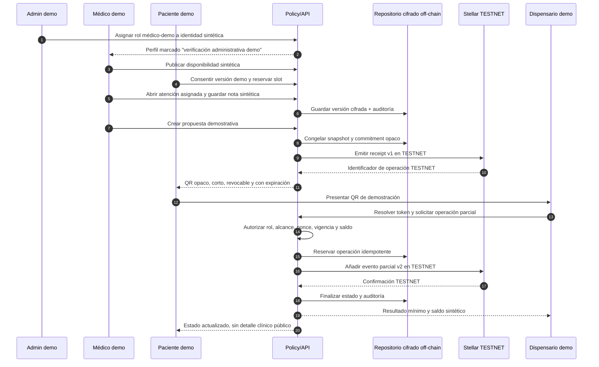
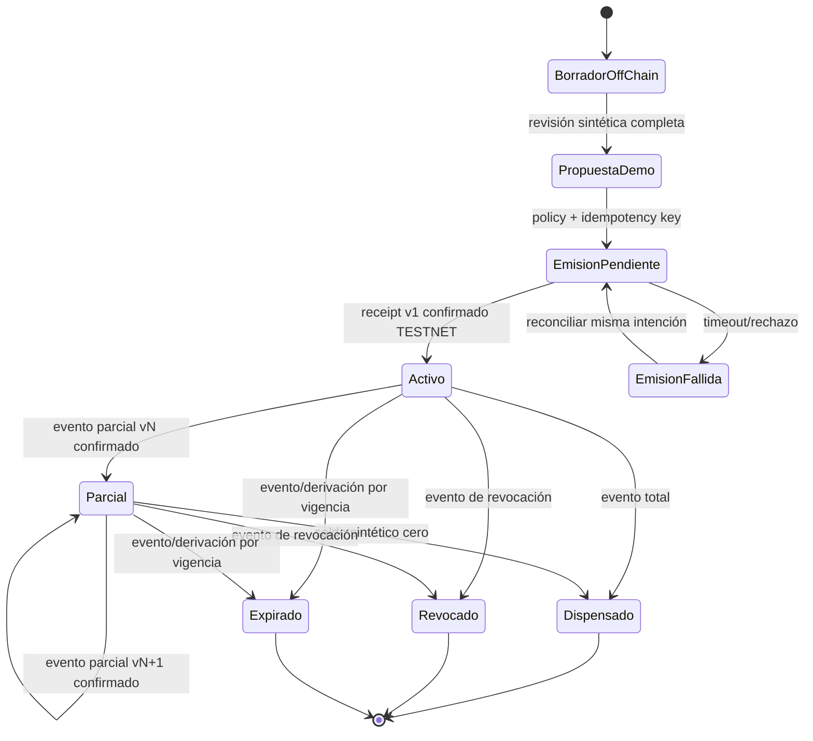
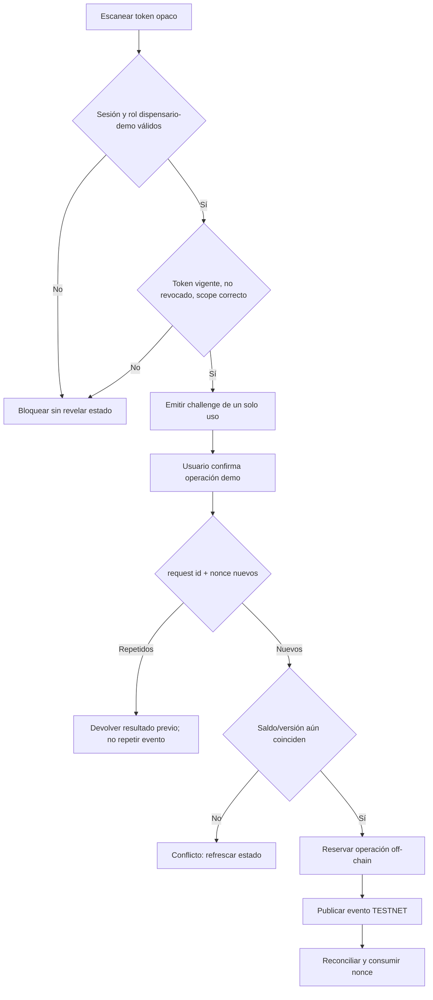

# UX del piloto demostrativo Stellar TESTNET

Estado de referencia: blueprint interno en `34c3bb2`. Documento de diseño; no implementa pantallas, persistencia, cuentas ni contratos.

El piloto permite a tres participantes usar datos totalmente sintéticos para demostrar un recibo opaco y eventos versionados en Stellar TESTNET. No emite una receta legal o clínicamente válida, no habilita dispensación farmacéutica, no usa dinero y no prueba cumplimiento. La fuente clínica detallada debe permanecer cifrada off-chain. Nunca se publica PII/PHI, RUT, diagnóstico, dosis, PDF, receta ni un identificador correlacionable en cadena.

## Leyenda y lenguaje obligatorio

- **M — Mock:** UI o cálculo local con fixtures sintéticos.
- **I — Infraestructura:** identidad, autorización, persistencia cifrada, auditoría, firma, servicio QR o Stellar TESTNET verificables.
- **G — Gate:** aprobación legal, clínica o farmacéutica necesaria antes de un uso real.
- **T — TESTNET:** transacción demostrativa, sin valor ni efecto clínico.
- **Fail-closed:** identidad, rol, consentimiento, versión, saldo, vigencia o configuración dudosa bloquean la operación.

Todas las pantallas visibles durante el piloto muestran de forma persistente: `DEMOSTRACIÓN · DATOS SINTÉTICOS · STELLAR TESTNET · SIN VALIDEZ CLÍNICA`.

No usar en etiquetas, estados o mensajes: “receta válida”, “médico verificado” sin calificador demo, “dispensación aprobada”, “auténtico”, “infalsificable”, “inmutable” o cualquier promesa de cumplimiento.

## Recorrido de los tres participantes

Una confirmación de red nunca reemplaza la autorización del policy gate ni el estado off-chain. La UI presenta por separado `registro TESTNET confirmado` y `operación demo autorizada`.

## Mapa de pantallas y responsabilidades

| Paso / pantalla | Actor | Clasificación | Acción visible | Evidencia exigida para continuar | Gate o límite |
|---|---|---|---|---|---|
| Acceso y selector de rol | Todos | M/I | Entrar a un espacio demo por rol | sesión sintética y claim emitido por servidor | nunca confiar en rol del cliente |
| Solicitud médico-demo | Médico/admin | M/I/G | Cargar marcador sintético; aceptar alcance | decisión administrativa auditada | no equivale a RNPI/SIS ni habilitación profesional |
| Perfil médico | Médico/paciente | M/I/G | Ver perfil y etiqueta demo | rol vigente y versión de perfil | sin datos profesionales reales en esta fase |
| Disponibilidad | Médico | M/I | Crear/retirar slots sintéticos | escritura autorizada, zona horaria y no solape | no prometer agenda persistente con fallback local |
| Reserva | Paciente | M/I | Mantener y confirmar slot | consentimiento vigente y reserva atómica | confirmación solo después de persistencia |
| Consentimiento | Paciente | M/I/G | Aceptar/rechazar versión demo | versión, timestamp, propósito y revocabilidad | no sustituye base jurídica aplicable |
| Atención/ficha | Médico | M/I/G | Ver resumen y nota sintéticos | asignación, rol, propósito y auditoría | datos reales bloqueados; sin efecto clínico |
| Seguimiento | Médico/paciente | M/I/G | Crear tarea demo | episodio persistido y alcance | no inferir seguimiento desde fixtures |
| Propuesta demostrativa | Médico | M/I/G | Crear y revisar una propuesta “NO VÁLIDA” | snapshot cifrado, versión y policy gate | no es receta ni instrucción de dispensación |
| Emisión receipt | Médico | I/T/G | Confirmar commitment opaco | idempotency key, firma, red TESTNET y snapshot congelado | botón bloqueado si red/cuenta/policy no son comprobables |
| Estado/QR | Paciente | I/T/G | Ver receipt, vigencia demo y QR | token opaco activo y servicio verificador | QR no contiene detalle clínico ni identificador estable |
| Verificación | Dispensario | I/T/G | Escanear y ver respuesta mínima | rol dispensario-demo, nonce no usado y estado consistente | no autoriza entrega farmacéutica real |
| Operación parcial | Dispensario | I/T/G | Ingresar cantidad sintética y confirmar | saldo reservado, request id único y evento previo confirmado | sin inventario, medicamento ni cantidad clínica real |
| Revocación/expiración | Médico/admin | I/T/G | Registrar nuevo evento | autorización, motivo interno off-chain y versión siguiente | no editar metadata ni evento anterior |
| Renovación | Médico | M/I/T/G | Crear nueva propuesta y receipt | nueva evaluación sintética, nuevo snapshot y commitment | nunca reactivar o sobrescribir receipt anterior |

## Estados y acciones permitidas

Reglas UX:

1. No hay transición directa desde borrador a activo: primero se persiste y congela una versión off-chain.
2. Cada acción de estado crea un evento nuevo; ningún evento ni metadata existente se modifica.
3. `Emisión pendiente` deshabilita reenvíos libres. La recuperación consulta/reconcilia la misma clave de idempotencia.
4. `Parcial` muestra unidades abstractas de demostración (`saldo demo`), nunca dosis, medicamento o indicación.
5. Estados terminales deshabilitan QR y acciones; renovación crea un receipt y QR nuevos sin enlazarlos públicamente.

## Tarjetas funcionales por rol

### Médico demo

- **Inicio:** agenda sintética, tareas y alertas de infraestructura; nunca presenta pacientes reales.
- **Atención:** resumen mínimo y nota ficticia, con indicador de versión y guardado confirmado.
- **Propuesta NO VÁLIDA:** vista previa sintética; confirma que no contiene instrucciones reales.
- **Receipt TESTNET:** previsualiza solo commitment, número de versión local, red y costo estimado de testnet; no muestra secreto de firma.
- **Revocar / renovar:** revocar agrega evento; renovar abre un nuevo borrador independiente.

### Paciente demo

- **Reserva y consentimiento:** permite rechazar o retirar consentimiento y explica el efecto demo.
- **Estado:** diferencia propuesta off-chain, receipt TESTNET y estado demo.
- **QR:** visible solo cuando está activo; botón para rotar token sin cambiar el receipt.
- **Actividad:** eventos mínimos y genéricos; sin actor detallado ni información clínica.

### Dispensario demo

- **Verificador:** cámara o ingreso manual de token opaco; no decodifica información en cliente.
- **Resultado mínimo:** `activo/parcial/dispensado/revocado/expirado`, saldo demo y expiración de sesión.
- **Operación parcial:** cantidad abstracta limitada al saldo demo; confirmación en dos pasos.
- **Comprobante:** request id local y operación TESTNET; no funciona como documento farmacéutico.

## QR, idempotencia y rechazo de replay

- El QR contiene un token aleatorio de vida corta, no el commitment, hash de una identidad, clave de cuenta ni payload clínico.
- Capturas o copias no permiten una segunda mutación: nonce y request id se consumen de forma atómica.
- Reintentar exactamente la misma intención devuelve el resultado anterior. Cambiar cantidad exige challenge nuevo y revalidación de saldo.
- Si Stellar no responde, la UI queda `pendiente de reconciliación`; nunca declara éxito ni permite otra operación incompatible.
- Rate limit, expiración de sesión y respuestas indistinguibles evitan usar el verificador para enumerar receipts.

## Mensajes fail-closed

| Condición | Mensaje al usuario | Comportamiento |
|---|---|---|
| Rol o sesión ausente | “No podemos comprobar tu autorización demo.” | ocultar datos y deshabilitar mutaciones |
| Infraestructura off-chain no disponible | “El registro seguro no está disponible. No se guardó ningún cambio.” | no usar fallback local para una confirmación |
| Red distinta de TESTNET | “La red configurada no está autorizada para esta demostración.” | bloquear firma/envío |
| Estado on-chain/off-chain divergente | “Estado en revisión. No realices otra operación.” | reconciliación administrativa auditada |
| QR vencido o revocado | “Este código no permite continuar.” | no revelar existencia, actor ni causa clínica |
| Replay/idempotency key repetida | “Esta solicitud ya fue procesada.” | devolver mismo resultado sin nuevo evento |
| Saldo o versión cambió | “El estado cambió. Actualiza antes de continuar.” | liberar reserva y exigir challenge nuevo |
| Falta aprobación profesional | “Esta función permanece limitada a datos sintéticos.” | bloquear datos y actos reales |

## Criterios de aceptación del recorrido

### Identidad, consentimiento y atención

- [ ] Los tres usuarios usan identidades ficticias y roles emitidos del lado servidor.
- [ ] Un usuario sin rol o con rol expirado no puede leer ni mutar la pantalla de otro actor.
- [ ] Rechazar o revocar consentimiento bloquea atención y emisión posterior.
- [ ] Guardar una nota demo crea versión y auditoría; no confirma hasta persistir.
- [ ] Ningún formulario admite o solicita RUT, diagnóstico, dosis o documentos reales.

### Receipt TESTNET y estados

- [ ] La emisión usa solamente un commitment opaco no correlacionable y red TESTNET verificada.
- [ ] Dos clics o reintentos con la misma idempotency key generan como máximo un evento.
- [ ] Cada parcial, total, revocación y expiración crea un evento versionado sin editar anteriores.
- [ ] La suma de operaciones sintéticas nunca supera el saldo demo; la concurrencia produce un solo ganador.
- [ ] Renovar crea nuevo receipt/commitment y deja el anterior terminal e inalterado.
- [ ] La UI distingue confirmación TESTNET, autorización demo y estado clínico off-chain.

### QR y privacidad

- [ ] El QR no revela contenido al decodificarse fuera del verificador.
- [ ] El mismo nonce no puede mutar estado dos veces, incluso en ventanas o dispositivos distintos.
- [ ] Un QR rotado o de estado terminal falla sin filtrar datos.
- [ ] Logs, explorer links y errores no contienen tokens, commitments combinados con identidades ni datos clínicos.
- [ ] Reduced motion, teclado, foco y mensajes de estado funcionan para las acciones críticas.

### Recuperación

- [ ] Un timeout deja la operación pendiente, reconciliable y sin falsa confirmación.
- [ ] Una caída de Firestore/Supabase o del repositorio futuro no activa fallback local para operaciones confirmables.
- [ ] Divergencias requieren cola administrativa auditada; el operador no puede “forzar activo” desde la UI.

## Qué pueden probar ahora los tres participantes

Cuando exista la infraestructura del backlog, médico, paciente y dispensario pueden probar con fixtures:

1. onboarding administrativo demo y separación de roles;
2. disponibilidad, consentimiento y reserva sintéticos;
3. atención y propuesta explícitamente no válida;
4. emisión de un commitment opaco como receipt en Stellar TESTNET;
5. entrega y rotación de QR opaco;
6. verificación mínima y una o más operaciones parciales abstractas;
7. rechazo de copia/replay y doble operación concurrente;
8. revocación, expiración y renovación como receipt nuevo;
9. reconciliación de un timeout simulado y trazabilidad técnica.

## Qué no deben probar todavía

- identidades, credenciales profesionales, pacientes o fichas reales;
- diagnóstico, dosis, producto, receta, PDF o consentimiento jurídicamente operativo;
- emisión o dispensación clínica/farmacéutica real;
- pagos, fondos, inventario o mainnet;
- integración productiva con Firestore, Supabase, SIS/RNPI, farmacia o custodios externos;
- afirmaciones de legalidad, autenticidad clínica, imposibilidad de falsificación o cumplimiento.

## Dependencias de implementación antes de habilitar el recorrido

| Prioridad | Entrega verificable | Tipo |
|---|---|---|
| P0 | policy gate fail-closed con claims de servidor y fixtures por rol | I |
| P0 | repositorio neutral en memoria para estados, versiones, idempotencia y auditoría | M/I |
| P0 | contrato de interfaces para receipt/eventos y adaptador Stellar TESTNET simulado | M/T |
| P0 | esquema de token QR opaco, challenge, nonce y rotación | I |
| P0 | pruebas de máquina de estados, concurrencia, replay y divergencia | I/T |
| P1 | pantallas mínimas por rol con etiquetas demo persistentes | M |
| P1 | adaptador Stellar TESTNET real con allowlist de red/cuenta y reconciliación | I/T |
| P1 | observabilidad sin secretos ni datos correlacionables | I |
| P2 | persistencia cifrada y KMS seleccionados mediante decisión arquitectónica reversible | I |
| Bloqueado | uso de datos reales, acto clínico o farmacéutico | G legal/clínico/farma |

Ni Firestore actual ni Supabase no configurado deben presentarse como persistencia clínica lista. El primer recorrido implementable debe funcionar con repositorios neutrales y fixtures, y activar el adaptador TESTNET únicamente detrás de configuración explícita, allowlist y kill switch.
