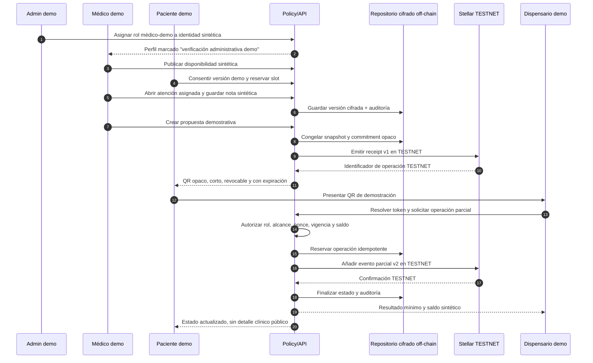
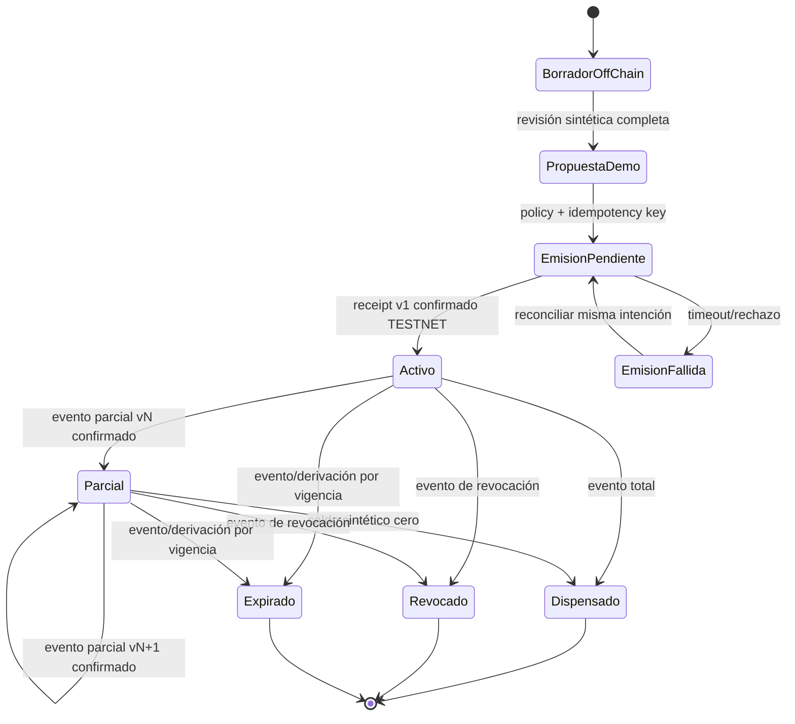
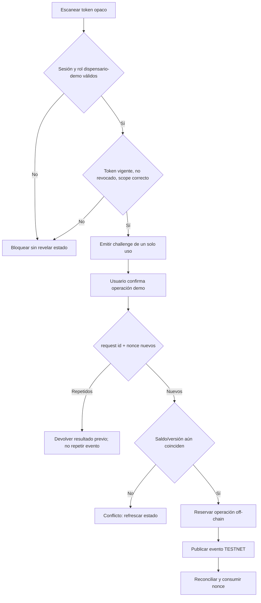
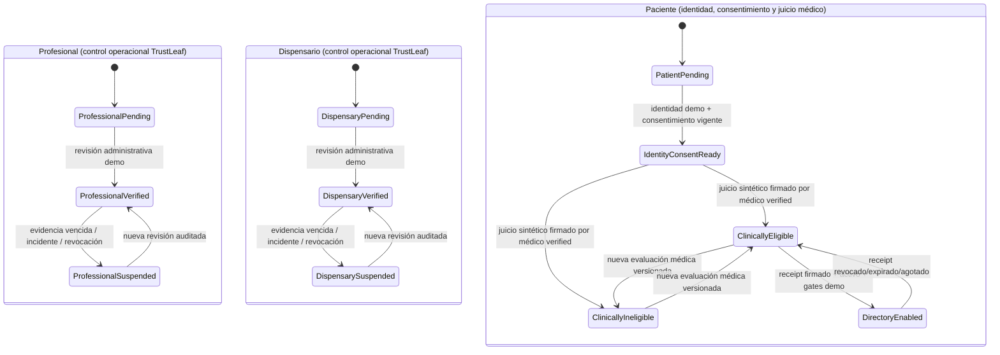
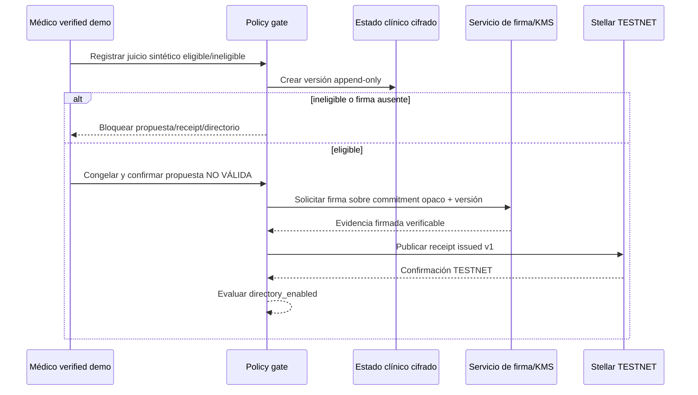

# UX del piloto demostrativo Stellar TESTNET

Estado de referencia: blueprint interno en `34c3bb2`. Documento de diseño; no implementa pantallas, persistencia, cuentas ni contratos.

El piloto permite a tres participantes usar datos totalmente sintéticos para demostrar un recibo opaco y eventos versionados en Stellar TESTNET. No emite una receta legal o clínicamente válida, no habilita dispensación farmacéutica, no usa dinero y no prueba cumplimiento. La fuente clínica detallada debe permanecer cifrada off-chain. Nunca se publica PII/PHI, RUT, diagnóstico, dosis, PDF, receta ni un identificador correlacionable en cadena.

## Leyenda y lenguaje obligatorio

- **M — Mock:** UI o cálculo local con fixtures sintéticos.
- **I — Infraestructura:** identidad, autorización, persistencia cifrada, auditoría, firma, servicio QR o Stellar TESTNET verificables.
- **G — Gate:** aprobación legal, clínica o farmacéutica necesaria antes de un uso real.
- **T — TESTNET:** transacción demostrativa, sin valor ni efecto clínico.
- **Fail-closed:** identidad, rol, consentimiento, versión, saldo, vigencia o configuración dudosa bloquean la operación.

Todas las pantallas visibles durante el piloto muestran de forma persistente: `DEMOSTRACIÓN · DATOS SINTÉTICOS · STELLAR TESTNET · SIN VALIDEZ CLÍNICA`.

No usar en etiquetas, estados o mensajes: “receta válida”, “médico verificado” sin calificador demo, “dispensación aprobada”, “auténtico”, “infalsificable”, “inmutable” o cualquier promesa de cumplimiento.

## Recorrido de los tres participantes

Una confirmación de red nunca reemplaza la autorización del policy gate ni el estado off-chain. La UI presenta por separado `registro TESTNET confirmado` y `operación demo autorizada`.

## Mapa de pantallas y responsabilidades

| Paso / pantalla | Actor | Clasificación | Acción visible | Evidencia exigida para continuar | Gate o límite |
|---|---|---|---|---|---|
| Acceso y selector de rol | Todos | M/I | Entrar a un espacio demo por rol | sesión sintética y claim emitido por servidor | nunca confiar en rol del cliente |
| Solicitud médico-demo | Médico/admin | M/I/G | Cargar marcador sintético; aceptar alcance | decisión administrativa auditada | no equivale a RNPI/SIS ni habilitación profesional |
| Perfil médico | Médico/paciente | M/I/G | Ver perfil y etiqueta demo | rol vigente y versión de perfil | sin datos profesionales reales en esta fase |
| Disponibilidad | Médico | M/I | Crear/retirar slots sintéticos | escritura autorizada, zona horaria y no solape | no prometer agenda persistente con fallback local |
| Reserva | Paciente | M/I | Mantener y confirmar slot | consentimiento vigente y reserva atómica | confirmación solo después de persistencia |
| Consentimiento | Paciente | M/I/G | Aceptar/rechazar versión demo | versión, timestamp, propósito y revocabilidad | no sustituye base jurídica aplicable |
| Atención/ficha | Médico | M/I/G | Ver resumen y nota sintéticos | asignación, rol, propósito y auditoría | datos reales bloqueados; sin efecto clínico |
| Seguimiento | Médico/paciente | M/I/G | Crear tarea demo | episodio persistido y alcance | no inferir seguimiento desde fixtures |
| Propuesta demostrativa | Médico | M/I/G | Crear y revisar una propuesta “NO VÁLIDA” | snapshot cifrado, versión y policy gate | no es receta ni instrucción de dispensación |
| Emisión receipt | Médico | I/T/G | Confirmar commitment opaco | idempotency key, firma, red TESTNET y snapshot congelado | botón bloqueado si red/cuenta/policy no son comprobables |
| Estado/QR | Paciente | I/T/G | Ver receipt, vigencia demo y QR | token opaco activo y servicio verificador | QR no contiene detalle clínico ni identificador estable |
| Verificación | Dispensario | I/T/G | Escanear y ver respuesta mínima | rol dispensario-demo, nonce no usado y estado consistente | no autoriza entrega farmacéutica real |
| Operación parcial | Dispensario | I/T/G | Ingresar cantidad sintética y confirmar | saldo reservado, request id único y evento previo confirmado | sin inventario, medicamento ni cantidad clínica real |
| Revocación/expiración | Médico/admin | I/T/G | Registrar nuevo evento | autorización, motivo interno off-chain y versión siguiente | no editar metadata ni evento anterior |
| Renovación | Médico | M/I/T/G | Crear nueva propuesta y receipt | nueva evaluación sintética, nuevo snapshot y commitment | nunca reactivar o sobrescribir receipt anterior |

## Estados y acciones permitidas

Reglas UX:

1. No hay transición directa desde borrador a activo: primero se persiste y congela una versión off-chain.
2. Cada acción de estado crea un evento nuevo; ningún evento ni metadata existente se modifica.
3. `Emisión pendiente` deshabilita reenvíos libres. La recuperación consulta/reconcilia la misma clave de idempotencia.
4. `Parcial` muestra unidades abstractas de demostración (`saldo demo`), nunca dosis, medicamento o indicación.
5. Estados terminales deshabilitan QR y acciones; renovación crea un receipt y QR nuevos sin enlazarlos públicamente.

## Tarjetas funcionales por rol

### Médico demo

- **Inicio:** agenda sintética, tareas y alertas de infraestructura; nunca presenta pacientes reales.
- **Atención:** resumen mínimo y nota ficticia, con indicador de versión y guardado confirmado.
- **Propuesta NO VÁLIDA:** vista previa sintética; confirma que no contiene instrucciones reales.
- **Receipt TESTNET:** previsualiza solo commitment, número de versión local, red y costo estimado de testnet; no muestra secreto de firma.
- **Revocar / renovar:** revocar agrega evento; renovar abre un nuevo borrador independiente.

### Paciente demo

- **Reserva y consentimiento:** permite rechazar o retirar consentimiento y explica el efecto demo.
- **Estado:** diferencia propuesta off-chain, receipt TESTNET y estado demo.
- **QR:** visible solo cuando está activo; botón para rotar token sin cambiar el receipt.
- **Actividad:** eventos mínimos y genéricos; sin actor detallado ni información clínica.

### Dispensario demo

- **Verificador:** cámara o ingreso manual de token opaco; no decodifica información en cliente.
- **Resultado mínimo:** `activo/parcial/dispensado/revocado/expirado`, saldo demo y expiración de sesión.
- **Operación parcial:** cantidad abstracta limitada al saldo demo; confirmación en dos pasos.
- **Comprobante:** request id local y operación TESTNET; no funciona como documento farmacéutico.

## QR, idempotencia y rechazo de replay

- El QR contiene un token aleatorio de vida corta, no el commitment, hash de una identidad, clave de cuenta ni payload clínico.
- Capturas o copias no permiten una segunda mutación: nonce y request id se consumen de forma atómica.
- Reintentar exactamente la misma intención devuelve el resultado anterior. Cambiar cantidad exige challenge nuevo y revalidación de saldo.
- Si Stellar no responde, la UI queda `pendiente de reconciliación`; nunca declara éxito ni permite otra operación incompatible.
- Rate limit, expiración de sesión y respuestas indistinguibles evitan usar el verificador para enumerar receipts.

## Mensajes fail-closed

| Condición | Mensaje al usuario | Comportamiento |
|---|---|---|
| Rol o sesión ausente | “No podemos comprobar tu autorización demo.” | ocultar datos y deshabilitar mutaciones |
| Infraestructura off-chain no disponible | “El registro seguro no está disponible. No se guardó ningún cambio.” | no usar fallback local para una confirmación |
| Red distinta de TESTNET | “La red configurada no está autorizada para esta demostración.” | bloquear firma/envío |
| Estado on-chain/off-chain divergente | “Estado en revisión. No realices otra operación.” | reconciliación administrativa auditada |
| QR vencido o revocado | “Este código no permite continuar.” | no revelar existencia, actor ni causa clínica |
| Replay/idempotency key repetida | “Esta solicitud ya fue procesada.” | devolver mismo resultado sin nuevo evento |
| Saldo o versión cambió | “El estado cambió. Actualiza antes de continuar.” | liberar reserva y exigir challenge nuevo |
| Falta aprobación profesional | “Esta función permanece limitada a datos sintéticos.” | bloquear datos y actos reales |

## Criterios de aceptación del recorrido

### Identidad, consentimiento y atención

- [ ] Los tres usuarios usan identidades ficticias y roles emitidos del lado servidor.
- [ ] Un usuario sin rol o con rol expirado no puede leer ni mutar la pantalla de otro actor.
- [ ] Rechazar o revocar consentimiento bloquea atención y emisión posterior.
- [ ] Guardar una nota demo crea versión y auditoría; no confirma hasta persistir.
- [ ] Ningún formulario admite o solicita RUT, diagnóstico, dosis o documentos reales.

### Receipt TESTNET y estados

- [ ] La emisión usa solamente un commitment opaco no correlacionable y red TESTNET verificada.
- [ ] Dos clics o reintentos con la misma idempotency key generan como máximo un evento.
- [ ] Cada parcial, total, revocación y expiración crea un evento versionado sin editar anteriores.
- [ ] La suma de operaciones sintéticas nunca supera el saldo demo; la concurrencia produce un solo ganador.
- [ ] Renovar crea nuevo receipt/commitment y deja el anterior terminal e inalterado.
- [ ] La UI distingue confirmación TESTNET, autorización demo y estado clínico off-chain.

### QR y privacidad

- [ ] El QR no revela contenido al decodificarse fuera del verificador.
- [ ] El mismo nonce no puede mutar estado dos veces, incluso en ventanas o dispositivos distintos.
- [ ] Un QR rotado o de estado terminal falla sin filtrar datos.
- [ ] Logs, explorer links y errores no contienen tokens, commitments combinados con identidades ni datos clínicos.
- [ ] Reduced motion, teclado, foco y mensajes de estado funcionan para las acciones críticas.

### Recuperación

- [ ] Un timeout deja la operación pendiente, reconciliable y sin falsa confirmación.
- [ ] Una caída de Firestore/Supabase o del repositorio futuro no activa fallback local para operaciones confirmables.
- [ ] Divergencias requieren cola administrativa auditada; el operador no puede “forzar activo” desde la UI.

## Qué pueden probar ahora los tres participantes

Cuando exista la infraestructura del backlog, médico, paciente y dispensario pueden probar con fixtures:

1. onboarding administrativo demo y separación de roles;
2. disponibilidad, consentimiento y reserva sintéticos;
3. atención y propuesta explícitamente no válida;
4. emisión de un commitment opaco como receipt en Stellar TESTNET;
5. entrega y rotación de QR opaco;
6. verificación mínima y una o más operaciones parciales abstractas;
7. rechazo de copia/replay y doble operación concurrente;
8. revocación, expiración y renovación como receipt nuevo;
9. reconciliación de un timeout simulado y trazabilidad técnica.

## Qué no deben probar todavía

- identidades, credenciales profesionales, pacientes o fichas reales;
- diagnóstico, dosis, producto, receta, PDF o consentimiento jurídicamente operativo;
- emisión o dispensación clínica/farmacéutica real;
- pagos, fondos, inventario o mainnet;
- integración productiva con Firestore, Supabase, SIS/RNPI, farmacia o custodios externos;
- afirmaciones de legalidad, autenticidad clínica, imposibilidad de falsificación o cumplimiento.

## Dependencias de implementación antes de habilitar el recorrido

| Prioridad | Entrega verificable | Tipo |
|---|---|---|
| P0 | policy gate fail-closed con claims de servidor y fixtures por rol | I |
| P0 | repositorio neutral en memoria para estados, versiones, idempotencia y auditoría | M/I |
| P0 | contrato de interfaces para receipt/eventos y adaptador Stellar TESTNET simulado | M/T |
| P0 | esquema de token QR opaco, challenge, nonce y rotación | I |
| P0 | pruebas de máquina de estados, concurrencia, replay y divergencia | I/T |
| P1 | pantallas mínimas por rol con etiquetas demo persistentes | M |
| P1 | adaptador Stellar TESTNET real con allowlist de red/cuenta y reconciliación | I/T |
| P1 | observabilidad sin secretos ni datos correlacionables | I |
| P2 | persistencia cifrada y KMS seleccionados mediante decisión arquitectónica reversible | I |
| Bloqueado | uso de datos reales, acto clínico o farmacéutico | G legal/clínico/farma |

Ni Firestore actual ni Supabase, aún no configurado, deben presentarse como persistencia clínica lista. El primer recorrido implementable debe funcionar con repositorios neutrales y fixtures, y activar el adaptador TESTNET únicamente detrás de configuración explícita, allowlist y kill switch.

## Aclaración de habilitación: operación, juicio clínico y gates externos

TrustLeaf administra acceso operacional; no decide si un paciente es clínicamente elegible ni certifica por sí mismo que un profesional o dispensario cumple la normativa. Deben existir tres planos separados:

1. **TrustLeaf operacional:** comprueba evidencias administrativas definidas para la demo, asigna alcance, habilita o suspende cuentas y conserva auditoría. Sus estados no deben llamarse “aprobación clínica” ni “cumplimiento legal”.
2. **Juicio clínico médico:** únicamente el profesional con estado operacional `verified` registra el resultado sintético `clinically_eligible` o `clinically_ineligible` tras una atención. TrustLeaf valida permisos y precondiciones, pero no calcula ni cambia ese juicio.
3. **Gates legal, clínico y farmacéutico:** revisiones externas pendientes para cualquier uso real. Un estado `verified` de plataforma no satisface estos gates.

Los nombres `verified`, `suspended`, `clinically_eligible` y `directory_enabled` son estados técnicos del piloto demostrativo. No deben traducirse en la UI como “legalmente habilitado”, “paciente aprobado” o “receta válida”.

### Guardas que cruzan los tres planos

| Acción | Autor de la decisión | Precondiciones técnicas | Resultado permitido |
|---|---|---|---|
| Verificar profesional demo | administrador TrustLeaf | identidad sintética, evidencia administrativa, auditoría | `professional_verified`; acceso por alcance |
| Suspender profesional | administrador/policy de seguridad | motivo interno, versión y auditoría | `professional_suspended`; bloqueo inmediato de nuevas firmas |
| Verificar/suspender dispensario demo | administrador TrustLeaf | identidad organizacional sintética y evidencia demo | habilitar/bloquear verificador y operaciones nuevas |
| Determinar elegibilidad clínica | médico `professional_verified` | relación asistencial sintética, consentimiento vigente y episodio abierto | evento clínico cifrado `eligible` o `ineligible` |
| Firmar propuesta | médico `professional_verified` | elegible, snapshot sintético congelado, firma válida, versión actual | evidencia firmada off-chain; todavía no receipt |
| Emitir receipt TESTNET | servicio autorizado tras firma | evidencia firmada, idempotencia, red allowlisted y policy gate | evento `issued` opaco; nunca antes de la firma |
| Habilitar directorio | policy gate | paciente listo, `eligible`, receipt activo y no suspendido | `directory_enabled` mínimo y revocable |
| Mostrar directorio | sistema | `directory_enabled` vigente | fixtures de dispensarios `verified`; no recomendación clínica |

Si el profesional es suspendido después de firmar, los receipts previos no se reescriben. El policy gate aplica la decisión definida por gobernanza (por defecto, bloquear nuevas operaciones y enviar los receipts activos a revisión/revocación auditada). Si un dispensario es suspendido, pierde de inmediato la capacidad de resolver QR y registrar eventos nuevos.

## Firma médica antes de cualquier evidencia TESTNET

La UI no debe mostrar QR utilizable, estado `activo`, enlace a explorer ni acceso al directorio antes de que la evidencia médica firmada sea verificable y el evento `issued` esté reconciliado. Una cuenta Stellar de servicio no sustituye la firma médica ni demuestra autoría clínica.

## Backlog adicional y gates de habilitación

| Orden | Entrega cerrada | Clase | Criterio verificable |
|---|---|---|---|
| P0-A | Tipos y máquinas independientes para profesional, dispensario y paciente | M/I | transiciones positivas/negativas; no existe transición `pending -> directory_enabled` |
| P0-B | Policy gate que separa `operational_status` de `clinical_eligibility` | I | admin no puede escribir elegibilidad; médico no puede verificarse/suspenderse a sí mismo |
| P0-C | Suspensión fail-closed | I | suspensión invalida sesión/alcance y bloquea nueva firma o verificación QR |
| P0-D | Contrato de firma médica demo | I/T | receipt rechazado sin firma, con firma inválida, versión vieja o profesional suspendido |
| P0-E | Gate `directory_enabled` derivado y revocable | M/I | solo true con identidad+consentimiento+eligible+receipt activo; se retira al expirar/revocar |
| P1-A | UI por estados sin lenguaje de aprobación legal | M | snapshots/copy tests para pending, verified, suspended, eligible e ineligible |
| P1-B | Directorio de fixtures filtrado por estado operacional | M/I | dispensario pending/suspended nunca aparece ni resuelve QR |
| P1-C | E2E de firma→receipt→directorio | M/I/T | demuestra orden causal y rechaza carreras, replay y suspensión intermedia |
| Gate-L | Revisión legal de identidad, consentimiento, firma y tratamiento de datos | G | informe profesional y controles trazados; no inferido desde TESTNET |
| Gate-C | Protocolo y responsabilidad del juicio clínico | G | aprobación de dirección clínica; fuera del algoritmo TrustLeaf |
| Gate-F | Alcance del dispensario y dispensación | G | aprobación farmacéutica/regulatoria antes de cualquier operación real |

## Conflictos comprobados con la UI y ramas actuales

Revisión read-only del estado base `34c3bb2`; estas observaciones no modifican el código.

| Evidencia actual | Conflicto con el diseño aclarado | Ajuste futuro |
|---|---|---|
| `src/lib/trustData.ts:13` define un único `ActorRegistrationStatus` con `approved/rejected`, compartido por médico y dispensario. | No modela `verified/suspended` ni separa revisión operacional de juicio clínico. | tipos explícitos por actor; migración de etiquetas y transición auditada, sin reinterpretar registros existentes |
| `src/App.tsx:583-598` considera aprobados los registros `status === 'approved'` y permite operar en cualquier `session.mode === 'demo'`. | El modo demo evita la revisión operacional; tampoco existe suspensión. | fixtures pre-verificados explícitos y claims del servidor; nunca bypass genérico por modo |
| `src/App.tsx:758-918` contiene rutas `/medico`, `/medico/operacion`, `/dispensario` y operación/historial/retiros. | Hay gates de ruta, pero el copy mezcla “aprobado”, credencial TESTNET y autorización para validar/emitir. | representar pending/verified/suspended y separar credencial operacional, firma médica y receipt |
| `src/App.tsx:90-95` expone `/paciente/dispensarios` sin una ruta/gate de elegibilidad clínica visible. | El directorio puede abrirse por tener sesión paciente, sin `directory_enabled`. | policy gate servidor y estado derivado antes de montar/cargar la vista |
| `src/components/DispensaryDashboard.tsx:227` y `MockupPortal.tsx:12751` dicen “Dispensario autorizado en Trust Leaf”. | Puede interpretarse como autorización regulatoria. | “Dispensario demo con acceso operacional” y badge TESTNET |
| `src/components/MockupPortal.tsx:4555-4620` tiene emisión con fallback local `DEMO / NO VÁLIDA`. | La vista previa segura existe, pero no prueba que la firma médica preceda al receipt. | workflow explícito: juicio versionado → firma verificable → receipt; fallback nunca produce QR/activo |
| `src/components/MockupPortal.tsx:11294` alterna “Receta testnet lista” según `doctorSignerReady`. | Signer listo no equivale a propuesta firmada ni a elegibilidad. | estado por artefacto: signer disponible, propuesta firmada, receipt reconciliado |
| `src/components/MockupPortal.tsx:14437` y `17867` presentan “Receta validada”. | Confunde verificación técnica con validez clínica/legal. | “Receipt demo activo” y explicación de alcance mínimo |
| `src/components/MockupPortal.tsx:18201` declara correctamente que la simulación no valida licencia ni emite receta válida. | Este límite contradice copy cercano que usa “validada/autorizado”. | conservar el límite y cubrir todo el portal con tests de copy prohibido |
| `src/translations.ts:12-442` mantiene afirmaciones como “Verificado Global”, “validación legal” y “Dispensarios Autorizados”. | Contradice los límites del piloto y puede aparecer en variantes de idioma. | inventario completo de copy y reemplazo neutral antes de demo con participantes |
| `tests/medical-flow-capabilities-audit.mjs:121-179` comprueba gates existentes y declara capacidades productivas verificadas: 0. | Confirma que rutas/UI no equivalen a infraestructura lista. | extender auditor con estados separados, orden de firma y gate de directorio |

También existen componentes duplicados: funciones y copy de dispensario aparecen tanto en `DispensaryDashboard.tsx` como dentro del extenso `MockupPortal.tsx`. Antes de implementar estados nuevos se debe elegir una única composición por ruta; de lo contrario, un gate corregido podría coexistir con una pantalla antigua que mantenga el bypass o el lenguaje contradictorio.
