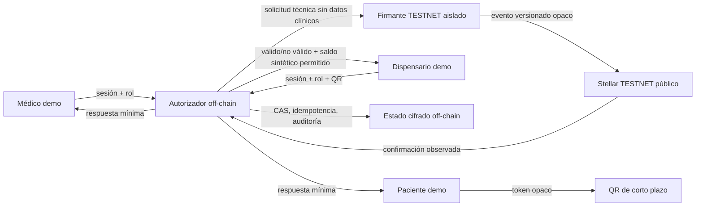

# Threat model: receipt versionado en Stellar TESTNET

**Estado:** diseño para revisión; no implementación.

**Ámbito:** demostración sintética con un médico, un paciente y un dispensario.
**No demuestra:** validez de receta, seguridad clínica, cumplimiento jurídico, identidad profesional, dispensación farmacéutica ni preparación para mainnet.

## Límites inviolables

- TESTNET solamente; sin fondos, pagos, mainnet ni acciones clínicas reales.
- La fuente clínica y el estado detallado viven cifrados off-chain, bajo autorización por roles y auditoría.
- Nunca publicar en cadena PII/PHI, RUT, nombre, contacto, diagnóstico, dosis, receta, PDF, dirección, identificador de paciente, wallet asociada a una persona ni identificador estable/correlacionable.
- Tampoco publicar hashes simples de esos datos: datos predecibles admiten ataques de diccionario. Todo commitment usa material aleatorio de alta entropía y separación de dominio; el secreto permanece off-chain.
- La cadena registra solo receipts opacos y eventos técnicos versionados. Metadata mutable no es fuente de verdad y no puede revelar acciones clínicas.
- `activo`, `parcial`, `dispensado`, `revocado` y `expirado` son estados de una simulación técnica, no decisiones clínicas ni farmacéuticas.
- Un receipt, hash, firma, QR o transacción no vuelve legal, auténtica o infalsificable una receta.

## Activos, fronteras y actores

**Activos protegidos:** confidencialidad del vínculo entre participantes; detalle clínico off-chain; claves de firma; tokens QR; autorización; integridad y orden de eventos; saldo sintético; evidencia de auditoría; capacidad de revocar y recuperar.

**Actores:** usuario médico demo, paciente demo, operador de dispensario demo, administrador de piloto, servicio autorizador off-chain, firmante TESTNET y adversario externo. Una persona puede controlar varias cuentas, pero las funciones permanecen separadas por políticas.

**Fronteras de confianza:** navegador ↔ API; API ↔ repositorio cifrado; autorizador ↔ firmante; firmante ↔ RPC/Horizon TESTNET; escáner ↔ verificador QR. Stellar es público y adversarial: observadores pueden conservar y correlacionar todos los eventos.

## Modelo del receipt y eventos

El identificador público debe ser efímero y no derivable de usuario, wallet, reserva o receta. El repositorio off-chain mantiene el mapeo protegido. Una forma candidata de commitment es `HMAC-SHA-256(k_epoch, domain || random_receipt_secret || version || state_commitment || random_nonce)`. `state_commitment` se calcula sobre una representación canónica sintética; nunca sobre campos clínicos reales. `k_epoch` vive en un gestor de claves y permite separar entornos/épocas. El diseño exacto requiere revisión criptográfica antes de código.

Hay una tensión no eliminable entre “eventos versionados trazables” y “ningún identificador correlacionable”: para verificar públicamente una secuencia, sus eventos deben poder asociarse técnicamente dentro de ese único ciclo. El piloto solo puede aceptar una **vinculación intrasecuencia opaca**, nunca vinculable deliberadamente a una persona, organización, wallet de usuario, contenido clínico, otro receipt o renovación. Si el requisito se interpreta como cero vinculación incluso dentro de la secuencia, esta opción B no es implementable sin otra primitiva criptográfica y debe detenerse el diseño, no relajar privacidad silenciosamente.

Cada transición agrega un evento con `opaque_receipt`, `version`, `previous_commitment`, `new_commitment`, `event_kind`, `event_nonce` y referencia de idempotencia opaca. No contiene cantidades clínicas. Para demostrar parcialidad, se usa un saldo/unidad **puramente sintético** dentro del commitment; el valor detallado autorizado queda off-chain.

```mermaid
stateDiagram-v2
  [*] --> Issued: emisión demo v1
  Issued --> Active: activación demo
  Active --> Partial: consumo sintético parcial
  Partial --> Partial: nuevo consumo; versión + 1
  Active --> Dispensed: consumo sintético total
  Partial --> Dispensed: saldo sintético cero
  Issued --> Revoked: revocación demo
  Active --> Revoked: revocación demo
  Partial --> Revoked: revocación demo
  Issued --> Expired: vencimiento técnico
  Active --> Expired: vencimiento técnico
  Partial --> Expired: vencimiento técnico
  Dispensed --> [*]
  Revoked --> [*]
  Expired --> [*]
```

Estados terminales no se reabren. Renovar crea otro receipt no enlazable públicamente; no modifica el anterior. Cada comando incluye versión esperada y clave de idempotencia. La aceptación ocurre solo después de una transición atómica off-chain y una política explícita sobre confirmación/finalidad on-chain; los fallos ambiguos se reconcilian, no se reintentan a ciegas.

## Estrategia de privacidad y custodia

- **Cuentas:** una cuenta técnica por entorno y función, no una cuenta públicamente asociada por paciente/receta. Evaluar batching o relayer para reducir correlación; nunca prometer anonimato.
- **Firmas:** clave del contrato/cuenta en KMS/HSM o servicio aislado; jamás en frontend, repositorio, logs o variables accesibles al cliente. Separar firmante de autorizador.
- **Roles:** RBAC fail-closed, identidad demo marcada, sesión corta, reautenticación para emitir/revocar/consumir y prohibición de autoasignar roles.
- **Recuperación:** rotación, pausa de emergencia, claves separadas por entorno, procedimiento de compromiso y doble control administrativo. No implementar custodia de claves personales del paciente para el piloto.
- **QR:** token aleatorio de al menos 128 bits, un solo propósito, TTL corto, audience ligada al verificador, challenge/nonce por escaneo y respuesta mínima. No embebe receipt público, URL estable, datos clínicos ni secretos reutilizables.
- **Logs:** identificadores rotativos/redactados, sin QR completo, payload, secretos ni correlación innecesaria; acceso y retención limitados.

## Matriz de amenazas, mitigaciones y pruebas exigibles

| Amenaza | Impacto | Mitigación de diseño | Prueba/gate antes de piloto |
|---|---|---|---|
| Correlación por cuenta, receipt o timing | Vincular participantes y acciones | Cuenta técnica/relayer, receipts aleatorios rotativos, batching/jitter cuando proceda, tráfico mínimo | Análisis de ledger demuestra que no hay ID estable; revisión humana de correlación residual |
| Análisis de tráfico | Inferir evento por frecuencia/hora | No emitir campos clínicos; evitar un evento claramente semántico por interacción; documentar que timing sigue siendo público | Dataset sintético y prueba de inferencia; aceptación explícita del riesgo residual |
| Diccionario contra commitments | Recuperar valores predecibles | HMAC/commitment con secreto de época, nonce aleatorio y separación de dominio; no hashear PII/PHI | Tests con corpus de valores comunes no reproducen commitments; revisión criptográfica |
| Front-running/copiar comando | Consumir o alterar antes que el actor | Autorización off-chain, nonce, deadline, versión esperada y firma ligada a actor/acción/audience | Intento de copiar payload desde otra sesión/rol es rechazado |
| QR fotografiado o reenviado | Replay/consulta no autorizada | TTL corto, challenge del verificador, single-use/rotación, sesión y rol del dispensario, rate limit | Segundo uso y uso concurrente fallan; QR expirado/rol incorrecto fallan |
| Doble dispensación | Dos consumos sobre el mismo saldo | CAS transaccional off-chain, versión monotónica, idempotencia y transición terminal | Carrera con N solicitudes concede como máximo una transición válida |
| Carrera en dispensación parcial | Saldo negativo o historia divergente | `expected_version`, saldo sintético validado, serialización por receipt y evento append-only | Prueba concurrente de parciales conserva invariante y orden |
| Reintento tras timeout | Duplicar evento | Clave de idempotencia persistente y reconciliación por hash/versión; no regenerarla | Repetir exactamente la solicitud devuelve el mismo resultado sin evento extra |
| Reorg/confirmación ambigua | Off-chain y ledger divergen | Estados `pending/confirmed/failed`, profundidad/criterio TESTNET definido, reconciliador y pausa fail-closed | Simular respuesta perdida, fallo RPC y ledger alternativo; converge sin duplicar |
| Compromiso de clave firmante | Eventos falsos o masivos | KMS/HSM, alcance mínimo, rate limit, allowlist de contrato/red, rotación y pausa | Runbook ensayado; clave rotada; solicitudes fuera de política rechazadas |
| Compromiso de sesión/rol | Acción de otro participante | MFA/reautenticación futura, sesión corta, claims server-side, segregación de funciones | Matriz allow/deny; elevación y claim del cliente fallan |
| Operador/admin interno | Reidentificación o alteración | Mínimo privilegio, doble control, auditoría append-only y acceso separado a mapeo/clave | Revisión de permisos; ningún rol individual obtiene ledger + mapeo + secretos |
| Metadata/evento excesivo | Filtrar clínica indirectamente | Esquema allowlist; tamaño/semántica constantes; prohibir texto libre y metadata mutable | Snapshot de todos los eventos y scanner de campos prohibidos |
| Enumeración del verificador | Descubrir receipts válidos | Tokens no enumerables, respuestas indistinguibles, rate limit y audience | Fuzzing no distingue inexistente/revocado sin autorización |
| Enlace entre renovación y anterior | Construir historia longitudinal | Nuevo secreto/receipt; ninguna referencia pública al anterior | Inspección del ledger no permite enlazarlos salvo por timing residual |
| Error de red/contrato/upgrade | Estado bloqueado o inconsistente | Pausa, compatibilidad de versión, migración ensayada, rollback operacional; no upgrade sin auditoría | Tests de versión desconocida y contrato pausado fallan cerrados |
| Confusión TESTNET/real | Uso clínico indebido | Banner persistente, fixtures sintéticos, red/keys separadas, copy no clínico y feature flags fail-closed | Test automático de red y copy; checklist presencial con tres participantes |

## Invariantes de seguridad

1. Ningún evento público permite recuperar o enlazar deliberadamente identidad o contenido clínico.
2. Solo una transición puede consumir una versión; `new_version = old_version + 1`.
3. Un comando idéntico tiene como máximo un efecto; un nonce no puede aplicarse a otra acción, receipt, actor o red.
4. El saldo sintético nunca es negativo ni aumenta en una transición de consumo.
5. Eventos terminales impiden consumos posteriores; renovación crea un receipt nuevo.
6. Una confirmación del ledger sin autorización/estado off-chain correspondiente se marca anomalía, no se adopta automáticamente.
7. Una mutación off-chain sin confirmación on-chain queda pendiente y bloquea operaciones incompatibles hasta reconciliar.
8. Toda ruta sensible falla cerrada ante rol ausente, versión desconocida, RPC caído, expiración, red equivocada o ambigüedad.

## Suite mínima de QA de seguridad

- Tests de esquema que rechacen todos los campos prohibidos y texto libre en eventos.
- Vectores deterministas de commitment, separación por red/época/dominio y prueba de nonces únicos.
- Matriz RBAC allow/deny por emisión, consulta mínima, parcial, total, revocación y expiración.
- Tests property-based o equivalentes de máquina de estados, versiones y saldo sintético.
- Concurrencia: doble scan, parciales simultáneos, revocación versus consumo y expiración versus consumo.
- Idempotencia: replay idéntico, misma clave con payload distinto, timeout antes/después de submit y respuesta perdida.
- QR: copiado, expirado, audience incorrecta, sesión ausente, rate limit y rotación.
- Integración TESTNET con cuenta desechable y fixtures sintéticos; assertions de red y cero pagos.
- Reconciliación ante RPC/Horizon/Soroban caído, submit rechazado y confirmación tardía.
- Inspección pública de eventos para correlación, tamaños, frecuencia y ausencia de secretos/datos prohibidos.
- Ensayo de compromiso y rotación de clave, pausa y recuperación sin aceptar eventos no autorizados.

## Gates y límites residuales

Antes de una demostración con los tres participantes se requiere: threat model aprobado; contrato e interfaces revisados; fixtures inequívocamente sintéticos; RBAC server-side; servicio de claves aislado; QR anti-replay; pruebas de carrera/idempotencia; observabilidad redactada; pausa/rotación ensayadas; y consentimiento de los participantes de que es una simulación técnica.

Antes de usar cualquier dato o acto real se requieren, además, aprobaciones legales, clínicas, farmacéuticas y de privacidad; identidad profesional verificable; backend clínico cifrado y autorizado; auditoría independiente; respuesta a incidentes; retención/borrado; evaluación formal de impacto; y decisión explícita sobre correlación pública. Estos gates están fuera del piloto TESTNET y no pueden darse por satisfechos por una prueba exitosa.

Riesgo residual inevitable: Stellar TESTNET es público; cuenta, tiempos, frecuencia y grafos pueden correlacionarse aun sin payload identificable. La red de prueba puede reiniciarse o comportarse distinto de mainnet. El receipt demuestra como máximo que un servicio publicó una secuencia técnica; no demuestra identidad, contenido clínico, entrega material ni cumplimiento.

## Decisiones abiertas antes de implementar

1. Elegir Soroban/eventos versus una transacción/memo con semántica mínima, según límites actuales verificados de Stellar; no asumir soporte sin prototipo.
2. Definir criterio de confirmación y reconciliación para TESTNET.
3. Validar criptográficamente el esquema de commitments y rotación de `k_epoch`.
4. Definir granularidad pública de `event_kind`: considerar evento uniforme para reducir inferencia.
5. Decidir relayer/batching y presupuesto de correlación aceptable.
6. Elegir KMS/HSM de desarrollo, responsables de rotación y doble control.
7. Especificar repositorio off-chain neutral; Firestore actual y Supabase no están listos como base clínica.
