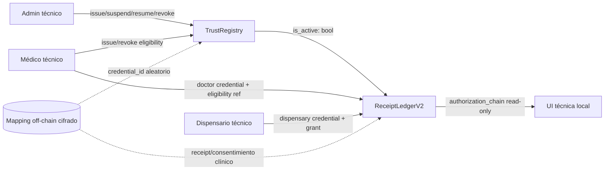
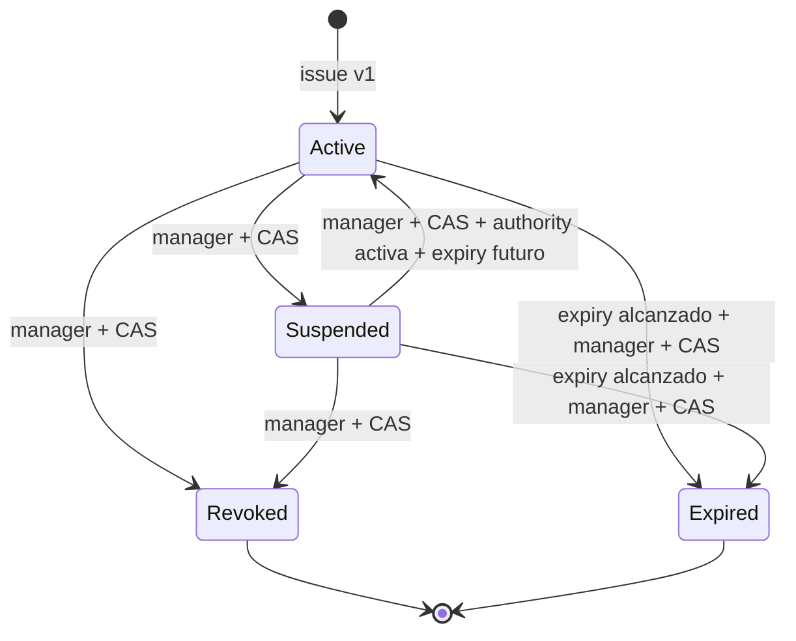

# TrustRegistry v1 — arquitectura local de credenciales revocables

Estado: **implementado y validado sólo localmente**. No existe contrato desplegado, contract ID Testnet ni autorización para enviar transacciones nuevas.

## Objetivo y límites

Un único `TrustRegistry` separado gestiona tres tipos de credencial técnica:

1. `Doctor`: emitida, suspendida, reactivada, renovada o revocada por admin.
2. `Dispensary`: emitida, suspendida, reactivada, renovada o revocada por admin.
3. `PatientEligibility`: emitida y administrada por un médico cuya credencial `Doctor` esté activa.

No se crea un contrato por rol. La separación de responsabilidades se aplica mediante `CredentialKind`, firma requerida y referencia a la credencial de autoridad.

No entran a cadena PII/PHI, RUT, email, dirección de paciente, ficha, diagnóstico, medicamento, dosis, gramaje, saldo, PDF ni declaraciones de validez jurídica o clínica. La persona paciente **no tiene `Address` en el ABI**: el vínculo persona↔`credential_id` aleatorio permanece off-chain y cifrado.

## Componentes

`TrustRegistry` no conoce `ReceiptLedgerV2`. El ledger conoce una dirección de registry inmutable configurada al inicializarse y consulta `is_active` por invocación cross-contract. Una respuesta ausente, falsa, vencida o con tipo/controller distinto bloquea.

## Modelo de credencial

| Campo on-chain | Propósito | Restricción |
|---|---|---|
| `credential_id: BytesN<32>` | referencia aleatoria de alta entropía | nunca derivada de RUT, email, wallet de paciente o documento |
| `controller: Address` | firmante técnico | para elegibilidad es el médico; nunca el paciente |
| `issuer: Address` | admin o médico emisor | cuenta técnica seudónima, sin metadata personal |
| `authority_credential_id` | cadena de autoridad | self para actor; credencial Doctor para elegibilidad |
| `kind` | Doctor/Dispensary/PatientEligibility | enum cerrado |
| `state` | Active/Suspended/Revoked/Expired | Revoked y Expired terminales |
| `expires_at` | expiry técnico | no codifica duración clínica; política humana pendiente |
| `version` | CAS monotónico | cada mutación válida incrementa una vez |

`is_active` exige simultáneamente: existencia, controller exacto, tipo exacto, `state == Active` y `ledger.timestamp < expires_at`. El vencimiento falla cerrado aunque `expire` todavía no haya materializado `Expired`.
Una credencial cuyo expiry ya transcurrió no puede resucitar mediante `renew`; debe emitirse una referencia nueva tras el gate correspondiente.

## Estados y autorización

- Admin administra sólo Doctor/Dispensary.
- Médico con credencial Doctor activa emite/renueva/reactiva elegibilidad.
- El médico emisor puede suspender; una revocación de seguridad sigue disponible aun si su credencial Doctor fue suspendida.
- Admin no puede emitir elegibilidad ni convertir una decisión clínica en `Active`.
- Una operación exacta repetida devuelve su resultado original; reutilizar `operation_id` con otro payload produce `OperationConflict`.

## ReceiptLedgerV2

Se implementó como paquete nuevo para no alterar el código ni el ABI del receipt v1 ya desplegado.

| Acción | Referencias activas requeridas |
|---|---|
| `issue` | Doctor del firmante + PatientEligibility emitida por el mismo médico |
| `activate` / `revoke` | credenciales guardadas en el receipt, activas y no vencidas |
| `set_grant(enabled/disabled)` | cadena del receipt + Dispensary activa |
| `record_partial` / `mark_dispensed` | cadena del receipt + grant exacto + Dispensary activa |
| `expire` | sólo admin; transición terminal de seguridad, nunca habilita actividad |

El receipt almacena sólo `receipt_id`, commitment opaco, issuer técnico, referencias de credenciales, estado y versión. `authorization_chain` devuelve un snapshot booleano/read-only para observabilidad; no revela vínculo de paciente.

## Compatibilidad comprobada

| Artefacto actual | Evidencia | Compatibilidad |
|---|---|---|
| `soroban/contracts/registry` | allowlist booleana sólo de médicos | insuficiente; se conserva, no se reutiliza |
| `soroban/contracts/receipt-ledger` / contrato Testnet existente | roles internos `set_doctor/set_dispensary`; ABI `init(admin)` | incompatible con enforcement externo; permanece histórico v1 |
| `trust-registry` local | IDL, eventos, expiry, CAS e idempotencia | nuevo contrato requerido |
| `receipt-ledger-v2` local | `init(admin, registry)` y referencias obligatorias | nuevo despliegue requerido; no upgrade implícito |

El receipt v1 no puede adquirir estas garantías mediante configuración. No se debe afirmar que el contrato Testnet actual ya valida credenciales.

## Threat model resumido

| Amenaza | Control implementado | Residual/gate |
|---|---|---|
| enumeración/correlación de pacientes | IDs aleatorios; ningún patient Address o campo clínico | expiry y actividad pública siguen siendo metadatos; definir ventanas/bucketing |
| admin comprometido | roles estrictos; admin no emite elegibilidad | custodia multisig/KMS/HSM y recuperación pendientes |
| médico suspendido emite elegibilidad | `issue_eligibility` consulta credencial Doctor activa | rotación/reemplazo de credencial requiere runbook humano |
| dispensario suspendido dispensa | cada parcial/cierre reconsulta registry y grant exacto | latencia/indexer UI no reemplaza consulta de contrato |
| TOCTOU entre consulta y receipt | la consulta ocurre dentro de la misma invocación Soroban | revisar footprint/costos antes de Testnet |
| replay/cambio de payload | `operation_id` + dominio + payload exacto | generador durable/idempotency store backend pendiente |
| carrera concurrente | `expected_version` CAS | reconciliación/indexer y política de retry pendientes |
| vencimiento no materializado | `is_active` compara timestamp siempre | evento `Expired` requiere llamada posterior autorizada |
| registry equivocado | dirección inmutable en `ReceiptLedgerV2` | allowlist de contract ID/WASM hash y revisión de deploy pendientes |
| pérdida de disponibilidad registry | llamada falla cerrada | runbook de incidente y rollback pendientes |

## Evidencia local

- `cargo test -p trust-registry`: 13/13 PASS.
- `cargo test -p receipt-ledger-v2`: 11/11 PASS con los contratos reales registrados en el mismo `Env`.
- `cargo clippy -p trust-registry -p receipt-ledger-v2 --all-targets -- -D warnings`: PASS.
- `npm run test:trust-registry-ui`: privacidad, escenarios y ausencia de writes PASS.
- `npm run preflight`: PASS completo, incluidos 24 tests contractuales, TypeScript y build web de 2.427 módulos.
- WASM local `trust_registry.wasm`: 14.022 bytes, SHA-256 `43830be9fc0013f8361f24727e80f74be39c7f230f482e3e20d834e0f8078936`.
- WASM local `receipt_ledger_v2.wasm`: 14.980 bytes, SHA-256 `93eade96ebbf63881aa691cbbc107da871607bbed78be8d539aea264b88b3e14`.
- Spec embebida inspeccionada con protocol 25, `soroban-sdk 25.3.1`, Rust `1.95.0` y Stellar CLI `26.0.0`.
- No se usaron red, cuentas, claves, fondos ni datos reales.

Esta arquitectura es evidencia técnica local, no cumplimiento legal, identidad profesional verificada ni validez clínica.
