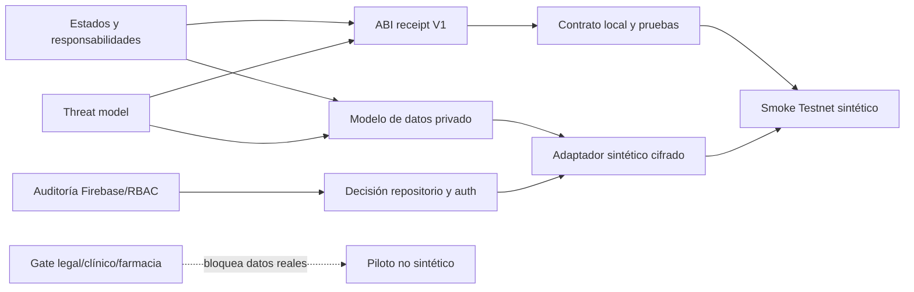

# Tablero maestro de entrega TrustLeaf

Estado: análisis interno en rama aislada. No autoriza datos reales, producción, mainnet, pagos, despliegues ni actos clínicos/farmacéuticos.

Seguimiento operativo actualizado: [preparación y validación end-to-end](end-to-end-readiness.md).

## Objetivo del sprint de análisis

Congelar un diseño implementable y verificable para una demostración sintética end-to-end: verificación operacional de actores, decisión clínica simulada bajo responsabilidad médica, receipt trazable en Stellar Testnet, persistencia privada separada y controles fail-closed. Ninguna capacidad se presenta como legalmente o clínicamente válida.

## Tablero

| Frente | Responsable | Rama | Estado | Gate de cierre |
|---|---|---|---|---|
| Receipt y trazabilidad Stellar | Arquitectura Stellar | `analysis/stellar-contract-architecture-20260822` | diseño completado | ABI/eventos/privacidad revisados antes de código |
| Threat model y datos clínicos | Privacidad | `analysis/stellar-privacy-threat-20260822` | diseño completado | decisiones KMS, repositorio, retención y riesgo de correlación |
| UX y contrato de estados | UX piloto | `analysis/stellar-pilot-ux-20260822` | ajuste en curso | responsabilidades y gates reflejados sin promesas |
| Firestore y permisos | Auditor Firebase | `analysis/stellar-contract-architecture-20260822` (documentación aislada) | auditoría en curso | matriz allow/deny con evidencia y pruebas de emulador propuestas |
| QA e integración documental | Scrum Master/QA | `analysis/stellar-testnet-pilot-integration-20260822` | en curso | diff documental limpio, contradicciones resueltas y decisiones listadas |
| Verificador público QR demo | Scrum Master + revisores seguridad/QA | `integration/qr-public-verifier-demo-20260822` | implementación local en QA | preflight, Browser QA y revisión humana del DTO público |

No se integrará nada a `main`. La integración actual es únicamente entre documentos internos de análisis mediante commits seleccionados y conserva las ramas fuente.

Para el paquete QR, documentación, implementación y pruebas se consolidan excepcionalmente en una única rama aislada. Los frentes auxiliares solo aportan revisión read-only.

## Dependencias y orden

## Puede ejecutarse tras aprobación del diseño

- Congelar IDL, lista negativa de campos y vectores de commitments.
- Crear contrato receipt separado y pruebas locales, sin reutilizar el contrato `prescription` actual.
- Implementar adaptadores neutrales e in-memory con fixtures sintéticos.
- Crear pruebas de autorización, idempotencia, concurrencia, replay, expiración y QR.
- Preparar cuentas técnicas Testnet no vinculadas a participantes y mutaciones deshabilitadas por defecto.
- Ejecutar posteriormente un despliegue Testnet efímero solo con autorización adicional y evidencia local verde.

## Bloqueado

- Datos de pacientes, identidades reales y ficha clínica: bloqueados por arquitectura operativa, seguridad y gates profesionales.
- Elección/configuración de Supabase/Postgres o endurecimiento de Firebase como repositorio clínico: requiere ADR y revisión de seguridad; ninguno está listo hoy.
- Validación RNPI/SIS, consentimiento jurídicamente suficiente y receta clínica: requieren revisión jurídica/clínica y fuentes autoritativas.
- Dispensación farmacéutica, pagos, mainnet y producción: fuera de alcance.
- Declarar cumplimiento legal, autenticidad absoluta o imposibilidad de falsificación: prohibido.

## Decisiones requeridas antes del sprint de implementación

1. Aceptar que los eventos públicos son correlacionables dentro de un receipt, aunque no con una persona ni entre ciclos.
2. Aprobar receipt no-token, cuentas técnicas de servicio y paciente sin wallet on-chain.
3. Aprobar el límite: sin ZK, Stellar prueba autorización/orden/unicidad, no la aritmética clínica de un saldo oculto.
4. Elegir el repositorio no productivo para fixtures y el patrón KMS; Supabase/Postgres sigue solo como candidato.
5. Definir quién aprueba y suspende operativamente a médicos y dispensarios, y qué evidencia mínima se revisa.
6. Autorizar por separado código, deploy Testnet efímero y sesión con los tres participantes sintéticos.

## Política de integración

Cada cambio de código futuro tendrá rama/worktree propio, alcance cerrado y pruebas. El Scrum Master solo propondrá integración cuando revisión independiente, allowlist de archivos, scan de datos/copy, pruebas locales y gates del frente estén verdes. Nunca se borrarán ramas ni se hará push, deploy o merge a `main` sin instrucción explícita.
