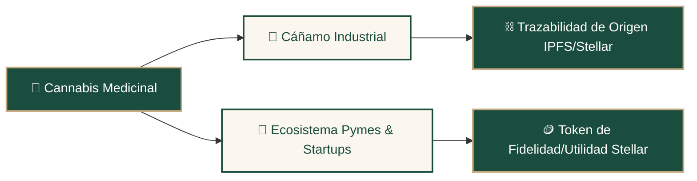

# 🗺️ Roadmap de Visión Global: Trust Leaf

Este documento traza el camino estratégico y técnico de **Trust Leaf**, desde la validación de su MVP técnico en Chile hasta su consolidación como una infraestructura de trazabilidad global y ecosistema de triple impacto sobre la red **Stellar**.

---

## 🏗️ Estado de Partida: MVP Validado en Testnet
*   **Blockchain:** 4 Smart Contracts escritos en Rust (Soroban) desplegados y testeados en Testnet.
*   **Persistencia y Privacidad:** Sincronización de retiros (`pickups`) en tiempo real en Firestore respetando el aislamiento de sucursales.
*   **Firma:** Soporte para Firma Híbrida (Firma Custodial en Servidor para demos vs. Firma Web3 local mediante Freighter/Albedo).

---

## 🚀 Fase 1: Consolidación MVP en Chile (Q3 2026)
**Objetivo:** Asegurar la robustez técnica de la plataforma y preparar el despliegue del software inicial.

*   **Identidad e Inicio de Sesión Real:**
    *   Integración de Google Auth vinculada a claves públicas descentralizadas.
    *   Mapeo de cuentas en la colección `users` de Firestore.
*   **UX/UI Simplificada:**
    *   Ocultar detalles puramente técnicos en los portales operativos (médico, paciente, dispensario), manteniéndolos legibles solo en `/admin` y `/mvp`.
*   **Filtros de Privacidad Robustos:**
    *   Asegurar que las reglas de seguridad de Firestore (`firestore.rules`) impidan a cualquier actor no autorizado leer fichas clínicas o pickups que no le pertenecen.
*   **Patrocinio Nativo de Comisiones (Fee Sponsorship):**
    *   Integrar operaciones de patrocinio de red nativas en Stellar para que el backend asuma los costos en XLM, eliminando la necesidad de que el paciente o el profesional fondee su wallet de hardware para interactuar con Soroban.

---

## 🔒 Fase 2: Piloto Controlado en Chile (Q4 2026 - Q1 2027)
**Objetivo:** Lanzamiento en ambiente cerrado con médicos del área y farmacias magistrales chilenas.

*   **Validaciones Regulatorias Chilenas Automatizadas:**
    *   Conexión de las solicitudes de médicos con el registro público de la **Superintendencia de Salud (SIS)** para validar RUT y licencia profesional de manera automatizada.
    *   Validación de número de resolución del **ISP (Instituto de Salud Pública)** para dispensarios magistrales.
*   **Cifrado Local Zero-Knowledge:**
    *   Implementación de cifrado simétrico en el cliente (usando llaves derivadas del FaceID/TouchID de la Passkey del paciente) para que el diagnóstico clínico guardado en Firestore sea completamente ilegible para los servidores.
*   **Receta Magistral en PDF Oficial:**
    *   Generación client-side del PDF oficial del preparado fitocannabinoide con código de barras, QR de verificación y firma digital del médico.

---

## 🌎 Fase 3: Expansión Regional LatAm (Q2 2027 - Q4 2027)
**Objetivo:** Adaptar y expandir la infraestructura a países vecinos con regulaciones médicas progresivas (Argentina y Uruguay).

*   **Arquitectura Soroban Multi-Jurisdiccional:**
    *   Despliegue de instancias independientes de los contratos inteligentes `Prescription` y `DispenseRecord` por país (ej. `prescription_cl`, `prescription_ar`, `prescription_uy`) para cumplir con normativas locales de retención, plazos de expiración y límites de gramos.
*   **Federación de Médicos Transfronterizos (Gobernanza Multi-firma):**
    *   Diseñar e implementar un sistema de confianza federada on-chain. El contrato `DoctorRegistry` de cada país podrá delegar o validar firmas mediante esquemas multifirma (m de n) autorizados por gobernanza, permitiendo a un médico de una jurisdicción socia emitir recetas válidas en otra.
*   **Integración de Credenciales Regionales:**
    *   **Argentina:** Integración con la red de registros **REPROCANN** para validar la posesión de autorizaciones de cultivo estatales directamente en la wallet del paciente.
    *   **Uruguay:** Cumplimiento con las regulaciones de adquisición farmacéutica del IRCCA.

---

## 🌱 Fase 4: Ecosistema Global & Hub de Impacto (Q1 2028+)
**Objetivo:** Ampliar la plataforma de la salud regulada hacia un ecosistema completo de economía circular, cáñamo industrial y bienestar.

*   **Trazabilidad del Cáñamo y Triple Impacto:**
    *   Uso de hashes inmutables vinculados a metadatos en **IPFS** y transacciones de Stellar para certificar la huella ecológica y origen lícito de productos industriales de cáñamo (materiales de construcción, textiles y empaques sustentables).
*   **Acuñación y Distribución Programática de Recompensas (Soroban SAC):**
    *   El token de fidelización `$LEAF` se emitirá a través de un contrato inteligente Soroban Asset Contract (SAC). La distribución se gatillará de manera automática en la red al completarse un retiro de receta exitoso, firmando la transacción de transferencia desde la wallet del dispensario hacia la del paciente.
*   **Integración de Staking en Defindex (Modelo ReFi):**
    *   Integración con el protocolo **Defindex** en Stellar/Soroban para habilitar bóvedas de staking de `$LEAF`. Los pacientes y la comunidad podrán depositar sus tokens de utilidad en estrategias DeFi automatizadas (vaults/pools).
    *   El rendimiento (yield) generado se redireccionará de forma programática para subsidiar consultas médicas de pacientes crónicos de bajos recursos o financiar directamente cooperativas agrícolas locales que cultivan bajo el marco de la Ley 21.575 (finanzas regenerativas).
*   **Hub Global Transatlántico:**
    *   Permitir la interoperabilidad de recetas mediante firmas Web3 para pacientes que viajen entre jurisdicciones autorizadas (LatAm, Europa y Estados Unidos).

---

## ⚖️ Reparto de Responsabilidades Técnicas

| Componente | Capa Técnica | Rol en la Red |
| :--- | :---: | :--- |
| **Identidad Médica (SIS)** | Backend / Firestore | Validación de credenciales del profesional. |
| **Ficha Clínica e Imágenes** | Cliente / Cifrado Simétrico | Datos médicos privados (off-chain). |
| **Vigencia y Expiración** | Soroban (`Prescription`) | Inmutable (on-chain). |
| **Saldo y Dosis Restantes** | Soroban (`DispenseRecord`) | Inmutable (on-chain). |
| **Quema / Cierre de Receta** | Horizon (`Clawback`) | Inmutable (on-chain). |
| **Trazabilidad de Cáñamo** | Stellar + IPFS | Inmutable (on-chain / descentralizado). |
| **Loyalty Program (Recompensas)** | Stellar Utility Token | Inmutable (on-chain). |
