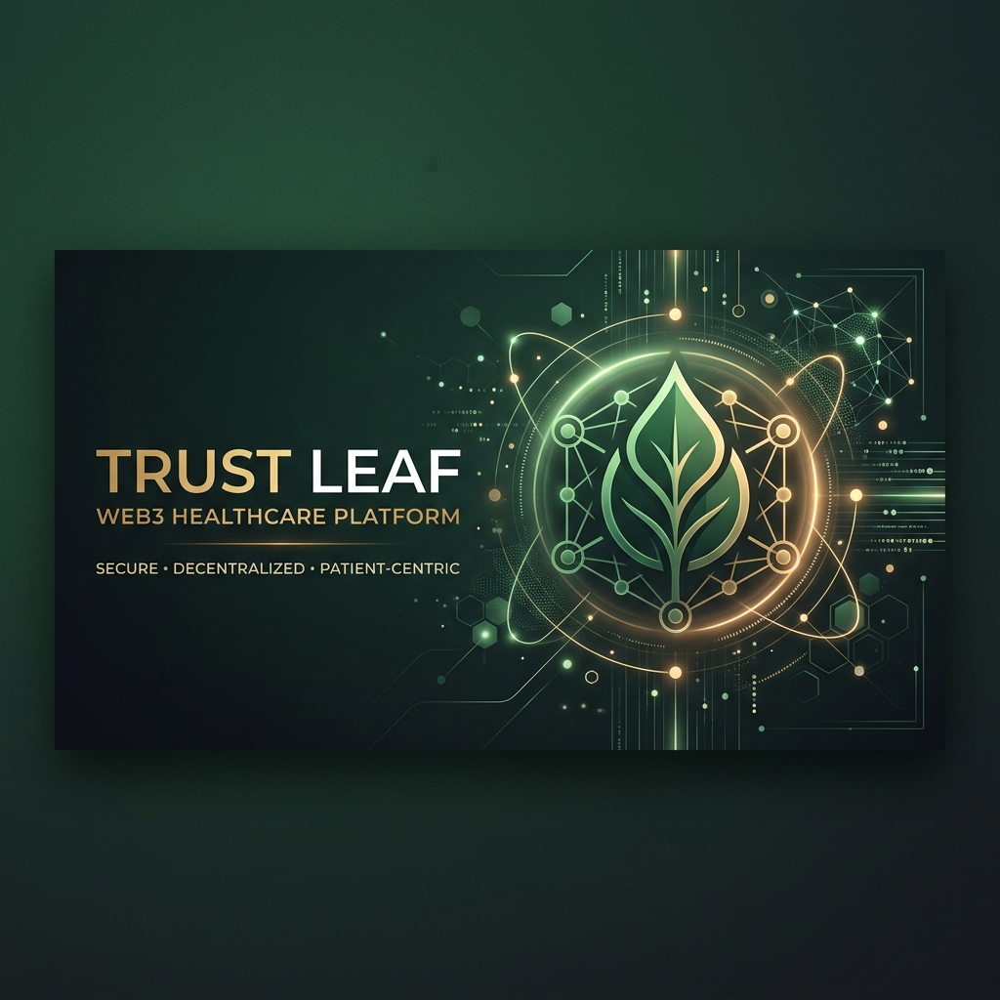
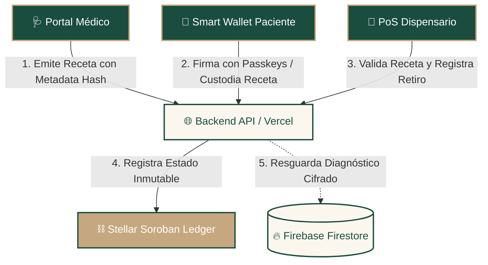
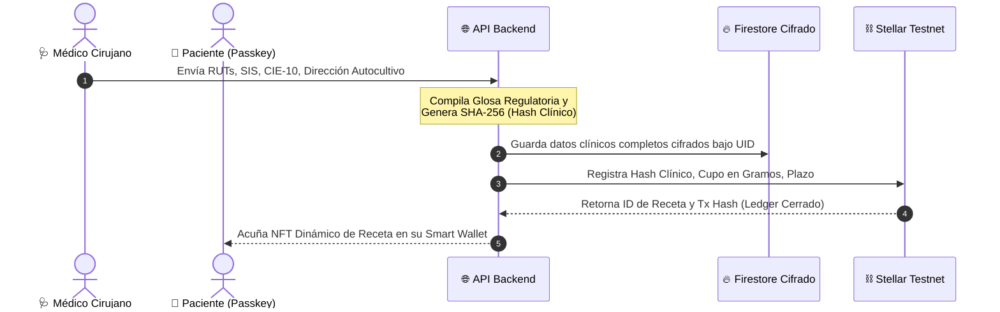
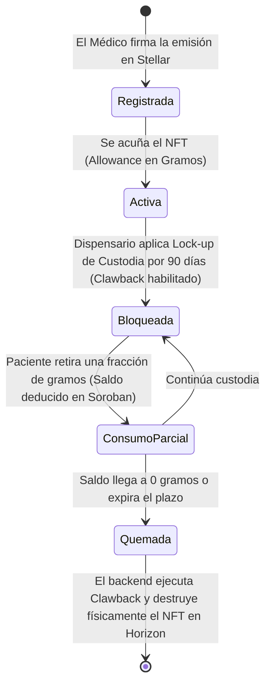
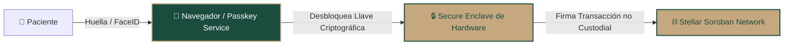

# Trust Leaf: Executive & Technical Whitepaper
### *The First DeCentrally Compliant Medical Cannabis & Controlled Substance Infrastructure Built on Stellar*

---

> [!NOTE]
> **Propósito del Documento:** Este documento sirve como dossier ejecutivo y técnico de alto nivel para Venture Capitalists (VCs) e inversionistas estratégicos. Detalla la propuesta de valor, la arquitectura híbrida Web3/Web2 y cómo resolvemos la fricción regulatoria en América Latina utilizando la red Stellar.

---

## 🏗️ 1. Resumen Ejecutivo (Executive Summary)

**Trust Leaf** es una plataforma B2B2C de infraestructura descentralizada que conecta de manera legal, segura y auditable a **Médicos**, **Pacientes** y **Dispensarios/Farmacias** de cannabis medicinal y sustancias controladas. 

Aprovechando el poder de los **Smart Contracts de Stellar (Soroban)**, la criptografía de **Passkeys (Llaves de Paso)** y una arquitectura híbrida de privacidad, logramos el cumplimiento absoluto del 100% de la normativa legal chilena (**Ley 21.575**, **Ley 20.000**, regulaciones del **ISP / Minsal** y protección de datos **Ley 19.628**) sin comprometer la privacidad del paciente ni la custodia de sus datos clínicos sensibles.

---

## 📈 2. El Problema de Mercado y la Oportunidad (TAM/SAM/SOM)

El mercado global de cannabis medicinal y sustancias controladas sufre de tres cuellos de botella insalvables para el software tradicional:

1. **Inseguridad Jurídica (Penal y Regulatoria):** En Chile y LatAm, la **receta médica es el único escudo legal** (Ley 21.575) que exime al paciente de sanciones penales por cultivo o posesión. Las recetas en papel o PDF son fácilmente falsificables, carecen de fecha cierta inalterable y exponen al paciente a incautaciones arbitrarias.
2. **Exposición de Datos Sensibles (Ley 19.628):** Las bases de datos centralizadas de salud son vulnerables a filtraciones catastróficas. Exponer diagnósticos de salud mental o dolores crónicos viola la ley y estigmatiza al paciente.
3. **Fraude en Dispensarios y Desvío de Stock:** Sin un ledger en tiempo real, el paciente puede usar una misma receta en múltiples dispensarios (doble gasto) o exceder el cupo máximo mensual autorizado por el ISP, generando multas y sanciones a las farmacias.

> [!TIP]
> **Nuestra Oportunidad:** Trust Leaf digitaliza el "resguardo penal" y el "cupo de consumo" mediante tokens no fungibles (NFT) condicionales en Stellar. Esto crea un mercado B2B SaaS de suscripción para clínicas y un cobro transaccional por retiro (lote validado) para dispensarios.

---

## ⚙️ 3. Arquitectura Híbrida de Privacidad (Zero-Knowledge Compliance)

Para cumplir con la **Ley 19.628 de Protección de Datos Personales**, Trust Leaf implementa un modelo en donde **Cero Datos de Salud viajan a la Blockchain**.

### El Hash de Cumplimiento Clínico
En lugar de subir el diagnóstico clínico a la blockchain, Trust Leaf concatena la metadata médica de manera determinista:

$$\text{Glosa} = \text{Diagnóstico CIE-10} \ + \ \text{RUT Médico/SIS} \ + \ \text{RUT Paciente} \ + \ \text{Fórmula Magistral} \ + \ \text{Dirección Cultivo Ley 21.575}$$

Esta glosa se procesa con SHA-256 para producir un **Hash Clínico** único de 64 caracteres. Este hash actúa como firma científica inmutable en la red Stellar. Cuando un fiscalizador o farmacéutico escanea el código QR del paciente, el backend de Trust Leaf descifra los metadatos y demuestra que el hash en el ledger coincide al 100% con los datos del paciente, otorgando **validez penal inexpugnable**.

---

## ⛓️ 4. Ciclo de Vida del Smart Contract en Stellar Soroban

El flujo on-chain está optimizado para garantizar gas mínimo, inmutabilidad y seguridad mediante contratos inteligentes programados en **Rust / Soroban**:

### Funciones Clave de los Contratos
1. **Gobernanza de Roles (`DoctorRegistry` / `DispensaryRegistry`):** Solo las wallets firmadas y aprobadas por el administrador de la red (tras validar físicamente su RUT y credencial SIS) pueden interactuar con el contrato de recetas.
2. **Custodia y Bloqueo (`PrescriptionContract`):** Al procesar un retiro, el dispensario activa un bloqueo de custodia (`Claimable Balance` con `TimeBounds`). Esto previene que el paciente intente transferir el NFT a un tercero mientras se dispensa.
3. **Clawback Final (Destrucción Criptográfica):** Cuando el saldo de gramos llega a cero o expira la receta médica, el backend ejecuta un **Clawback** que destruye físicamente el token on-chain. Esto impide el reuso de la receta, resolviendo de raíz el problema de desvío de estupefacientes.

---

## 🩺 5. Cumplimiento Exhaustivo de Leyes Chilenas

| Ley / Ente Regulador | Exigencia Legal del ISP / Minsal | Implementación Técnica en Trust Leaf |
| :--- | :--- | :--- |
| **Ley 21.575 (Modificación Ley 20.000)** | La receta médica extendida por un cirujano tratante constituye causa justificada y suficiente para excluir de sanción penal el cultivo y posesión de cannabis medicinal. | **Prueba de Inmutabilidad Blockchain:** El NFT registra la estampa de tiempo del Ledger, la geolocalización exacta del cultivo y el límite de plantas autorizado, blindando la defensa penal del paciente. |
| **Superintendencia de Salud (SIS)** | Solamente profesionales acreditados en el Registro de Prestadores Individuales pueden prescribir. | **Filtro SIS Obligatorio:** Formulario del médico exige RUT Profesional y Número de Registro SIS. El Admin valida contra el portal de la SIS antes de habilitar al médico en el Smart Contract. |
| **Decreto 404 / 466 (Minsal)** | Exige a las farmacias y dispensarios llevar un libro trazable de control de estupefacientes y preparados de recetario magistral. | **Libro de Estupefacientes PoS:** El portal del dispensario genera un registro digital inalterable de cada retiro con el lote de laboratorio (QC), fecha, RUT del paciente y médico responsable. |
| **Ley 19.628 (Datos Sensibles)** | Prohíbe divulgar o tratar datos de salud del paciente sin consentimiento específico. | **Zero-Knowledge Architecture:** Los diagnósticos clínicos se encriptan off-chain. La blockchain solo aloja el hash de validación criptográfica SHA-256. |

---

## 🔐 6. Criptografía de Vanguardia: Passkeys (Llaves de Paso)

Para lograr una adopción masiva sin fricciones, **Trust Leaf elimina las contraseñas y las complejas frases semilla de 12 palabras**.

* **Acceso Biométrico Instantáneo:** Utilizando WebAuthn / Passkeys, los pacientes y médicos crean y acceden a su wallet de Stellar usando la huella digital (TouchID) o reconocimiento facial (FaceID) de su dispositivo celular.
* **Firmas No Custodiales Seguras:** La llave privada se resguarda en el enclave seguro de hardware del dispositivo móvil del usuario. El backend de Trust Leaf nunca conoce la llave privada del usuario, garantizando descentralización absoluta y soberanía total sobre su historial y recetas.
* **Asociación de Identidad Web2/Web3:** Mapeamos la cuenta de Stellar firmada mediante Passkey con la autenticación federada de Google en Firebase para dar una transición amigable a los usuarios que se integran por primera vez al ecosistema Web3.

---

## 💼 7. Modelo de Negocio e Ingresos (Monetización)

Trust Leaf opera bajo un modelo de negocio B2B SaaS altamente escalable y de baja fricción transaccional:

1. **Clinical SaaS (Suscripción para Clínicas y Médicos):** Planes mensuales para médicos independientes y centros clínicos de cannabis medicinal que les otorgan acceso al Portal Médico Avanzado, agenda de pacientes, fichas encriptadas y emisión ilimitada de recetas con validación SIS.
2. **Dispensary Transactional Fees (Farmacias y Tiendas):** Cobro de una comisión fija por cada transacción de retiro (dispensación) validada criptográficamente en el punto de venta de la farmacia.
3. **Traceability Enterprise API (Laboratorios y Productores):** API de integración premium para laboratorios autorizados que deseen trazar sus lotes desde el cultivo y la cosecha hasta el consumidor final en farmacias, garantizando estándares de calidad (GMP/GACP).

---

> [!TIP]
> **Contacto & Roadmap:** Con el despliegue exitoso en Stellar Testnet y la puesta en marcha de nuestro frontend de producción en [www.trustleaf.org](https://www.trustleaf.org), Trust Leaf está preparado para iniciar su ronda de levantamiento pre-semilla (Pre-Seed) para expandir la acreditación legal y comercial en Chile y acelerar la entrada en mercados regulados clave de Latinoamérica (Colombia, Argentina, Brasil).

---
*Dossier Confidencial • Propiedad de Trust Leaf Technologies © 2026. Todos los derechos reservados.*
